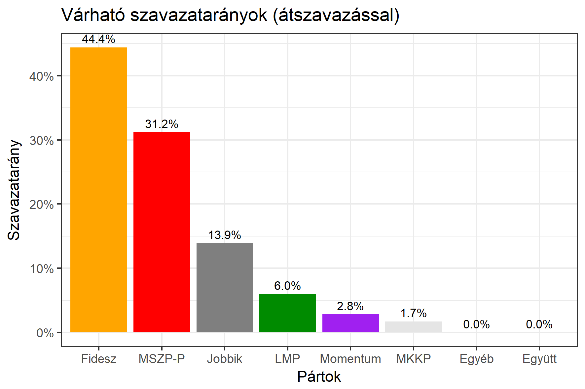

<h1 class="page-title">{{ page.title | escape }}</h1>

    

          
<h6><strong>A következő becslés várható időpontja: 2018. március 26.</strong></h6>
		  <h5>Komárom-Esztergom megye 1-es választókerület (Tatabánya)</h5>
 <h6><strong>Választókerületi profil (2014-ben): Enyhén Fideszes (baloldali kihívó)</strong></h6>
 
<h6><strong>Legfrissebb 2018-as becslések eredménye (átszavazással):</strong></h6>  
			<h5><strong>Legesélyesebb ellenzéki jelölt: Fekete Miklós (MSZP-Párbeszéd)</strong></h5>
<h5><strong><a href="https://rendszervaltas2018.hu">Márki-Zay Péter ajánlása</a>: Fekete Miklós (MSZP-Párbeszéd) </strong></h5>
<table class="striped">
              <thead>
                <tr>
                    <th>Jelöltek</th>
                    <th>Várható szavazatarány egyéniben (zárójelben az arányok átszavazás esetén)</th>
                </tr>
              </thead>
              <tbody>
             <tr>
                  <td>Bencsik János - Fidesz-KDNP </td>
				  <td id="id_fidesz">44.2% (44.4%)</td>
			</tr>
			<tr><td>Boda Bánk László - Jobbik </td><td id="id_jobbik">17.0% (12.8%)</td></tr>
<tr>
                  <td>Fekete Miklós - MSZP-Párbeszéd </td>
				  <td id="id_baloldal">25.7% (34.7%)</td>
			</tr>
			<tr>
                  <td>Körtvélyfáy Menyhért - LMP </td>
				  <td id="lmp">8.9% (5.4%)</td>
			</tr>
			<tr>
				  <td>Novák László - Momentum </td>
				  <td id="id_momentum">3.1% (1.9%)</td>
			</tr>
          
<tr>
<td>Barna Alexandra - MKKP </td>
<td id="id_mkkp">1.0% (0.8%)</td>
</tr>        
              </tbody>
            </table><h5>Várható győztes: Fidesz</h5>
			
			
 
<strong>Fontos:</strong> A becslések csak az egyéni jelöltre adott szavazatok arányát mutatják, nem a listás szavazatokét. A becslés jelentős eltérést mutathat a kisebb pártok esetében és olyan kerületekben, ahol nincs egyértelmű esélyes jelölt.

 
			
 <h6><strong>Becslés megbízhatósága a legesélyesebb jelöltről:</strong> <strong>A baloldali jelölt az egyértelmű esélyes</strong></h6>

Az aktuális becslés leírásáról <a href="../metodologia#0319">bővebben itt olvashatsz</a>.

          

    

    

          

		  <h5>Komárom-Esztergom megye 1-es választókerület (Tatabánya) - 2014-es eredmények</h5>
            <table class="striped">
              <thead>
                <tr>
                    <th>Jelöltek</th>
                    <th>Szavazatarányok</th>
                </tr>
              </thead>
              <tbody>
             <tr>
                  <td>Bencsik János - Fidesz-KDNP</td>
				  <td>42.9%</td>
			</tr>
			<tr>
			      <td>Lukács Zoltán Géza - Összefogás (MSZP-Együtt-DK-PM-MLP)</td>
				  <td>31.9%</td>
			      
			</tr>
			<tr>
			      <td>Vágó Sebestyén - Jobbik</td>
				  <td>15.7%</td>
			</tr>
			<tr>
				  <td>Gutai Zsolt - LMP</td>
				  <td>5.0%</td>
			</tr>                
              </tbody>
            </table>
			<h5>Győztes: Fidesz-KDNP, 11.0%-kal</h5>
          

    

