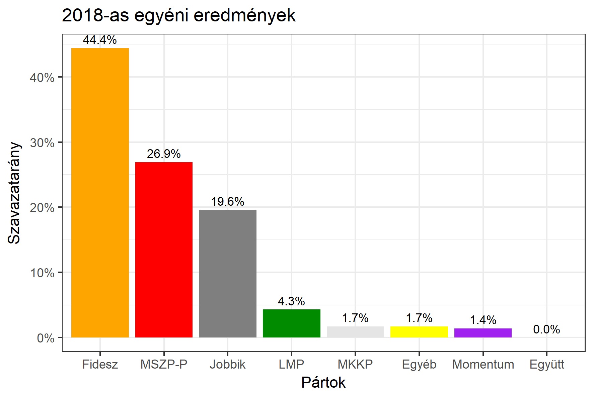

<h1 class="page-title">{{ page.title | escape }}</h1>

    

          

		  <h5>Komárom-Esztergom megye 1-es választókerület (Tatabánya)</h5>
 <h5><strong>2018-as egyéni eredmények</strong></h5>  <table class="striped">
              <thead>
                <tr>
                    <th>Jelöltek</th>
                    <th>Szavazatarány (százalék)</th>
<th>Eltérés a becsléstől</th>
                </tr>
              </thead>
              <tbody>
             <tr>
                  <td>Bencsik János - Fidesz-KDNP </td>
				   <td id="id_fidesz">44.4%</td>
				   <td>+0.0%</td>
			</tr>
			<tr><td>Boda Bánk László - Jobbik </td> 
			<td id="id_jobbik">19.6%</td>
				   <td>+5.7%</td>
			</tr>
<tr>
                  <td>Fekete Miklós - MSZP-Párbeszéd </td>
				   <td id="id_baloldal">26.9%</td>
				   <td>-4.3%</td>
			</tr>
			<tr>
                  <td>Körtvélyfáy Menyhért - LMP </td>
				   <td id="id_lmp">4.3%</td>
				   <td>-1.7%</td>
			</tr>
			<tr>
				  <td>Novák László - Momentum </td>
				  <td id="id_momentum">1.4%</td>
				   <td>-1.4%</td>
			</tr>
          
<tr>
<td>Barna Alexandra - MKKP </td>
 <td id="id_mkkp">1.7%</td>
				   <td>+0.0%</td>
</tr>        
              </tbody>
            </table><h6><strong>Választókerületi profil (2014-ben): Enyhén Fideszes (baloldali kihívó)</strong></h6>
 

 
			

          

    

    

          

		  <h5>Komárom-Esztergom megye 1-es választókerület (Tatabánya) - 2014-es eredmények</h5>
            <table class="striped">
              <thead>
                <tr>
                    <th>Jelöltek</th>
                    <th>Szavazatarányok</th>
                </tr>
              </thead>
              <tbody>
             <tr>
                  <td>Bencsik János - Fidesz-KDNP</td>
				  <td>42.9%</td>
			</tr>
			<tr>
			      <td>Lukács Zoltán Géza - Összefogás (MSZP-Együtt-DK-PM-MLP)</td>
				  <td>31.9%</td>
			      
			</tr>
			<tr>
			      <td>Vágó Sebestyén - Jobbik</td>
				  <td>15.7%</td>
			</tr>
			<tr>
				  <td>Gutai Zsolt - LMP</td>
				  <td>5.0%</td>
			</tr>                
              </tbody>
            </table>
			<h5>Győztes: Fidesz-KDNP, 11.0%-kal</h5>
          

    

