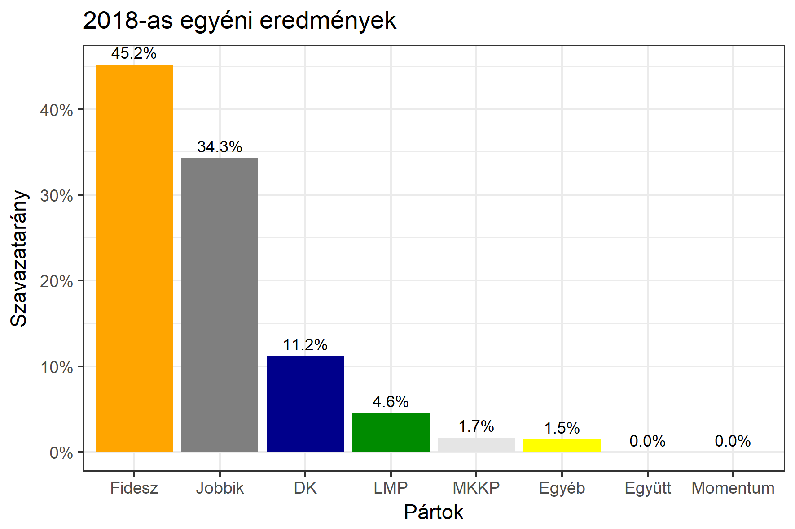
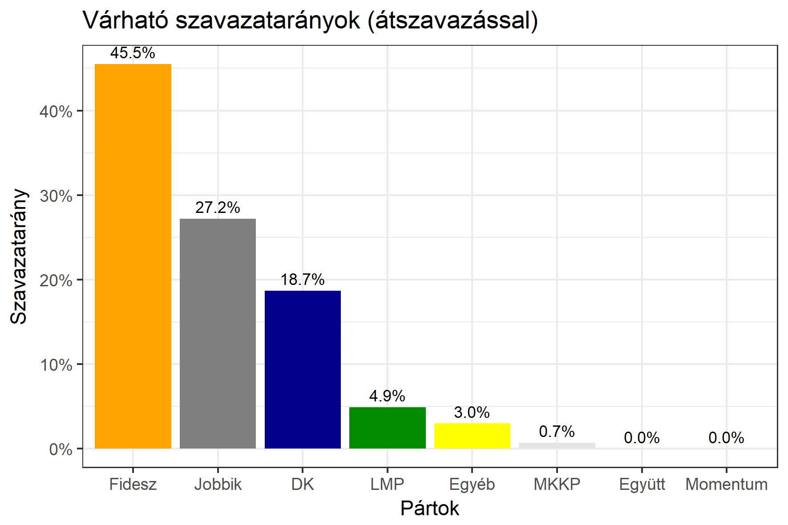

<h1 class="page-title">{{ page.title | escape }}</h1>

    

          

		  <h5>Komárom-Esztergom megye 2-es választókerület (Esztergom)</h5>
 <h5><strong>2018-as egyéni eredmények</strong></h5>  <table class="striped">
              <thead>
                <tr>
                    <th>Jelöltek</th>
                    <th>Szavazatarány (százalék)</th>
<th>Eltérés a becsléstől</th>
                </tr>
              </thead>
              <tbody>
             <tr>
                  <td>dr. Völner Pál - Fidesz-KDNP </td>
				   <td id="id_fidesz">45.2%</td>
				   <td>-0.3%</td>
			</tr>
			<tr><td>Nunkovics Tibor - Jobbik </td> 
			<td id="id_jobbik">34.3%</td>
				   <td>+7.1%</td>
			</tr>
<tr>
                  <td>dr. Vadai Ágnes - DK </td>
				   <td id="id_baloldal">11.2%</td>
				   <td>-7.5%</td>
			</tr>
			<tr>
                  <td>dr. Munkácsy Béla Attila - LMP </td>
				   <td id="id_lmp">4.6%</td>
				   <td>-0.3%</td>
			</tr>
<tr>
<td>Papp László - MKKP </td>
 <td id="id_mkkp">1.7%</td>
				   <td>+1.0%</td>
</tr>     
<tr>
<td>Cserép János - független</td>
<td id="id_egyeb2">1.5%</td>
				   <td>-1.5%</td>
</tr>       
              </tbody>
            </table><h6><strong>Választókerületi profil (2014-ben): Biztos Fideszes</strong></h6>
 
<h5><strong>2018. április 8-i becslések (átszavazással):</strong></h5>  
			<h6><strong>Becslés megbízhatósága a legesélyesebb jelöltről:</strong> <strong>Nincs egyértelmű esélyes</strong></h6> 
<h5><strong>Legesélyesebb ellenzéki jelölt: Nunkovics Tibor (Jobbik)</strong></h5>
<h5><strong><a href="https://rendszervaltas2018.hu">Márki-Zay Péter ajánlása</a>: Nunkovics Tibor (Jobbik)</strong></h5>

  <table class="striped">
              <thead>
                <tr>
                    <th>Jelöltek</th>
                    <th>Várható szavazatarány egyéniben (zárójelben az arányok átszavazás esetén)</th>
                </tr>
              </thead>
              <tbody>
             <tr>
                  <td>dr. Völner Pál - Fidesz-KDNP </td>
				   <td id="id_fidesz">44.0% &emsp; (45.5%)</td>
			</tr>
			<tr><td>Nunkovics Tibor - Jobbik </td> <td id="id_jobbik">22.9% &emsp; (27.2%)</td></tr>
<tr>
                  <td>dr. Vadai Ágnes - DK </td>
				   <td id="id_baloldal">18.3% &emsp; (18.7%)</td>
			</tr>
			<tr>
                  <td>dr. Munkácsy Béla Attila - LMP </td>
				   <td id="id_lmp">6.7% &emsp; (4.9%)</td>
			</tr>
			<tr>
				  </tr>
        
<tr>
<td>Papp László - MKKP </td>
 <td id="id_mkkp">0.8% &emsp; (0.7%)</td>
</tr>     
<tr>
<td>Cserép János - független</td>
<td id="id_egyeb2">3.0% &emsp; (3.0%)</td>
</tr>       
              </tbody>
            </table><h5>Várható győztes: Fidesz-KDNP</h5>
			
			
 
<strong>Fontos:</strong> A becslések csak az egyéni jelöltre adott szavazatok arányát mutatják, nem a listás szavazatokét. A becslés jelentős eltérést mutathat a kisebb pártok esetében és olyan kerületekben, ahol nincs egyértelmű esélyes jelölt.

 
			

Az aktuális becslés leírásáról <a href="../metodologia#0406">bővebben itt olvashatsz</a>.

          

    

    

          

		  <h5>Komárom-Esztergom megye 2-es választókerület (Esztergom) - 2014-es eredmények</h5>
            <table class="striped">
              <thead>
                <tr>
                    <th>Jelöltek</th>
                    <th>Szavazatarányok</th>
                </tr>
              </thead>
              <tbody>
             <tr>
                  <td>Dr. Völner Pál - Fidesz-KDNP</td>
				  <td>45.9%</td>
			</tr>
			<tr>
			      <td>Dr. Vadai Ágnes - Összefogás (MSZP-Együtt-DK-PM-MLP)</td>
				  <td>27.2%</td>
			      
			</tr>
			<tr>
			      <td>Nunkovics Tibor - Jobbik</td>
				  <td>19.8%</td>
			</tr>
			<tr>
				  <td>Prommer Mátyás Jenő - LMP</td>
				  <td>4.3%</td>
			</tr>                
              </tbody>
            </table>
			<h5>Győztes: Fidesz-KDNP, 18.7%-kal</h5>
          

    

