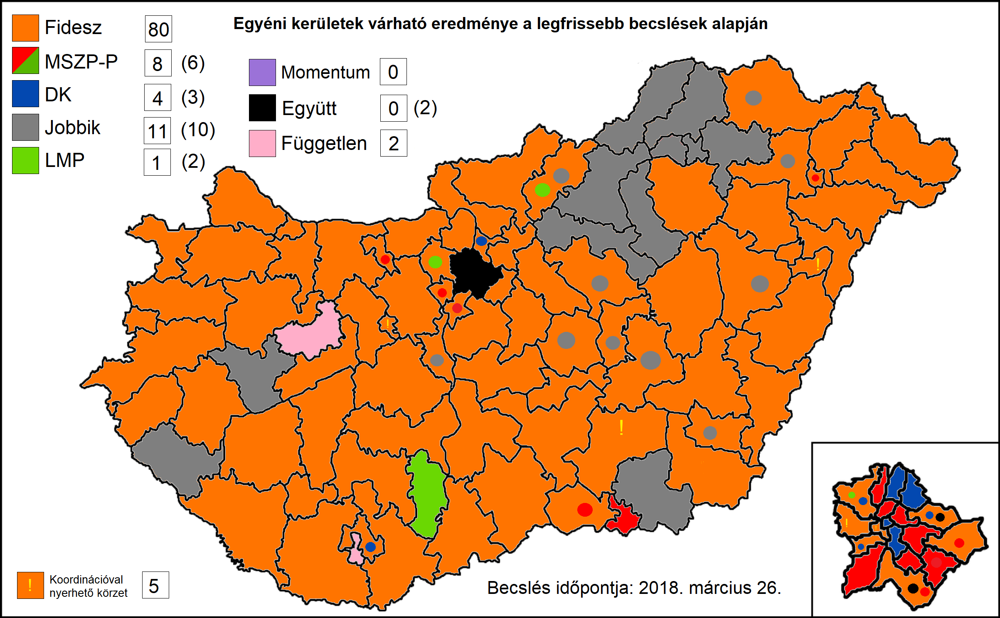

<h1 class="page-title">{{ page.title | escape }}</h1>

    

          

		  <h5>Ha most vasárnap lennének a választások, melyik párt hány képviselőt küldene a parlamentbe?</h5> 

Az alábbi táblázat összefoglalja a várható egyéni (106) és listás (93) mandátumok kiosztását.

<h6><strong>A következő becslés várható időpontja: 2018. április 2.</strong></h6>

<table class="striped">
              <thead>
                <tr>
                    <th>Pártok</th>
                    <th>Egyéni mandátum</th>
					<th>Listás mandátum</th>
					<th>Összes mandátum</th>
					<th>Mandátumarány</th>
                </tr>
              </thead>
              <tbody>
             <tr>
                  <td>Fidesz</td>
				  <td>80</td>
				  <td>39</td>
				  <td>119</td>
				  <td>60%</td>
			</tr>
			<tr>
				  <td>Jobbik</td>
				  <td>11</td>
				  <td>22</td>
				  <td>33</td>
				  <td>16.5%</td>
			</tr>
			<tr>
                  <td>MSZP-Párbeszéd</td>
				  <td>8</td>
				  <td>15</td>
				  <td>23</td>
				  <td>11.5%</td>
			</tr>
			<tr>
			      <td>DK</td>
                  <td>4</td>
				  <td>8</td>
				  <td>12</td>
				  <td>6.0%</td>
			</tr>
			<tr>
				 <td>LMP</td>
				<td>1</td>
				  <td>8</td>
				  <td>9</td>
				  <td>4.5%</td>
			</tr>
			<tr>
			<td>Független</td>
				<td>2</td>
				  <td>0</td>
				  <td>2</td>
				  <td>1.0%</td>
			</tr>
			<td>Német nemzetiségi képviselő</td>
				<td>0</td>
				  <td>1</td>
				  <td>1</td>
				  <td>0.5%</td>
			</tr>
              </tbody>
            </table>
<h5>Eredmény: A Fidesz stabil többséget szerez a parlamentben 119 mandátummal.</h5>
 
<h6><strong>Magasabb átszavazási hajlandóság és koordináció mellett a Fidesz várható mandátumainak száma 100-ra csökken.</strong></h6>
<h6>Utolsó frissítés: 2018. március 26.</h6>
          

    

	
 

    

          

		  <h5>Egyéni kerületek sorsa</h5> 

Az alábbi táblázat megmutatja, hogy az egyéni választókerületekben mely párt és milyen arányban győzedelmeskedne. A lista folyamatosan frissül <a href="/meresek">az új közvélemény-kutatási eredmények tükrében.</a>

A térképen az egyes pártok győztes kerületei láthatók. A kis színes körök az ellenzék számára nyerhető körzeteket mutatják.

 

 
            <table class="striped">
              <thead>
                <tr>
                    <th>Választókerület</th>
                    <th>Győztes</th>
					<th>Második</th>
					<th>Különbség</th>
                </tr>
              </thead>
              <tbody>
<tr><td><a href="../bp1">Budapesti 1.</a></td>
<td id="gyoztes_bp1">Fidesz</td>
<td id="masodik_bp1">Váradiné Naszály Márta (MSZP-Párbeszéd)</td>
<td id="kulonbseg_bp1">7.7%</td></tr>	
<tr><td><a href="../bp2">Budapesti 2.</a></td>
<td id="gyoztes_bp2">Fidesz</td>
<td id="masodik_bp2">Gy. Németh Erzsébet (DK)</td>
<td id="kulonbseg_bp2">5.0%</td></tr>	
<tr><td><a href="../bp3">Budapesti 3.</a></td>
<td id="gyoztes_bp3">Fidesz</td>
<td id="masodik_bp3">Bauer Tamás (DK)</td>
<td id="kulonbseg_bp3">10.2%</td></tr>	
<tr><td><a href="../bp4">Budapesti 4.</a></td>
<td id="gyoztes_bp4">Fidesz</td>
<td id="masodik_bp4">Ungár Péter (LMP)</td>
<td id="kulonbseg_bp4">11.0%</td></tr>	
<tr><td><a href="../bp5">Budapesti 5.</a></td>
<td id="gyoztes_bp5">Dr. Oláh Lajos (DK)</td>
<td id="masodik_bp5">Fidesz</td>
<td id="kulonbseg_bp5">6.8%</td></tr>	
<tr><td><a href="../bp6">Budapesti 6.</a></td>
<td id="gyoztes_bp6">Ara-Kovács Attila (DK)</td>
<td id="masodik_bp6">Fidesz</td>
<td id="kulonbseg_bp6">6.6%</td></tr>	
<tr><td><a href="../bp7">Budapesti 7.</a></td>
<td id="gyoztes_bp7">Hiszékeny Dezső (MSZP-Párbeszéd)</td>
<td id="masodik_bp7">Fidesz</td>
<td id="kulonbseg_bp7">21.5%</td></tr>	
<tr><td><a href="../bp8">Budapesti 8.</a></td>
<td id="gyoztes_bp8">Tóth Csaba (MSZP-Párbeszéd)</td>
<td id="masodik_bp8">Fidesz</td>
<td id="kulonbseg_bp8">11.0%</td></tr>	
<tr><td><a href="../bp9">Budapesti 9.</a></td>
<td id="gyoztes_bp9">Burány Sándor (MSZP-Párbeszéd)</td>
<td id="masodik_bp9">Fidesz</td>
<td id="kulonbseg_bp9">8.4%</td></tr>	
<tr><td><a href="../bp10">Budapesti 10.</a></td>
<td id="gyoztes_bp10">Szabó Tímea (MSZP-Párbeszéd)</td>
<td id="masodik_bp10">Fidesz</td>
<td id="kulonbseg_bp10">11.6%</td></tr>	
<tr><td><a href="../bp11">Budapesti 11.</a></td>
<td id="gyoztes_bp11">Varju László (DK)</td>
<td id="masodik_bp11">Fidesz</td>
<td id="kulonbseg_bp11">14.9%</td></tr>	
<tr><td><a href="../bp12">Budapesti 12.</a></td>
<td id="gyoztes_bp12">Hajdu László (DK)</td>
<td id="masodik_bp12">Fidesz</td>
<td id="kulonbseg_bp12">2.0%</td></tr>	
<tr><td><a href="../bp13">Budapesti 13.</a></td>
<td id="gyoztes_bp13">Fidesz</td>
<td id="masodik_bp13">Vajda Zoltán (Együtt)</td>
<td id="kulonbseg_bp13">17.5%</td></tr>	
<tr><td><a href="../bp14">Budapesti 14.</a></td>
<td id="gyoztes_bp14">Fidesz</td>
<td id="masodik_bp14">Lukoczki Károly (MSZP-Párbeszéd)</td>
<td id="kulonbseg_bp14">5.3%</td></tr>	
<tr><td><a href="../bp15">Budapesti 15.</a></td>
<td id="gyoztes_bp15">Kunhalmi Ágnes (MSZP-Párbeszéd)</td>
<td id="masodik_bp15">Fidesz</td>
<td id="kulonbseg_bp15">7.4%</td></tr>	
<tr><td><a href="../bp16">Budapesti 16.</a></td>
<td id="gyoztes_bp16">dr. Hiller István (MSZP-Párbeszéd)</td>
<td id="masodik_bp16">Fidesz</td>
<td id="kulonbseg_bp16">8.0%</td></tr>	
<tr><td><a href="../bp17">Budapesti 17.</a></td>
<td id="gyoztes_bp17">Fidesz</td>
<td id="masodik_bp17">Szabó Szabolcs (Együtt)</td>
<td id="kulonbseg_bp17">7.0%</td></tr>	
<tr><td><a href="../bp18">Budapesti 18.</a></td>
<td id="gyoztes_bp18">Molnár Gyula (MSZP-Párbeszéd)</td>
<td id="masodik_bp18">Fidesz</td>
<td id="kulonbseg_bp18">1.9%</td></tr>	
<tr><td><a href="../bk1">Bács-Kiskun megyei 1.</a></td>
<td id="gyoztes_bk1">Fidesz</td>
<td id="masodik_bk1">Lejer Zoltán (Jobbik)</td>
<td id="kulonbseg_bk1">25.8%</td></tr>	
<tr><td><a href="../bk2">Bács-Kiskun megyei 2.</a></td>
<td id="gyoztes_bk2">Fidesz</td>
<td id="masodik_bk2">Radics Tivadar (Jobbik)</td>
<td id="kulonbseg_bk2">28.8%</td></tr>	
<tr><td><a href="../bk3">Bács-Kiskun megyei 3.</a></td>
<td id="gyoztes_bk3">Fidesz</td>
<td id="masodik_bk3">Suhajda Krisztián (Jobbik)</td>
<td id="kulonbseg_bk3">18.5%</td></tr>	
<tr><td><a href="../bk4">Bács-Kiskun megyei 4.</a></td>
<td id="gyoztes_bk4">Fidesz</td>
<td id="masodik_bk4">Kollár László (Jobbik)</td>
<td id="kulonbseg_bk4">22.9%</td></tr>	
<tr><td><a href="../bk5">Bács-Kiskun megyei 5.</a></td>
<td id="gyoztes_bk5">Fidesz</td>
<td id="masodik_bk5">Farkas Gergely (Jobbik)</td>
<td id="kulonbseg_bk5">16.0%</td></tr>	
<tr><td><a href="../bk6">Bács-Kiskun megyei 6.</a></td>
<td id="gyoztes_bk6">Fidesz</td>
<td id="masodik_bk6">Hajdú Miklós (MSZP-Párbeszéd)</td>
<td id="kulonbseg_bk6">23.7%</td></tr>	
<tr><td><a href="../ba1">Baranya megyei 1.</a></td>
<td id="gyoztes_ba1">Dr. Mellár Tamás (független)</td>
<td id="masodik_ba1">Fidesz</td>
<td id="kulonbseg_ba1">2.3%</td></tr>	
<tr><td><a href="../ba2">Baranya megyei 2.</a></td>
<td id="gyoztes_ba2">Fidesz</td>
<td id="masodik_ba2">Nagy Ferenc (DK)</td>
<td id="kulonbseg_ba2">2.3%</td></tr>	
<tr><td><a href="../ba3">Baranya megyei 3.</a></td>
<td id="gyoztes_ba3">Fidesz</td>
<td id="masodik_ba3">Szőcs Norbert (Jobbik)</td>
<td id="kulonbseg_ba3">28.8%</td></tr>	
<tr><td><a href="../ba4">Baranya megyei 4.</a></td>
<td id="gyoztes_ba4">Fidesz</td>
<td id="masodik_ba4">dr. Vass Péter (MSZP-Párbeszéd)</td>
<td id="kulonbseg_ba4">19.3%</td></tr>	
<tr><td><a href="../be1">Békés megyei 1.</a></td>
<td id="gyoztes_be1">Fidesz</td>
<td id="masodik_be1">Nagy-Huszein Tibor (DK)</td>
<td id="kulonbseg_be1">12.1%</td></tr>	
<tr><td><a href="../be2">Békés megyei 2.</a></td>
<td id="gyoztes_be2">Fidesz</td>
<td id="masodik_be2">Samu Tamás Gergő (Jobbik)</td>
<td id="kulonbseg_be2">13.9%</td></tr>	
<tr><td><a href="../be3">Békés megyei 3.</a></td>
<td id="gyoztes_be3">Fidesz</td>
<td id="masodik_be3">Dr. Dévényi-Dabrowsky Géza (Jobbik)</td>
<td id="kulonbseg_be3">27.1%</td></tr>	
<tr><td><a href="../be4">Békés megyei 4.</a></td>
<td id="gyoztes_be4">Fidesz</td>
<td id="masodik_be4">Dr. Szabó Ervin (Jobbik)</td>
<td id="kulonbseg_be4">17.9%</td></tr>	
<tr><td><a href="../baz1">Borsod-Abaúj-Zemplén megyei 1.</a></td>
<td id="gyoztes_baz1">Jakab Péter Dénes (Jobbik)</td>
<td id="masodik_baz1">Fidesz</td>
<td id="kulonbseg_baz1">12.9%</td></tr>
<tr><td><a href="../baz2">Borsod-Abaúj-Zemplén megyei 2.</a></td>
<td id="gyoztes_baz2">Pakusza Zoltán (Jobbik)</td>
<td id="masodik_baz2">Fidesz</td>
<td id="kulonbseg_baz2">14.9%</td></tr>	
<tr><td><a href="../baz3">Borsod-Abaúj-Zemplén megyei 3.</a></td>
<td id="gyoztes_baz3">Farkas Péter Barnabás (Jobbik)</td>
<td id="masodik_baz3">Fidesz</td>
<td id="kulonbseg_baz3">2.8%</td></tr>	
<tr><td><a href="../baz4">Borsod-Abaúj-Zemplén megyei 4.</a></td>
<td id="gyoztes_baz4">Egyed Zsolt (Jobbik)</td>
<td id="masodik_baz4">Fidesz</td>
<td id="kulonbseg_baz4">2.7%</td></tr>	
<tr><td><a href="../baz5">Borsod-Abaúj-Zemplén megyei 5.</a></td>
<td id="gyoztes_baz5">Fidesz</td>
<td id="masodik_baz5">Mikola Gergely (Jobbik)</td>
<td id="kulonbseg_baz5">8.2%</td></tr>	
<tr><td><a href="../baz6">Borsod-Abaúj-Zemplén megyei 6.</a></td>
<td id="gyoztes_baz6">Bíró László (Jobbik)</td>
<td id="masodik_baz6">Fidesz</td>
<td id="kulonbseg_baz6">0.8%</td></tr>	
<tr><td><a href="../baz7">Borsod-Abaúj-Zemplén megyei 7.</a></td>
<td id="gyoztes_baz7">Fidesz</td>
<td id="masodik_baz7">Lukács Attila (Jobbik)</td>
<td id="kulonbseg_baz7">11.5%</td></tr>	
<tr><td><a href="../cs1">Csongrád megyei 1.</a></td>
<td id="gyoztes_cs1">Szabó Sándor (MSZP-Párbeszéd)</td>
<td id="masodik_cs1">Fidesz</td>
<td id="kulonbseg_cs1">12.5%</td></tr>	
<tr><td><a href="../cs2">Csongrád megyei 2.</a></td>
<td id="gyoztes_cs2">Fidesz</td>
<td id="masodik_cs2">Joób Márton (MSZP-Párbeszéd)</td>
<td id="kulonbseg_cs2">6.8%</td></tr>	
<tr><td><a href="../cs3">Csongrád megyei 3.</a></td>
<td id="gyoztes_cs3">Fidesz</td>
<td id="masodik_cs3">Szabó Zoltán Ferenc (Jobbik)</td>
<td id="kulonbseg_cs3">9.1%</td></tr>	
<tr><td><a href="../cs4">Csongrád megyei 4.</a></td>
<td id="gyoztes_cs4">Dr. Kiss Attila (Jobbik)</td>
<td id="masodik_cs4">Fidesz</td>
<td id="kulonbseg_cs4">2.3%</td></tr>	
<tr><td><a href="../fe1">Fejér megyei 1.</a></td>
<td id="gyoztes_fe1">Fidesz</td>
<td id="masodik_fe1">Ráczné Földi Judit (DK)</td>
<td id="kulonbseg_fe1">11.9%</td></tr>	
<tr><td><a href="../fe2">Fejér megyei 2.</a></td>
<td id="gyoztes_fe2">Fidesz</td>
<td id="masodik_fe2">Fazakas Attila (Jobbik)</td>
<td id="kulonbseg_fe2">19.2%</td></tr>	
<tr><td><a href="../fe3">Fejér megyei 3.</a></td>
<td id="gyoztes_fe3">Fidesz</td>
<td id="masodik_fe3">Varga László Béla (Jobbik)</td>
<td id="kulonbseg_fe3">28.2%</td></tr>	
<tr><td><a href="../fe4">Fejér megyei 4.</a></td>
<td id="gyoztes_fe4">Fidesz</td>
<td id="masodik_fe4">Pintér Tamás (Jobbik)</td>
<td id="kulonbseg_fe4">3.2%</td></tr>	
<tr><td><a href="../fe5">Fejér megyei 5.</a></td>
<td id="gyoztes_fe5">Fidesz</td>
<td id="masodik_fe5">Árgyelán János (Jobbik)</td>
<td id="kulonbseg_fe5">10.8%</td></tr>	
<tr><td><a href="../gy1">Győr-Moson-Sopron megyei 1.</a></td>
<td id="gyoztes_gy1">Fidesz</td>
<td id="masodik_gy1">Glázer Tímea (DK)</td>
<td id="kulonbseg_gy1">15.6%</td></tr>	
<tr><td><a href="../gy2">Győr-Moson-Sopron megyei 2.</a></td>
<td id="gyoztes_gy2">Fidesz</td>
<td id="masodik_gy2">Dr. Menyhárt Miklós (Jobbik)</td>
<td id="kulonbseg_gy2">33.8%</td></tr>	
<tr><td><a href="../gy3">Győr-Moson-Sopron megyei 3.</a></td>
<td id="gyoztes_gy3">Fidesz</td>
<td id="masodik_gy3">Magyar Zoltán (Jobbik)</td>
<td id="kulonbseg_gy3">30.3%</td></tr>	
<tr><td><a href="../gy4">Győr-Moson-Sopron megyei 4.</a></td>
<td id="gyoztes_gy4">Fidesz</td>
<td id="masodik_gy4">Póczik Roland (MSZP-Párbeszéd)</td>
<td id="kulonbseg_gy4">26.9%</td></tr>	
<tr><td><a href="../gy5">Győr-Moson-Sopron megyei 5.</a></td>
<td id="gyoztes_gy5">Fidesz</td>
<td id="masodik_gy5">Jávor Miklós (Jobbik)</td>
<td id="kulonbseg_gy5">27.7%</td></tr>	
<tr><td><a href="../hb1">Hajdú-Bihar megyei 1.</a></td>
<td id="gyoztes_hb1">Fidesz</td>
<td id="masodik_hb1">Gulyásné dr. Gurmai Zita (MSZP-Párbeszéd)</td>
<td id="kulonbseg_hb1">16.0%</td></tr>	
<tr><td><a href="../hb2">Hajdú-Bihar megyei 2.</a></td>
<td id="gyoztes_hb2">Fidesz</td>
<td id="masodik_hb2">Kőszeghy Ábel (Jobbik)</td>
<td id="kulonbseg_hb2">17.2%</td></tr>	
<tr><td><a href="../hb3">Hajdú-Bihar megyei 3.</a></td>
<td id="gyoztes_hb3">Fidesz</td>
<td id="masodik_hb3">Csikai József (Jobbik)</td>
<td id="kulonbseg_hb3">18.5%</td></tr>	
<tr><td><a href="../hb4">Hajdú-Bihar megyei 4.</a></td>
<td id="gyoztes_hb4">Fidesz</td>
<td id="masodik_hb4">Keresztessy Gergő (Jobbik)</td>
<td id="kulonbseg_hb4">10.2%</td></tr>	
<tr><td><a href="../hb5">Hajdú-Bihar megyei 5.</a></td>
<td id="gyoztes_hb5">Fidesz</td>
<td id="masodik_hb5">Rigán István (Jobbik)</td>
<td id="kulonbseg_hb5">7.6%</td></tr>	
<tr><td><a href="../hb6">Hajdú-Bihar megyei 6.</a></td>
<td id="gyoztes_hb6">Fidesz</td>
<td id="masodik_hb6">Demeter Pál (Jobbik)</td>
<td id="kulonbseg_hb6">12.6%</td></tr>	
<tr><td><a href="../he1">Heves megyei 1.</a></td>
<td id="gyoztes_he1">Mirkóczki Ádám (Jobbik)</td>
<td id="masodik_he1">Fidesz</td>
<td id="kulonbseg_he1">5.4%</td></tr>	
<tr><td><a href="../he2">Heves megyei 2.</a></td>
<td id="gyoztes_he2">Vona Gábor (Jobbik)</td>
<td id="masodik_he2">Fidesz</td>
<td id="kulonbseg_he2">11.6%</td></tr>	
<tr><td><a href="../he3">Heves megyei 3.</a></td>
<td id="gyoztes_he3">Sneider Tamás (Jobbik)</td>
<td id="masodik_he3">Fidesz</td>
<td id="kulonbseg_he3">2.3%</td></tr>	
<tr><td><a href="../sz1">Jász-Nagykun-Szolnok megyei 1.</a></td>
<td id="gyoztes_sz1">Fidesz</td>
<td id="masodik_sz1">dr. Csikós Attila (Jobbik)</td>
<td id="kulonbseg_sz1">4.8%</td></tr>	
<tr><td><a href="../sz2">Jász-Nagykun-Szolnok megyei 2.</a></td>
<td id="gyoztes_sz2">Fidesz</td>
<td id="masodik_sz2">Budai Lóránt (Jobbik)</td>
<td id="kulonbseg_sz2">2.2%</td></tr>	
<tr><td><a href="../sz3">Jász-Nagykun-Szolnok megyei 3.</a></td>
<td id="gyoztes_sz3">Fidesz</td>
<td id="masodik_sz3">Dr. Lukács László György (Jobbik)</td>
<td id="kulonbseg_sz3">18.9%</td></tr>	
<tr><td><a href="../sz4">Jász-Nagykun-Szolnok megyei 4.</a></td>
<td id="gyoztes_sz4">Fidesz</td>
<td id="masodik_sz4">Csányi Tamás (Jobbik)</td>
<td id="kulonbseg_sz4">0.5%</td></tr>	
<tr><td><a href="../ke1">Komárom-Esztergom megyei 1.</a></td>
<td id="gyoztes_ke1">Fidesz</td>
<td id="masodik_ke1">Fekete Miklós (MSZP-Párbeszéd)</td>
<td id="kulonbseg_ke1">7.7%</td></tr>	
<tr><td><a href="../ke2">Komárom-Esztergom megyei 2.</a></td>
<td id="gyoztes_ke2">Fidesz</td>
<td id="masodik_ke2">Nunkovics Tibor (Jobbik)</td>
<td id="kulonbseg_ke2">20.1%</td></tr>	
<tr><td><a href="../ke3">Komárom-Esztergom megyei 3.</a></td>
<td id="gyoztes_ke3">Fidesz</td>
<td id="masodik_ke3">Tóth Endre (Jobbik)</td>
<td id="kulonbseg_ke3">19.9%</td></tr>	
<tr><td><a href="../no1">Nógrád megyei 1.</a></td>
<td id="gyoztes_no1">Fidesz</td>
<td id="masodik_no1">Cseresznyés István (Jobbik)</td>
<td id="kulonbseg_no1">8.0%</td></tr>	
<tr><td><a href="../no2">Nógrád megyei 2.</a></td>
<td id="gyoztes_no2">Fidesz</td>
<td id="masodik_no2">Dobrocsi Lénárd (Jobbik)</td>
<td id="kulonbseg_no2">16.8%</td></tr>	
<tr><td><a href="../pe1">Pest megyei 1.</a></td>
<td id="gyoztes_pe1">Fidesz</td>
<td id="masodik_pe1">dr. Czőzik László (MSZP-Párbeszéd)</td>
<td id="kulonbseg_pe1">7.4%</td></tr>	
<tr><td><a href="../pe2">Pest megyei 2.</a></td>
<td id="gyoztes_pe2">Fidesz</td>
<td id="masodik_pe2">dr. Szél Bernadett (LMP)</td>
<td id="kulonbseg_pe2">3.7%</td></tr>	
<tr><td><a href="../pe3">Pest megyei 3.</a></td>
<td id="gyoztes_pe3">Fidesz</td>
<td id="masodik_pe3">Király Miklós (DK)</td>
<td id="kulonbseg_pe3">20.2%</td></tr>	
<tr><td><a href="../pe4">Pest megyei 4.</a></td>
<td id="gyoztes_pe4">Fidesz</td>
<td id="masodik_pe4">Fehér Zsolt (Jobbik)</td>
<td id="kulonbseg_pe4">22.6%</td></tr>	
<tr><td><a href="../pe5">Pest megyei 5.</a></td>
<td id="gyoztes_pe5">Fidesz</td>
<td id="masodik_pe5">Rónai Sándor (DK)</td>
<td id="kulonbseg_pe5">7.0%</td></tr>	
<tr><td><a href="../pe6">Pest megyei 6.</a></td>
<td id="gyoztes_pe6">Fidesz</td>
<td id="masodik_pe6">Víg János (Jobbik)</td>
<td id="kulonbseg_pe6">19.0%</td></tr>	
<tr><td><a href="../pe7">Pest megyei 7.</a></td>
<td id="gyoztes_pe7">Fidesz</td>
<td id="masodik_pe7">Nyeste Andrea (DK)</td>
<td id="kulonbseg_pe7">15.0%</td></tr>	
<tr><td><a href="../pe8">Pest megyei 8.</a></td>
<td id="gyoztes_pe8">Fidesz</td>
<td id="masodik_pe8">Stefanik Zsolt (MSZP-Párbeszéd)</td>
<td id="kulonbseg_pe8">7.3%</td></tr>	
<tr><td><a href="../pe9">Pest megyei 9.</a></td>
<td id="gyoztes_pe9">Fidesz</td>
<td id="masodik_pe9">Bozsik József (Jobbik)</td>
<td id="kulonbseg_pe9">15.5%</td></tr>	
<tr><td><a href="../pe10">Pest megyei 10.</a></td>
<td id="gyoztes_pe10">Fidesz</td>
<td id="masodik_pe10">Lendvay Endre (Jobbik)</td>
<td id="kulonbseg_pe10">9.8%</td></tr>	
<tr><td><a href="../pe11">Pest megyei 11.</a></td>
<td id="gyoztes_pe11">Fidesz</td>
<td id="masodik_pe11">Magyar Péter (Jobbik)</td>
<td id="kulonbseg_pe11">21.7%</td></tr>	
<tr><td><a href="../pe12">Pest megyei 12.</a></td>
<td id="gyoztes_pe12">Fidesz</td>
<td id="masodik_pe12">Volner János (Jobbik)</td>
<td id="kulonbseg_pe12">0.6%</td></tr>	
<tr><td><a href="../so1">Somogy megyei 1.</a></td>
<td id="gyoztes_so1">Fidesz</td>
<td id="masodik_so1">dr. László Imre (DK)</td>
<td id="kulonbseg_so1">11.4%</td></tr>	
<tr><td><a href="../so2">Somogy megyei 2.</a></td>
<td id="gyoztes_so2">Fidesz</td>
<td id="masodik_so2">Ander Balázs (Jobbik)</td>
<td id="kulonbseg_so2">9.9%</td></tr>	
<tr><td><a href="../so3">Somogy megyei 3.</a></td>
<td id="gyoztes_so3">Fidesz</td>
<td id="masodik_so3">Dr. Steinmetz Ádám (Jobbik)</td>
<td id="kulonbseg_so3">15.7%</td></tr>	
<tr><td><a href="../so4">Somogy megyei 4.</a></td>
<td id="gyoztes_so4">Fidesz</td>
<td id="masodik_so4">dr. Magyar György (MSZP-Párbeszéd)</td>
<td id="kulonbseg_so4">21.8%</td></tr>	
<tr><td><a href="../szb1">Szabolcs-Szatmár-Bereg megyei 1.</a></td>
<td id="gyoztes_szb1">Fidesz</td>
<td id="masodik_szb1">Csabai Lászlóné (MSZP-Párbeszéd)</td>
<td id="kulonbseg_szb1">4.9%</td></tr>	
<tr><td><a href="../szb2">Szabolcs-Szatmár-Bereg megyei 2.</a></td>
<td id="gyoztes_szb2">Fidesz</td>
<td id="masodik_szb2">dr. Fülöp Erik (Jobbik)</td>
<td id="kulonbseg_szb2">1.7%</td></tr>	
<tr><td><a href="../szb3">Szabolcs-Szatmár-Bereg megyei 3.</a></td>
<td id="gyoztes_szb3">Fidesz</td>
<td id="masodik_szb3">Dr. Gyüre Csaba (Jobbik)</td>
<td id="kulonbseg_szb3">13.9%</td></tr>	
<tr><td><a href="../szb4">Szabolcs-Szatmár-Bereg megyei 4.</a></td>
<td id="gyoztes_szb4">Fidesz</td>
<td id="masodik_szb4">Adorján Béla (Jobbik)</td>
<td id="kulonbseg_szb4">19.4%</td></tr>	
<tr><td><a href="../szb5">Szabolcs-Szatmár-Bereg megyei 5.</a></td>
<td id="gyoztes_szb5">Fidesz</td>
<td id="masodik_szb5">dr. Apáti István (Jobbik)</td>
<td id="kulonbseg_szb5">15.3%</td></tr>	
<tr><td><a href="../szb6">Szabolcs-Szatmár-Bereg megyei 6.</a></td>
<td id="gyoztes_szb6">Fidesz</td>
<td id="masodik_szb6">Kész Géza (Jobbik)</td>
<td id="kulonbseg_szb6">10.9%</td></tr>	
<tr><td><a href="../to1">Tolna megyei 1.</a></td>
<td id="gyoztes_to1">dr. Hadházy Ákos (LMP)</td>
<td id="masodik_to1">Fidesz</td>
<td id="kulonbseg_to1">0.3%</td></tr>	
<tr><td><a href="../to2">Tolna megyei 2.</a></td>
<td id="gyoztes_to2">Fidesz</td>
<td id="masodik_to2">Fenyvesi Csaba Zsolt (Jobbik)</td>
<td id="kulonbseg_to2">19.3%</td></tr>	
<tr><td><a href="../to3">Tolna megyei 3.</a></td>
<td id="gyoztes_to3">Fidesz</td>
<td id="masodik_to3">Bencze János (Jobbik)</td>
<td id="kulonbseg_to3">18.2%</td></tr>	
<tr><td><a href="../va1">Vas megyei 1.</a></td>
<td id="gyoztes_va1">Fidesz</td>
<td id="masodik_va1">dr. Nemény András (MSZP-Párbeszéd)</td>
<td id="kulonbseg_va1">14.6%</td></tr>	
<tr><td><a href="../va2">Vas megyei 2.</a></td>
<td id="gyoztes_va2">Fidesz</td>
<td id="masodik_va2">dr. Horváth Attila (MSZP-Párbeszéd)</td>
<td id="kulonbseg_va2">28.8%</td></tr>	
<tr><td><a href="../va3">Vas megyei 3.</a></td>
<td id="gyoztes_va3">Fidesz</td>
<td id="masodik_va3">Bana Tibor (Jobbik)</td>
<td id="kulonbseg_va3">27.7%</td></tr>	
<tr><td><a href="../ve1">Veszprém megyei 1.</a></td>
<td id="gyoztes_ve1">Kész Zoltán (független)</td>
<td id="masodik_ve1">Fidesz</td>
<td id="kulonbseg_ve1">1.5%</td></tr>	
<tr><td><a href="../ve2">Veszprém megyei 2.</a></td>
<td id="gyoztes_ve2">Fidesz</td>
<td id="masodik_ve2">Kepli Lajos (Jobbik)</td>
<td id="kulonbseg_ve2">13.6%</td></tr>	
<tr><td><a href="../ve3">Veszprém megyei 3.</a></td>
<td id="gyoztes_ve3">Rig Lajos (Jobbik)</td>
<td id="masodik_ve3">Fidesz</td>
<td id="kulonbseg_ve3">1.8%</td></tr>	
<tr><td><a href="../ve4">Veszprém megyei 4.</a></td>
<td id="gyoztes_ve4">Fidesz</td>
<td id="masodik_ve4">Töreki Milán (Jobbik)</td>
<td id="kulonbseg_ve4">17.3%</td></tr>	
<tr><td><a href="../za1">Zala megyei 1.</a></td>
<td id="gyoztes_za1">Fidesz</td>
<td id="masodik_za1">Benke Richárd (Jobbik)</td>
<td id="kulonbseg_za1">18.8%</td></tr>	
<tr><td><a href="../za2">Zala megyei 2.</a></td>
<td id="gyoztes_za2">Fidesz</td>
<td id="masodik_za2">dr. Weller-Jakus Tamás (Jobbik)</td>
<td id="kulonbseg_za2">15.6%</td></tr>	
<tr><td><a href="../za3">Zala megyei 3.</a></td>
<td id="gyoztes_za3">Zakó László (Jobbik)</td>
<td id="masodik_za3">Fidesz</td>
<td id="kulonbseg_za3">0.9%</td></tr>	
              </tbody>
            </table>
          

    

	
