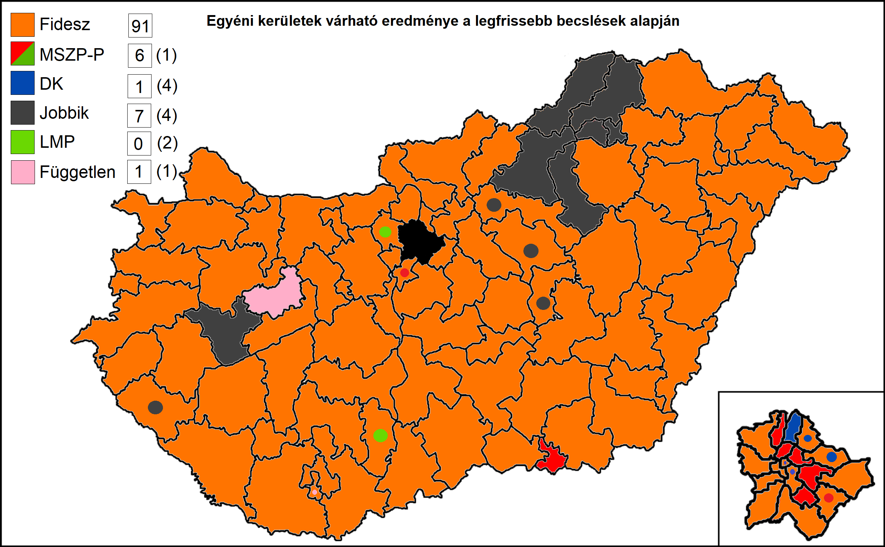

<h1 class="page-title">{{ page.title | escape }}</h1>

    

          

		  <h5>Ha most vasárnap lennének a választások, melyik párt hány képviselőt küldene a parlamentbe?</h5> 

Az alábbi táblázat összefoglalja a várható egyéni (106) és listás (93) mandátumok kiosztását.

<h6><strong>A következő becslés várható időpontja: 2018. március 19.</strong></h6>

<table class="striped">
              <thead>
                <tr>
                    <th>Pártok</th>
                    <th>Egyéni mandátum</th>
					<th>Listás mandátum</th>
					<th>Összes mandátum</th>
					<th>Mandátumarány</th>
                </tr>
              </thead>
              <tbody>
             <tr>
                  <td>Fidesz</td>
				  <td>91</td>
				  <td>40</td>
				  <td>131</td>
				  <td>66%</td>
			</tr>
			<tr>
				  <td>Jobbik</td>
				  <td>7</td>
				  <td>22</td>
				  <td>29</td>
				  <td>14.5%</td>
			</tr>
			<tr>
                  <td>MSZP-Párbeszéd</td>
				  <td>6</td>
				  <td>15</td>
				  <td>21</td>
				  <td>10.5%</td>
			</tr>
			<tr>
			      <td>DK</td>
                  <td>1</td>
				  <td>8</td>
				  <td>9</td>
				  <td>4.5%</td>
			</tr>
			<tr>
				 <td>LMP</td>
				<td>0</td>
				  <td>8</td>
				  <td>8</td>
				  <td>4%%</td>
			</tr>  
			<td>Független</td>
				<td>1</td>
				  <td>1</td>
				  <td>0</td>
				  <td>0.5%</td>
              </tbody>
            </table>
<h5>Eredmény: A Fidesz stabil többséget szerez a parlamentben 131 mandátummal.</h5>
 
<h6><strong>Magasabb átszavazási hajlandóság és koordináció mellett a Fidesz várható mandátumainak száma 120-ra csökken.</strong></h6>
<h6>Utolsó frissítés: 2018. március 12.</h6>
          

    

	
 

    

          

		  <h5>Egyéni kerületek sorsa</h5> 

Az alábbi táblázat megmutatja, hogy az egyéni választókerületekben mely párt és milyen arányban győzedelmeskedne. A lista folyamatosan frissül <a href="/meresek">az új közvélemény-kutatási eredmények tükrében.</a>

A térképen az egyes pártok győztes kerületei láthatók. A kis színes körök az ellenzék számára nyerhető körzeteket mutatják.

 

 
            <table class="striped">
              <thead>
                <tr>
                    <th>Választókerület</th>
                    <th>Győztes</th>
					<th>Második</th>
					<th>Különbség</th>
                </tr>
              </thead>
              <tbody>
<tr><td><a href="../bp1">Budapesti 1.</a></td>
<td id="gyoztes_bp1">Fidesz</td>
<td id="masodik_bp1">MSZP-Párbeszéd/DK</td>
<td id="kulonbseg_bp1">18.8%</td></tr>	
<tr><td><a href="../bp2">Budapesti 2.</a></td>
<td id="gyoztes_bp2">Fidesz</td>
<td id="masodik_bp2">MSZP-Párbeszéd/DK</td>
<td id="kulonbseg_bp2">9.4%</td></tr>	
<tr><td><a href="../bp3">Budapesti 3.</a></td>
<td id="gyoztes_bp3">Fidesz</td>
<td id="masodik_bp3">MSZP-Párbeszéd/DK</td>
<td id="kulonbseg_bp3">13.3%</td></tr>	
<tr><td><a href="../bp4">Budapesti 4.</a></td>
<td id="gyoztes_bp4">Fidesz</td>
<td id="masodik_bp4">MSZP-Párbeszéd/DK</td>
<td id="kulonbseg_bp4">9.5%</td></tr>	
<tr><td><a href="../bp5">Budapesti 5.</a></td>
<td id="gyoztes_bp5">Fidesz</td>
<td id="masodik_bp5">MSZP-Párbeszéd/DK</td>
<td id="kulonbseg_bp5">0.8%</td></tr>	
<tr><td><a href="../bp6">Budapesti 6.</a></td>
<td id="gyoztes_bp6">Fidesz</td>
<td id="masodik_bp6">MSZP-Párbeszéd/DK</td>
<td id="kulonbseg_bp6">1.2%</td></tr>	
<tr><td><a href="../bp7">Budapesti 7.</a></td>
<td id="gyoztes_bp7">MSZP-Párbeszéd/DK</td>
<td id="masodik_bp7">Fidesz</td>
<td id="kulonbseg_bp7">16.3%</td></tr>	
<tr><td><a href="../bp8">Budapesti 8.</a></td>
<td id="gyoztes_bp8">MSZP-Párbeszéd/DK</td>
<td id="masodik_bp8">Fidesz</td>
<td id="kulonbseg_bp8">2.7%</td></tr>	
<tr><td><a href="../bp9">Budapesti 9.</a></td>
<td id="gyoztes_bp9">MSZP-Párbeszéd/DK</td>
<td id="masodik_bp9">Fidesz</td>
<td id="kulonbseg_bp9">1.1%</td></tr>	
<tr><td><a href="../bp10">Budapesti 10.</a></td>
<td id="gyoztes_bp10">MSZP-Párbeszéd/DK</td>
<td id="masodik_bp10">Fidesz</td>
<td id="kulonbseg_bp10">2.3%</td></tr>	
<tr><td><a href="../bp11">Budapesti 11.</a></td>
<td id="gyoztes_bp11">MSZP-Párbeszéd/DK</td>
<td id="masodik_bp11">Fidesz</td>
<td id="kulonbseg_bp11">7.7%</td></tr>	
<tr><td><a href="../bp12">Budapesti 12.</a></td>
<td id="gyoztes_bp12">Fidesz</td>
<td id="masodik_bp12">MSZP-Párbeszéd/DK</td>
<td id="kulonbseg_bp12">0.5%</td></tr>	
<tr><td><a href="../bp13">Budapesti 13.</a></td>
<td id="gyoztes_bp13">Fidesz</td>
<td id="masodik_bp13">MSZP-Párbeszéd/DK</td>
<td id="kulonbseg_bp13">4.7%</td></tr>	
<tr><td><a href="../bp14">Budapesti 14.</a></td>
<td id="gyoztes_bp14">Fidesz</td>
<td id="masodik_bp14">MSZP-Párbeszéd/DK</td>
<td id="kulonbseg_bp14">10.1%</td></tr>	
<tr><td><a href="../bp15">Budapesti 15.</a></td>
<td id="gyoztes_bp15">Fidesz</td>
<td id="masodik_bp15">MSZP-Párbeszéd/DK</td>
<td id="kulonbseg_bp15">0.1%</td></tr>	
<tr><td><a href="../bp16">Budapesti 16.</a></td>
<td id="gyoztes_bp16">MSZP-Párbeszéd/DK</td>
<td id="masodik_bp16">Fidesz</td>
<td id="kulonbseg_bp16">2.0%</td></tr>	
<tr><td><a href="../bp17">Budapesti 17.</a></td>
<td id="gyoztes_bp17">Fidesz</td>
<td id="masodik_bp17">MSZP-Párbeszéd/DK</td>
<td id="kulonbseg_bp17">6.0%</td></tr>	
<tr><td><a href="../bp18">Budapesti 18.</a></td>
<td id="gyoztes_bp18">Fidesz</td>
<td id="masodik_bp18">MSZP-Párbeszéd/DK</td>
<td id="kulonbseg_bp18">5.4%</td></tr>	
<tr><td><a href="../bk1">Bács-Kiskun megyei 1.</a></td>
<td id="gyoztes_bk1">Fidesz</td>
<td id="masodik_bk1">Jobbik</td>
<td id="kulonbseg_bk1">27.5%</td></tr>	
<tr><td><a href="../bk2">Bács-Kiskun megyei 2.</a></td>
<td id="gyoztes_bk2">Fidesz</td>
<td id="masodik_bk2">Jobbik</td>
<td id="kulonbseg_bk2">30.1%</td></tr>	
<tr><td><a href="../bk3">Bács-Kiskun megyei 3.</a></td>
<td id="gyoztes_bk3">Fidesz</td>
<td id="masodik_bk3">Jobbik</td>
<td id="kulonbseg_bk3">19.1%</td></tr>	
<tr><td><a href="../bk4">Bács-Kiskun megyei 4.</a></td>
<td id="gyoztes_bk4">Fidesz</td>
<td id="masodik_bk4">Jobbik</td>
<td id="kulonbseg_bk4">23.5%</td></tr>	
<tr><td><a href="../bk5">Bács-Kiskun megyei 5.</a></td>
<td id="gyoztes_bk5">Fidesz</td>
<td id="masodik_bk5">Jobbik</td>
<td id="kulonbseg_bk5">19.3%</td></tr>	
<tr><td><a href="../bk6">Bács-Kiskun megyei 6.</a></td>
<td id="gyoztes_bk6">Fidesz</td>
<td id="masodik_bk6">MSZP-Párbeszéd/DK</td>
<td id="kulonbseg_bk6">28.0%</td></tr>	
<tr><td><a href="../ba1">Baranya megyei 1.</a></td>
<td id="gyoztes_ba1">Fidesz</td>
<td id="masodik_ba1">Dr. Mellár Tamás</td>
<td id="kulonbseg_ba1">3.0%</td></tr>	
<tr><td><a href="../ba2">Baranya megyei 2.</a></td>
<td id="gyoztes_ba2">Fidesz</td>
<td id="masodik_ba2">MSZP-Párbeszéd/DK</td>
<td id="kulonbseg_ba2">9.4%</td></tr>	
<tr><td><a href="../ba3">Baranya megyei 3.</a></td>
<td id="gyoztes_ba3">Fidesz</td>
<td id="masodik_ba3">Jobbik</td>
<td id="kulonbseg_ba3">29.5%</td></tr>	
<tr><td><a href="../ba4">Baranya megyei 4.</a></td>
<td id="gyoztes_ba4">Fidesz</td>
<td id="masodik_ba4">MSZP-Párbeszéd/DK</td>
<td id="kulonbseg_ba4">20.7%</td></tr>	
<tr><td><a href="../be1">Békés megyei 1.</a></td>
<td id="gyoztes_be1">Fidesz</td>
<td id="masodik_be1">MSZP-Párbeszéd/DK</td>
<td id="kulonbseg_be1">16.3%</td></tr>	
<tr><td><a href="../be2">Békés megyei 2.</a></td>
<td id="gyoztes_be2">Fidesz</td>
<td id="masodik_be2">Jobbik</td>
<td id="kulonbseg_be2">12.9%</td></tr>	
<tr><td><a href="../be3">Békés megyei 3.</a></td>
<td id="gyoztes_be3">Fidesz</td>
<td id="masodik_be3">Jobbik</td>
<td id="kulonbseg_be3">27.0%</td></tr>	
<tr><td><a href="../be4">Békés megyei 4.</a></td>
<td id="gyoztes_be4">Fidesz</td>
<td id="masodik_be4">Jobbik</td>
<td id="kulonbseg_be4">19.6%</td></tr>	
<tr><td><a href="../baz1">Borsod-Abaúj-Zemplén megyei 1.</a></td>
<td id="gyoztes_baz1">Jobbik</td>
<td id="masodik_baz1">Fidesz</td>
<td id="kulonbseg_baz1">9.3%</td></tr>
<tr><td><a href="../baz2">Borsod-Abaúj-Zemplén megyei 2.</a></td>
<td id="gyoztes_baz2">Jobbik</td>
<td id="masodik_baz2">Fidesz</td>
<td id="kulonbseg_baz2">13.4%</td></tr>	
<tr><td><a href="../baz3">Borsod-Abaúj-Zemplén megyei 3.</a></td>
<td id="gyoztes_baz3">Jobbik</td>
<td id="masodik_baz3">Fidesz</td>
<td id="kulonbseg_baz3">1.9%</td></tr>	
<tr><td><a href="../baz4">Borsod-Abaúj-Zemplén megyei 4.</a></td>
<td id="gyoztes_baz4">Jobbik</td>
<td id="masodik_baz4">Fidesz</td>
<td id="kulonbseg_baz4">2.0%</td></tr>	
<tr><td><a href="../baz5">Borsod-Abaúj-Zemplén megyei 5.</a></td>
<td id="gyoztes_baz5">Fidesz</td>
<td id="masodik_baz5">Jobbik</td>
<td id="kulonbseg_baz5">9.9%</td></tr>	
<tr><td><a href="../baz6">Borsod-Abaúj-Zemplén megyei 6.</a></td>
<td id="gyoztes_baz6">Fidesz</td>
<td id="masodik_baz6">Jobbik</td>
<td id="kulonbseg_baz6">1.1%</td></tr>	
<tr><td><a href="../baz7">Borsod-Abaúj-Zemplén megyei 7.</a></td>
<td id="gyoztes_baz7">Fidesz</td>
<td id="masodik_baz7">Jobbik</td>
<td id="kulonbseg_baz7">12.4%</td></tr>	
<tr><td><a href="../cs1">Csongrád megyei 1.</a></td>
<td id="gyoztes_cs1">MSZP-Párbeszéd/DK</td>
<td id="masodik_cs1">Fidesz</td>
<td id="kulonbseg_cs1">5.8%</td></tr>	
<tr><td><a href="../cs2">Csongrád megyei 2.</a></td>
<td id="gyoztes_cs2">Fidesz</td>
<td id="masodik_cs2">MSZP-Párbeszéd/DK</td>
<td id="kulonbseg_cs2">11.0%</td></tr>	
<tr><td><a href="../cs3">Csongrád megyei 3.</a></td>
<td id="gyoztes_cs3">Fidesz</td>
<td id="masodik_cs3">Jobbik</td>
<td id="kulonbseg_cs3">12.0%</td></tr>	
<tr><td><a href="../cs4">Csongrád megyei 4.</a></td>
<td id="gyoztes_cs4">Fidesz</td>
<td id="masodik_cs4">Jobbik</td>
<td id="kulonbseg_cs4">5.5%</td></tr>	
<tr><td><a href="../fe1">Fejér megyei 1.</a></td>
<td id="gyoztes_fe1">Fidesz</td>
<td id="masodik_fe1">MSZP-Párbeszéd/DK</td>
<td id="kulonbseg_fe1">17.5%</td></tr>	
<tr><td><a href="../fe2">Fejér megyei 2.</a></td>
<td id="gyoztes_fe2">Fidesz</td>
<td id="masodik_fe2">Jobbik</td>
<td id="kulonbseg_fe2">20.0%</td></tr>	
<tr><td><a href="../fe3">Fejér megyei 3.</a></td>
<td id="gyoztes_fe3">Fidesz</td>
<td id="masodik_fe3">Jobbik</td>
<td id="kulonbseg_fe3">29.2%</td></tr>	
<tr><td><a href="../fe4">Fejér megyei 4.</a></td>
<td id="gyoztes_fe4">Fidesz</td>
<td id="masodik_fe4">Jobbik</td>
<td id="kulonbseg_fe4">6.3%</td></tr>	
<tr><td><a href="../fe5">Fejér megyei 5.</a></td>
<td id="gyoztes_fe5">Fidesz</td>
<td id="masodik_fe5">Jobbik</td>
<td id="kulonbseg_fe5">11.2%</td></tr>	
<tr><td><a href="../gy1">Győr-Moson-Sopron megyei 1.</a></td>
<td id="gyoztes_gy1">Fidesz</td>
<td id="masodik_gy1">MSZP-Párbeszéd/DK</td>
<td id="kulonbseg_gy1">19.4%</td></tr>	
<tr><td><a href="../gy2">Győr-Moson-Sopron megyei 2.</a></td>
<td id="gyoztes_gy2">Fidesz</td>
<td id="masodik_gy2">Jobbik</td>
<td id="kulonbseg_gy2">34.5%</td></tr>	
<tr><td><a href="../gy3">Győr-Moson-Sopron megyei 3.</a></td>
<td id="gyoztes_gy3">Fidesz</td>
<td id="masodik_gy3">Jobbik</td>
<td id="kulonbseg_gy3">31.4%</td></tr>	
<tr><td><a href="../gy4">Győr-Moson-Sopron megyei 4.</a></td>
<td id="gyoztes_gy4">Fidesz</td>
<td id="masodik_gy4">MSZP-Párbeszéd/DK</td>
<td id="kulonbseg_gy4">28.9%</td></tr>	
<tr><td><a href="../gy5">Győr-Moson-Sopron megyei 5.</a></td>
<td id="gyoztes_gy5">Fidesz</td>
<td id="masodik_gy5">Jobbik</td>
<td id="kulonbseg_gy5">28.2%</td></tr>	
<tr><td><a href="../hb1">Hajdú-Bihar megyei 1.</a></td>
<td id="gyoztes_hb1">Fidesz</td>
<td id="masodik_hb1">MSZP-Párbeszéd/DK</td>
<td id="kulonbseg_hb1">23.1%</td></tr>	
<tr><td><a href="../hb2">Hajdú-Bihar megyei 2.</a></td>
<td id="gyoztes_hb2">Fidesz</td>
<td id="masodik_hb2">Jobbik</td>
<td id="kulonbseg_hb2">18.5%</td></tr>	
<tr><td><a href="../hb3">Hajdú-Bihar megyei 3.</a></td>
<td id="gyoztes_hb3">Fidesz</td>
<td id="masodik_hb3">Jobbik</td>
<td id="kulonbseg_hb3">19.0%</td></tr>	
<tr><td><a href="../hb4">Hajdú-Bihar megyei 4.</a></td>
<td id="gyoztes_hb4">Fidesz</td>
<td id="masodik_hb4">Jobbik</td>
<td id="kulonbseg_hb4">10.5%</td></tr>	
<tr><td><a href="../hb5">Hajdú-Bihar megyei 5.</a></td>
<td id="gyoztes_hb5">Fidesz</td>
<td id="masodik_hb5">Jobbik</td>
<td id="kulonbseg_hb5">8.7%</td></tr>	
<tr><td><a href="../hb6">Hajdú-Bihar megyei 6.</a></td>
<td id="gyoztes_hb6">Fidesz</td>
<td id="masodik_hb6">Jobbik</td>
<td id="kulonbseg_hb6">12.7%</td></tr>	
<tr><td><a href="../he1">Heves megyei 1.</a></td>
<td id="gyoztes_he1">Jobbik</td>
<td id="masodik_he1">Fidesz</td>
<td id="kulonbseg_he1">0.7%</td></tr>	
<tr><td><a href="../he2">Heves megyei 2.</a></td>
<td id="gyoztes_he2">Jobbik</td>
<td id="masodik_he2">Fidesz</td>
<td id="kulonbseg_he2">8.3%</td></tr>	
<tr><td><a href="../he3">Heves megyei 3.</a></td>
<td id="gyoztes_he3">Fidesz</td>
<td id="masodik_he3">Jobbik</td>
<td id="kulonbseg_he3">1.3%</td></tr>	
<tr><td><a href="../sz1">Jász-Nagykun-Szolnok megyei 1.</a></td>
<td id="gyoztes_sz1">Fidesz</td>
<td id="masodik_sz1">Jobbik</td>
<td id="kulonbseg_sz1">7.3%</td></tr>	
<tr><td><a href="../sz2">Jász-Nagykun-Szolnok megyei 2.</a></td>
<td id="gyoztes_sz2">Fidesz</td>
<td id="masodik_sz2">Jobbik</td>
<td id="kulonbseg_sz2">4.2%</td></tr>	
<tr><td><a href="../sz3">Jász-Nagykun-Szolnok megyei 3.</a></td>
<td id="gyoztes_sz3">Fidesz</td>
<td id="masodik_sz3">Jobbik</td>
<td id="kulonbseg_sz3">19.1%</td></tr>	
<tr><td><a href="../sz4">Jász-Nagykun-Szolnok megyei 4.</a></td>
<td id="gyoztes_sz4">Fidesz</td>
<td id="masodik_sz4">Jobbik</td>
<td id="kulonbseg_sz4">2.5%</td></tr>	
<tr><td><a href="../ke1">Komárom-Esztergom megyei 1.</a></td>
<td id="gyoztes_ke1">Fidesz</td>
<td id="masodik_ke1">MSZP-Párbeszéd/DK</td>
<td id="kulonbseg_ke1">10.7%</td></tr>	
<tr><td><a href="../ke2">Komárom-Esztergom megyei 2.</a></td>
<td id="gyoztes_ke2">Fidesz</td>
<td id="masodik_ke2">MSZP-Párbeszéd/DK</td>
<td id="kulonbseg_ke2">23.3%</td></tr>	
<tr><td><a href="../ke3">Komárom-Esztergom megyei 3.</a></td>
<td id="gyoztes_ke3">Fidesz</td>
<td id="masodik_ke3">Jobbik</td>
<td id="kulonbseg_ke3">23.1%</td></tr>	
<tr><td><a href="../no1">Nógrád megyei 1.</a></td>
<td id="gyoztes_no1">Fidesz</td>
<td id="masodik_no1">Jobbik</td>
<td id="kulonbseg_no1">11.2%</td></tr>	
<tr><td><a href="../no2">Nógrád megyei 2.</a></td>
<td id="gyoztes_no2">Fidesz</td>
<td id="masodik_no2">Jobbik</td>
<td id="kulonbseg_no2">18.4%</td></tr>	
<tr><td><a href="../pe1">Pest megyei 1.</a></td>
<td id="gyoztes_pe1">Fidesz</td>
<td id="masodik_pe1">MSZP-Párbeszéd/DK</td>
<td id="kulonbseg_pe1">11.1%</td></tr>	
<tr><td><a href="../pe2">Pest megyei 2.</a></td>
<td id="gyoztes_pe2">Fidesz</td>
<td id="masodik_pe2">LMP</td>
<td id="kulonbseg_pe2">12.8%</td></tr>	
<tr><td><a href="../pe3">Pest megyei 3.</a></td>
<td id="gyoztes_pe3">Fidesz</td>
<td id="masodik_pe3">MSZP-Párbeszéd/DK</td>
<td id="kulonbseg_pe3">23.3%</td></tr>	
<tr><td><a href="../pe4">Pest megyei 4.</a></td>
<td id="gyoztes_pe4">Fidesz</td>
<td id="masodik_pe4">Jobbik</td>
<td id="kulonbseg_pe4">23.3%</td></tr>	
<tr><td><a href="../pe5">Pest megyei 5.</a></td>
<td id="gyoztes_pe5">Fidesz</td>
<td id="masodik_pe5">MSZP-Párbeszéd/DK</td>
<td id="kulonbseg_pe5">9.4%</td></tr>	
<tr><td><a href="../pe6">Pest megyei 6.</a></td>
<td id="gyoztes_pe6">Fidesz</td>
<td id="masodik_pe6">MSZP-Párbeszéd/DK</td>
<td id="kulonbseg_pe6">20.3%</td></tr>	
<tr><td><a href="../pe7">Pest megyei 7.</a></td>
<td id="gyoztes_pe7">Fidesz</td>
<td id="masodik_pe7">MSZP-Párbeszéd/DK</td>
<td id="kulonbseg_pe7">17.9%</td></tr>	
<tr><td><a href="../pe8">Pest megyei 8.</a></td>
<td id="gyoztes_pe8">Fidesz</td>
<td id="masodik_pe8">MSZP-Párbeszéd/DK</td>
<td id="kulonbseg_pe8">11.5%</td></tr>	
<tr><td><a href="../pe9">Pest megyei 9.</a></td>
<td id="gyoztes_pe9">Fidesz</td>
<td id="masodik_pe9">Jobbik</td>
<td id="kulonbseg_pe9">17.2%</td></tr>	
<tr><td><a href="../pe10">Pest megyei 10.</a></td>
<td id="gyoztes_pe10">Fidesz</td>
<td id="masodik_pe10">Jobbik</td>
<td id="kulonbseg_pe10">11.6%</td></tr>	
<tr><td><a href="../pe11">Pest megyei 11.</a></td>
<td id="gyoztes_pe11">Fidesz</td>
<td id="masodik_pe11">Jobbik</td>
<td id="kulonbseg_pe11">24.4%</td></tr>	
<tr><td><a href="../pe12">Pest megyei 12.</a></td>
<td id="gyoztes_pe12">Fidesz</td>
<td id="masodik_pe12">Jobbik</td>
<td id="kulonbseg_pe12">6.2%</td></tr>	
<tr><td><a href="../so1">Somogy megyei 1.</a></td>
<td id="gyoztes_so1">Fidesz</td>
<td id="masodik_so1">MSZP-Párbeszéd/DK</td>
<td id="kulonbseg_so1">15.6%</td></tr>	
<tr><td><a href="../so2">Somogy megyei 2.</a></td>
<td id="gyoztes_so2">Fidesz</td>
<td id="masodik_so2">Jobbik</td>
<td id="kulonbseg_so2">13.9%</td></tr>	
<tr><td><a href="../so3">Somogy megyei 3.</a></td>
<td id="gyoztes_so3">Fidesz</td>
<td id="masodik_so3">Jobbik</td>
<td id="kulonbseg_so3">21.8%</td></tr>	
<tr><td><a href="../so4">Somogy megyei 4.</a></td>
<td id="gyoztes_so4">Fidesz</td>
<td id="masodik_so4">Jobbik</td>
<td id="kulonbseg_so4">24.2%</td></tr>	
<tr><td><a href="../szb1">Szabolcs-Szatmár-Bereg megyei 1.</a></td>
<td id="gyoztes_szb1">Fidesz</td>
<td id="masodik_szb1">MSZP-Párbeszéd/DK</td>
<td id="kulonbseg_szb1">7.8%</td></tr>	
<tr><td><a href="../szb2">Szabolcs-Szatmár-Bereg megyei 2.</a></td>
<td id="gyoztes_szb2">Fidesz</td>
<td id="masodik_szb2">Jobbik</td>
<td id="kulonbseg_szb2">6.5%</td></tr>	
<tr><td><a href="../szb3">Szabolcs-Szatmár-Bereg megyei 3.</a></td>
<td id="gyoztes_szb3">Fidesz</td>
<td id="masodik_szb3">Jobbik</td>
<td id="kulonbseg_szb3">14.5%</td></tr>	
<tr><td><a href="../szb4">Szabolcs-Szatmár-Bereg megyei 4.</a></td>
<td id="gyoztes_szb4">Fidesz</td>
<td id="masodik_szb4">Jobbik</td>
<td id="kulonbseg_szb4">20.6%</td></tr>	
<tr><td><a href="../szb5">Szabolcs-Szatmár-Bereg megyei 5.</a></td>
<td id="gyoztes_szb5">Fidesz</td>
<td id="masodik_szb5">Jobbik</td>
<td id="kulonbseg_szb5">17.0%</td></tr>	
<tr><td><a href="../szb6">Szabolcs-Szatmár-Bereg megyei 6.</a></td>
<td id="gyoztes_szb6">Fidesz</td>
<td id="masodik_szb6">Jobbik</td>
<td id="kulonbseg_szb6">11.5%</td></tr>	
<tr><td><a href="../to1">Tolna megyei 1.</a></td>
<td id="gyoztes_to1">Fidesz</td>
<td id="masodik_to1">LMP</td>
<td id="kulonbseg_to1">6.4%</td></tr>	
<tr><td><a href="../to2">Tolna megyei 2.</a></td>
<td id="gyoztes_to2">Fidesz</td>
<td id="masodik_to2">Jobbik</td>
<td id="kulonbseg_to2">21.4%</td></tr>	
<tr><td><a href="../to3">Tolna megyei 3.</a></td>
<td id="gyoztes_to3">Fidesz</td>
<td id="masodik_to3">Jobbik</td>
<td id="kulonbseg_to3">18.7%</td></tr>	
<tr><td><a href="../va1">Vas megyei 1.</a></td>
<td id="gyoztes_va1">Fidesz</td>
<td id="masodik_va1">MSZP-Párbeszéd/DK</td>
<td id="kulonbseg_va1">13.9%</td></tr>	
<tr><td><a href="../va2">Vas megyei 2.</a></td>
<td id="gyoztes_va2">Fidesz</td>
<td id="masodik_va2">MSZP-Párbeszéd/DK</td>
<td id="kulonbseg_va2">32.1%</td></tr>	
<tr><td><a href="../va3">Vas megyei 3.</a></td>
<td id="gyoztes_va3">Fidesz</td>
<td id="masodik_va3">Jobbik</td>
<td id="kulonbseg_va3">28.1%</td></tr>	
<tr><td><a href="../ve1">Veszprém megyei 1.</a></td>
<td id="gyoztes_ve1">Kész Zoltán</td>
<td id="masodik_ve1">Fidesz</td>
<td id="kulonbseg_ve1">2.0%</td></tr>	
<tr><td><a href="../ve2">Veszprém megyei 2.</a></td>
<td id="gyoztes_ve2">Fidesz</td>
<td id="masodik_ve2">MSZP-Párbeszéd/DK</td>
<td id="kulonbseg_ve2">22.3%</td></tr>	
<tr><td><a href="../ve3">Veszprém megyei 3.</a></td>
<td id="gyoztes_ve3">Jobbik</td>
<td id="masodik_ve3">Fidesz</td>
<td id="kulonbseg_ve3">2.5%</td></tr>	
<tr><td><a href="../ve4">Veszprém megyei 4.</a></td>
<td id="gyoztes_ve4">Fidesz</td>
<td id="masodik_ve4">Jobbik</td>
<td id="kulonbseg_ve4">25.2%</td></tr>	
<tr><td><a href="../za1">Zala megyei 1.</a></td>
<td id="gyoztes_za1">Fidesz</td>
<td id="masodik_za1">Jobbik</td>
<td id="kulonbseg_za1">20.2%</td></tr>	
<tr><td><a href="../za2">Zala megyei 2.</a></td>
<td id="gyoztes_za2">Fidesz</td>
<td id="masodik_za2">Jobbik</td>
<td id="kulonbseg_za2">16.0%</td></tr>	
<tr><td><a href="../za3">Zala megyei 3.</a></td>
<td id="gyoztes_za3">Fidesz</td>
<td id="masodik_za3">Jobbik</td>
<td id="kulonbseg_za3">1.2%</td></tr>	
              </tbody>
            </table>
          

    

	
