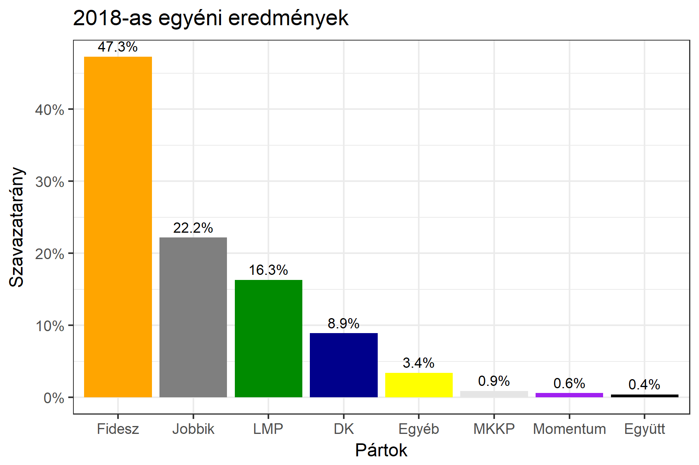

<h1 class="page-title">{{ page.title | escape }}</h1>

    

          

		  <h5>Nógrád megye 1-es választókerület (Salgótarján)</h5>
 <h5><strong>2018-as egyéni eredmények</strong></h5>  <table class="striped">
              <thead>
                <tr>
                    <th>Jelöltek</th>
                    <th>Szavazatarány (százalék)</th>
<th>Eltérés a becsléstől</th>
                </tr>
              </thead>
              <tbody>
             <tr>
                  <td>dr. Becsó Károly - Fidesz-KDNP </td>
				   <td id="id_fidesz">47.3%</td>
				   <td>+8.7%</td>
			</tr>
			<tr><td>Cseresznyés István - Jobbik </td> 
		<td id="id_jobbik">22.2%</td>
				   <td>-7.4%</td>
			</tr>
<tr>
                  <td>Kovács Zsolt - DK </td>
				  <td id="id_baloldal">8.9%</td>
				   <td>-8.9%</td>
			</tr>
			<tr>
                  <td>Dömsödi Gábor - LMP </td>
				<td id="id_lmp">16.3%</td>
				   <td>+4.5%</td>
			</tr>
			<tr>
				  <td>Tóth Csaba - Momentum </td>
				  <td id="id_momentum">0.6%</td>
				   <td>-0.5%</td>
			</tr>
<tr>
<td>Nógrádi Nóra -  Együtt </td>
 <td id="id_egyutt">0.4%</td>
				   <td>-0.3%</td>
</tr>       
<tr>
<td>Betes Mona - MKKP </td>
 <td id="id_mkkp">0.9%</td>
				   <td>+0.4%</td>
</tr>           
              </tbody>
            </table><h6><strong>Választókerületi profil (2014-ben): Enyhén Fideszes (baloldal / Jobbik az esélyes kihívók)</strong></h6>
 

 
			

          

    

    

          

		  <h5>Nógrád megye 1-es választókerület (Salgótarján) - 2014-es eredmények</h5>
            <table class="striped">
              <thead>
                <tr>
                    <th>Jelöltek</th>
                    <th>Szavazatarányok</th>
                </tr>
              </thead>
              <tbody>
             <tr>
                  <td>Becsó Zsolt - Fidesz-KDNP</td>
				  <td>37.6%</td>
			</tr>
			<tr>
			      <td>Boldvai László Róbert - Összefogás (MSZP-Együtt-DK-PM-MLP)</td>
				  <td>26.9%</td>
			      
			</tr>
			<tr>
			      <td>Kutas József - Jobbik</td>
				  <td>23.5%</td>
			</tr>
			<tr>
				  <td>Komlósi Csaba - LMP</td>
				  <td>2.6%</td>
			</tr>  
            <tr>
				  <td>Seres Mária - SMS</td>
				  <td>2.5%</td>
			</tr> 			
              </tbody>
            </table>
			<h5>Győztes: Fidesz-KDNP, 10.7%-kal</h5>
          

    

