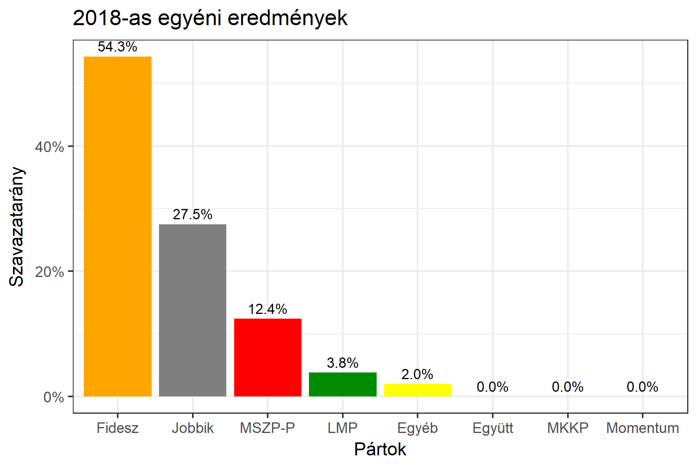

<h1 class="page-title">{{ page.title | escape }}</h1>

    

          

		  <h5>Nógrád megye 2-es választókerület (Balassagyarmat)</h5>
 <h5><strong>2018-as egyéni eredmények</strong></h5>  <table class="striped">
              <thead>
                <tr>
                    <th>Jelöltek</th>
                    <th>Szavazatarány (százalék)</th>
<th>Eltérés a becsléstől</th>
                </tr>
              </thead>
              <tbody>
             <tr>
                  <td>Balla Mihály - Fidesz-KDNP </td>
				   <td id="id_fidesz">54.3%</td>
				   <td>+5.5%</td>
			</tr>
			<tr><td>Dobrocsi Lénárd - Jobbik </td> 
		<td id="id_jobbik">27.5%</td>
				   <td>-5.5%</td>
			</tr>
<tr>
                  <td>Csukáné Szerémy Andrea </td>
				   <td id="id_baloldal">12.4%</td>
				   <td>-2.2%</td>
			</tr>
			<tr>
                  <td>Gyenes Szilárd - LMP </td>
				   <td id="id_lmp">3.8%</td>
				   <td>+0.2%</td>
			</tr>
			<tr>
				  </tr>
                
              </tbody>
            </table><h6><strong>Választókerületi profil (2014-ben): Biztos Fideszes</strong></h6>
 

 
			

          

    

    

          

		  <h5>Nógrád megye 2-es választókerület (Balassagyarmat) - 2014-es eredmények</h5>
            <table class="striped">
              <thead>
                <tr>
                    <th>Jelöltek</th>
                    <th>Szavazatarányok</th>
                </tr>
              </thead>
              <tbody>
             <tr>
                  <td>Balla Mihály Tibor - Fidesz-KDNP</td>
				  <td>48.8%</td>
			</tr>
			<tr>
			      <td>Kiss László - Jobbik</td>
				  <td>22.4%</td>
			</tr>
			<tr>
			      <td>Borenszki Ervin - Összefogás (MSZP-Együtt-DK-PM-MLP)</td>
				  <td>20.6%</td>  
			</tr>
			<tr>
				  <td>Zagyvai Sándor - LMP</td>
				  <td>3.1%</td>
			</tr>  	
              </tbody>
            </table>
			<h5>Győztes: Fidesz-KDNP, 26.4%-kal</h5>
          

    

