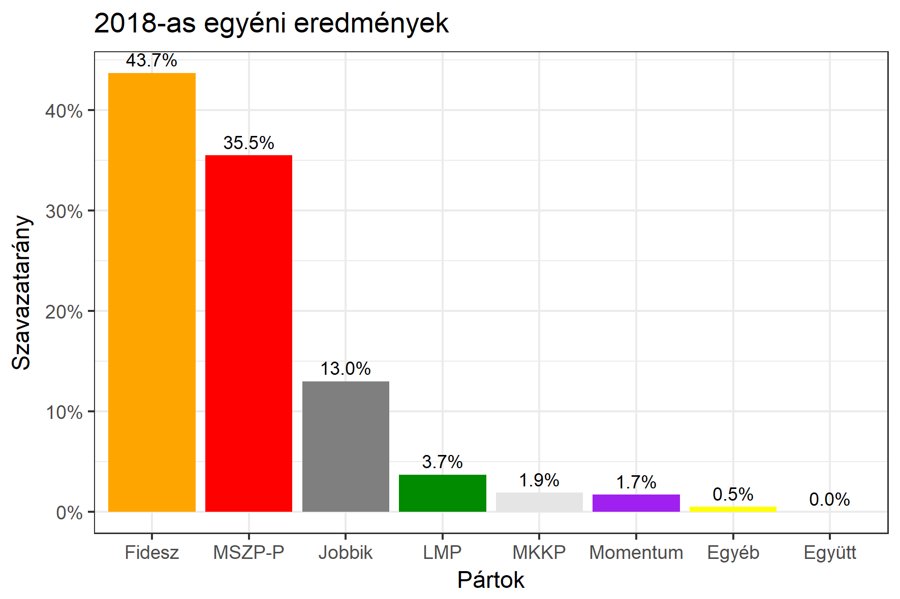

<h1 class="page-title">{{ page.title | escape }}</h1>

    

          

		  <h5>Pest megye 1-es választókerület (Érd)</h5>
 <h5><strong>2018-as egyéni eredmények</strong></h5>  <table class="striped">
              <thead>
                <tr>
                    <th>Jelöltek</th>
                    <th>Szavazatarány (százalék)</th>
<th>Eltérés a becsléstől</th>
                </tr>
              </thead>
              <tbody>
             <tr>
                  <td>dr. Aradszki András - Fidesz-KDNP </td>
				   <td id="id_fidesz">43.7%</td>
				   <td>+1.1%</td>
			</tr>
			<tr><td>Vágó Sebestyén - Jobbik </td> 
		<td id="id_jobbik">13.0%</td>
				   <td>-3.9%</td>
			</tr>
<tr>
                  <td>dr. Csőzik László - MSZP-Párbeszéd </td>
				   <td id="id_baloldal">35.5%</td>
				   <td>+4.8%</td>
			</tr>
			<tr>
                  <td>Turcsán Szabolcs - LMP </td>
				   <td id="id_lmp">3.7%</td>
				   <td>-2.8%</td>
			</tr>
			<tr>
				  <td>Gál Alex - Momentum </td>
				   <td id="id_momentum">1.7%</td>
				   <td>-0.6%</td>
			</tr>
         
<tr>
<td>Szécsi Barbara - MKKP </td>
 <td id="id_mkkp">1.9%</td>
				   <td>+1.0%</td>
</tr>         
              </tbody>
            </table><h6><strong>Választókerületi profil (2014-ben): Enyhén Fideszes (baloldali kihívó)</strong></h6>
 

 
			

          

    

    

          

		  <h5>Pest megye 1-es választókerület (Érd) - 2014-es eredmények</h5>
            <table class="striped">
              <thead>
                <tr>
                    <th>Jelöltek</th>
                    <th>Szavazatarányok</th>
                </tr>
              </thead>
              <tbody>
             <tr>
                  <td>Dr. Aradszki András - Fidesz-KDNP</td>
				  <td>43.0%</td>
			</tr>
			<tr>
			      <td>Dr. Dorosz Dávid - Összefogás (MSZP-Együtt-DK-PM-MLP)</td>
				  <td>31.6%</td>  
			</tr>
			<tr>
			      <td>Pulai Edina - Jobbik</td>
				  <td>16.0%</td>
			</tr>
			<tr>
				  <td>Varga Illés Levente - LMP</td>
				  <td>5.6%</td>
			</tr>  	
              </tbody>
            </table>
			<h5>Győztes: Fidesz-KDNP, 11.4%-kal</h5>
          

    

