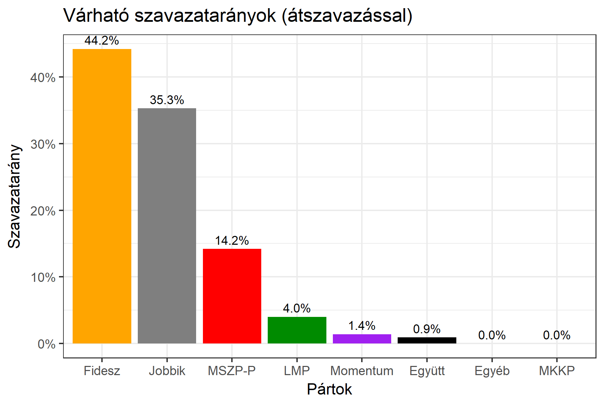

<h1 class="page-title">{{ page.title | escape }}</h1>

    

          
<h6><strong>A következő becslés várható időpontja: 2018. március 26.</strong></h6>
		  <h5>Pest megye 10-es választókerület (Monor)</h5>
 <h6><strong>Választókerületi profil (2014-ben): Biztos Fideszes</strong></h6>
 
<h6><strong>Legfrissebb 2018-as becslések eredménye (átszavazással):</strong></h6>  
			<h5><strong>Legesélyesebb ellenzéki jelölt: Lendvay Endre (Jobbik)</strong></h5>
<table class="striped">
              <thead>
                <tr>
                    <th>Jelöltek</th>
                    <th>Várható szavazatarány egyéniben (zárójelben az arányok átszavazás esetén)</th>
                </tr>
              </thead>
              <tbody>
             <tr>
                  <td>Pogácsás Tibor - Fidesz-KDNP </td>
				  <td id="id_fidesz">46.5% (45.0%)</td>
			</tr>
			<tr><td>Lendvay Endre - Jobbik </td><td id="id_jobbik">26.6% (34.5%)</td></tr>
<tr>
                  <td>Torzsa Sándor - MSZP-Párbeszéd </td>
				  <td id="id_baloldal">16.9% (14.7%)</td>
			</tr>
			<tr>
                  <td>Lutter Ferenc - LMP </td>
				  <td id="lmp">6.3% (3.7%)</td>
			</tr>
			<tr>
				  <td>Janzsó Miklós Csaba - Momentum </td>
				  <td id="id_momentum">2.2% (1.3%)</td>
			</tr>
<tr>
<td>Papp Roland -  Együtt </td>
<td id="id_egyutt">1.5% (0.9%)</td>
</tr>                
              </tbody>
            </table><h5>Várható győztes: Fidesz</h5>
			
			
 
<strong>Fontos:</strong> A becslések csak az egyéni jelöltre adott szavazatok arányát mutatják, nem a listás szavazatokét. A becslés jelentős eltérést mutathat a kisebb pártok esetében és olyan kerületekben, ahol nincs egyértelmű esélyes jelölt.

 
			
 <h6><strong>Becslés megbízhatósága a legesélyesebb jelöltről:</strong> <strong>A Jobbikos jelölt az egyértelmű esélyes</strong></h6>

Az aktuális becslés leírásáról <a href="../metodologia#0319">bővebben itt olvashatsz</a>.

          

    

    

          

		  <h5>Pest megye 10-es választókerület (Monor) - 2014-es eredmények</h5>
            <table class="striped">
              <thead>
                <tr>
                    <th>Jelöltek</th>
                    <th>Szavazatarányok</th>
                </tr>
              </thead>
              <tbody>
             <tr>
                  <td>Pogácsás Tibor János - Fidesz-KDNP</td>
				  <td>46.3%</td>
			</tr>
			<tr>
			      <td>Dr. Kereszturi Imre - Jobbik</td>
				  <td>25.3%</td>
			</tr>
			<tr>
			      <td>Braun Róbert - Összefogás (MSZP-Együtt-DK-PM-MLP)</td>
				  <td>21.5%</td>  
			</tr>
			<tr>
				  <td>Török László - LMP</td>
				  <td>3.6%</td>
			</tr>  	
              </tbody>
            </table>
			<h5>Győztes: Fidesz-KDNP, 21.0%-kal</h5>
          

    

