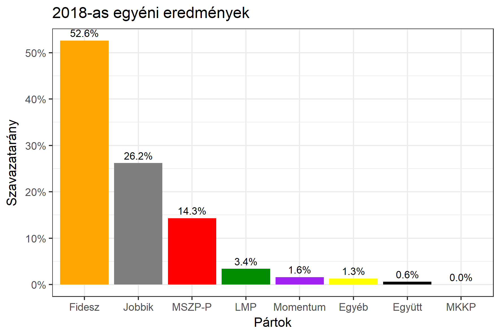

<h1 class="page-title">{{ page.title | escape }}</h1>

    

          

		  <h5>Pest megye 10-es választókerület (Monor)</h5>
 <h5><strong>2018-as egyéni eredmények</strong></h5>  <table class="striped">
              <thead>
                <tr>
                    <th>Jelöltek</th>
                    <th>Szavazatarány (százalék)</th>
<th>Eltérés a becsléstől</th>
                </tr>
              </thead>
              <tbody>
             <tr>
                  <td>Pogácsás Tibor - Fidesz-KDNP </td>
				   <td id="id_fidesz">52.6%</td>
				   <td>+8.4%</td>
			</tr>
			<tr><td>Lendvay Endre - Jobbik </td> 
			<td id="id_jobbik">26.2%</td>
				   <td>-9.1%</td>
			</tr>
<tr>
                  <td>Torzsa Sándor - MSZP-Párbeszéd </td>
				   <td id="id_baloldal">14.3%</td>
				   <td>+0.1%</td>
			</tr>
			<tr>
                  <td>Lutter Ferenc - LMP </td>
				   <td id="id_lmp">3.4%</td>
				   <td>-0.6%</td>
			</tr>
			<tr>
				  <td>Janzsó Miklós Csaba - Momentum </td>
				  <td id="id_momentum">1.6%</td>
				   <td>+0.2%</td>
			</tr>
<tr>
<td>Papp Roland -  Együtt </td>
 <td id="id_egyutt">0.6%</td>
				   <td>-0.3%</td>
</tr>                
              </tbody>
            </table><h6><strong>Választókerületi profil (2014-ben): Biztos Fideszes</strong></h6>
 

 
			

          

    

    

          

		  <h5>Pest megye 10-es választókerület (Monor) - 2014-es eredmények</h5>
            <table class="striped">
              <thead>
                <tr>
                    <th>Jelöltek</th>
                    <th>Szavazatarányok</th>
                </tr>
              </thead>
              <tbody>
             <tr>
                  <td>Pogácsás Tibor János - Fidesz-KDNP</td>
				  <td>46.3%</td>
			</tr>
			<tr>
			      <td>Dr. Kereszturi Imre - Jobbik</td>
				  <td>25.3%</td>
			</tr>
			<tr>
			      <td>Braun Róbert - Összefogás (MSZP-Együtt-DK-PM-MLP)</td>
				  <td>21.5%</td>  
			</tr>
			<tr>
				  <td>Török László - LMP</td>
				  <td>3.6%</td>
			</tr>  	
              </tbody>
            </table>
			<h5>Győztes: Fidesz-KDNP, 21.0%-kal</h5>
          

    

