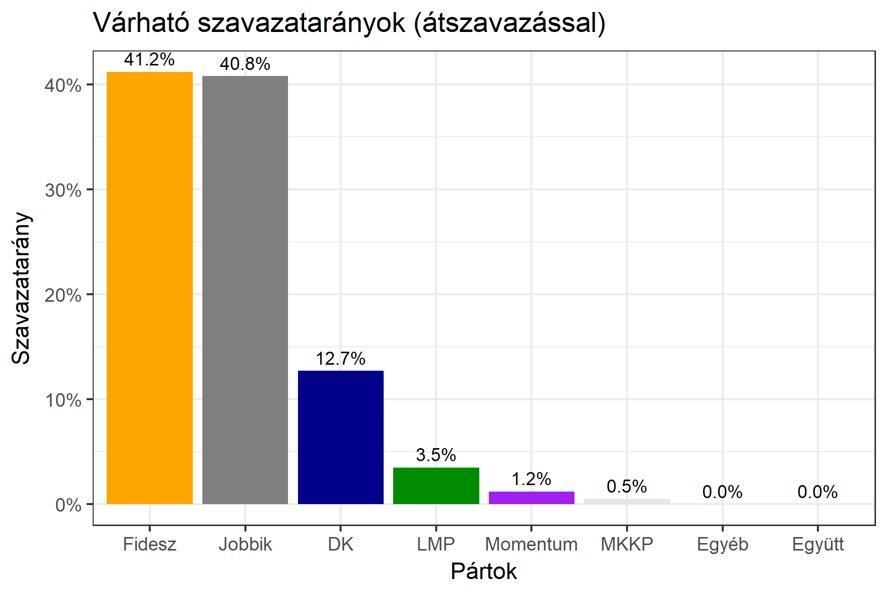

<h1 class="page-title">{{ page.title | escape }}</h1>

    

          
<h6><strong>A következő becslés várható időpontja: 2018. március 19.</strong></h6>
		  <h5>Pest megye 12-es választókerület (Cegléd)</h5>
 <h6><strong>Választókerületi profil (2014-ben): Stabil Fideszes</strong></h6>
 
<h6><strong>Legfrissebb 2018-as becslések eredménye:</strong></h6>  
			<h5><strong>Legesélyesebb ellenzéki jelölt: Jobbik</strong></h5>
<table class="striped">
              <thead>
                <tr>
                    <th>Jelöltek</th>
                    <th>Várható szavazatarány egyéniben (átszavazással)</th>
                </tr>
              </thead>
              <tbody>
             <tr>
                  <td>Földi László - Fidesz-KDNP </td>
				  <td id="id_fidesz">44.1%</td>
			</tr>
			<tr><td>Volner János - Jobbik </td><td id="id_jobbik">37.8%</td></tr>
<tr>
                  <td>dr. Szüdi János - DK </td>
				  <td id="id_baloldal">11.2%</td>
			</tr>
			<tr>
                  <td>Földi Áron - LMP </td>
				  <td id="lmp">4.1%</td>
			</tr>
			<tr>
				  <td>Mucsinyi Levente - Momentum </td>
				  <td id="id_momentum">1.8%</td>
			</tr>
          
<tr>
<td>Kis Viktor - MKKP </td>
<td id="id_mkkp">1.0%</td>
</tr>        
              </tbody>
            </table><h5>Várható győztes: Fidesz</h5>
			
			
 
<strong>Fontos:</strong> A becslések csak az egyéni jelöltre adott szavazatok arányát mutatják, nem a listás szavazatokét. A becslés jelentős eltérést mutathat a kisebb pártok esetében és olyan kerületekben, ahol nincs egyértelmű esélyes jelölt.

 
			
 <h6><strong>Becslés megbízhatósága a legesélyesebb jelöltről:</strong> <strong>Egyértelmű az esélyes - az esélyes jelölt várhatóan nem változik</strong></h6>

Megjegyzés a kerülethez: A Jobbik erős jelöltje - koordináció esetén - könnyen szorossá teheti a küzdelmet.

Az aktuális becslés leírásáról <a href="../metodologia#0312">bővebben itt olvashatsz</a>.

          

    

    

          

		  <h5>Pest megye 12-es választókerület (Cegléd) - 2014-es eredmények</h5>
            <table class="striped">
              <thead>
                <tr>
                    <th>Jelöltek</th>
                    <th>Szavazatarányok</th>
                </tr>
              </thead>
              <tbody>
             <tr>
                  <td>Földi László - Fidesz-KDNP</td>
				  <td>44.1%</td>
			</tr>
			<tr>
			      <td>Volner János - Jobbik</td>
				  <td>28.9%</td>
			</tr>
			<tr>
			      <td>Romhányiné Dr. Balogh Edit - Összefogás (MSZP-Együtt-DK-PM-MLP)</td>
				  <td>20.8%</td>  
			</tr>
			<tr>
				  <td>Földi Áron - LMP</td>
				  <td>3.2%</td>
			</tr>  	
              </tbody>
            </table>
			<h5>Győztes: Fidesz-KDNP, 15.2%-kal</h5>
          

    

