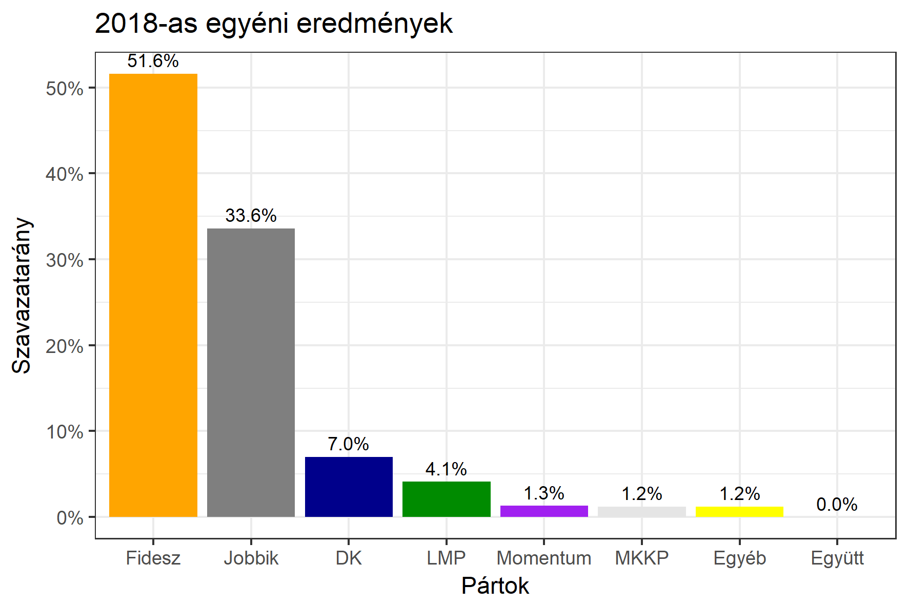

<h1 class="page-title">{{ page.title | escape }}</h1>

    

          

		  <h5>Pest megye 12-es választókerület (Cegléd)</h5>
 <h5><strong>2018-as egyéni eredmények</strong></h5>  <table class="striped">
              <thead>
                <tr>
                    <th>Jelöltek</th>
                    <th>Szavazatarány (százalék)</th>
<th>Eltérés a becsléstől</th>
                </tr>
              </thead>
              <tbody>
             <tr>
                  <td>Földi László - Fidesz-KDNP </td>
				   <td id="id_fidesz">51.6%</td>
				   <td>+10.4%</td>
			</tr>
			<tr><td>Volner János - Jobbik </td> 
			<td id="id_jobbik">33.6%</td>
				   <td>-7.2%</td>
			</tr>
<tr>
                  <td>dr. Szüdi János - DK </td>
				   <td id="id_baloldal">7.0%</td>
				   <td>-5.7%</td>
			</tr>
			<tr>
                  <td>Földi Áron - LMP </td>
				  <td id="id_lmp">4.1%</td>
				   <td>+0.6%</td>
			</tr>
			<tr>
				  <td>Mucsinyi Levente - Momentum </td>
				   <td id="id_momentum">1.3%</td>
				   <td>+0.1%</td>
			</tr>
          
<tr>
<td>Kis Viktor - MKKP </td>
 <td id="id_mkkp">1.2%</td>
				   <td>+0.7%</td>
</tr>        
              </tbody>
            </table><h6><strong>Választókerületi profil (2014-ben): Stabil Fideszes</strong></h6>
 

 
			

          

    

    

          

		  <h5>Pest megye 12-es választókerület (Cegléd) - 2014-es eredmények</h5>
            <table class="striped">
              <thead>
                <tr>
                    <th>Jelöltek</th>
                    <th>Szavazatarányok</th>
                </tr>
              </thead>
              <tbody>
             <tr>
                  <td>Földi László - Fidesz-KDNP</td>
				  <td>44.1%</td>
			</tr>
			<tr>
			      <td>Volner János - Jobbik</td>
				  <td>28.9%</td>
			</tr>
			<tr>
			      <td>Romhányiné Dr. Balogh Edit - Összefogás (MSZP-Együtt-DK-PM-MLP)</td>
				  <td>20.8%</td>  
			</tr>
			<tr>
				  <td>Földi Áron - LMP</td>
				  <td>3.2%</td>
			</tr>  	
              </tbody>
            </table>
			<h5>Győztes: Fidesz-KDNP, 15.2%-kal</h5>
          

    

