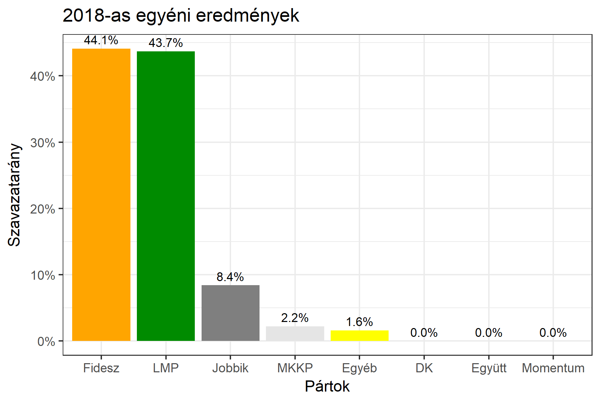

<h1 class="page-title">{{ page.title | escape }}</h1>

    

          

		  <h5>Pest megye 2-es választókerület (Budakeszi)</h5>
 <h5><strong>2018-as egyéni eredmények</strong></h5>  <table class="striped">
              <thead>
                <tr>
                    <th>Jelöltek</th>
                    <th>Szavazatarány (százalék)</th>
<th>Eltérés a becsléstől</th>
                </tr>
              </thead>
              <tbody>
             <tr>
                  <td>Csenger-Zalán Zsolt - Fidesz-KDNP </td>
				  <td id="id_fidesz">44.1%</td>
				   <td>-0.2%</td>
			</tr>
			<tr><td>Császárné Kollár Tímea - Jobbik </td> 
			<td id="id_jobbik">8.4%</td>
				   <td>-0.7%</td>
			</tr>
			<tr>
                  <td>dr. Szél Bernadett - LMP </td>
				  <td id="id_lmp">43.7%</td>
				   <td>-1.2%</td>
			</tr>    
<tr>
<td>Betlehem Csaba - MKKP </td>
 <td id="id_mkkp">2.2%</td>
				   <td>+0.5%</td>
</tr>  
              </tbody>
            </table><h6><strong>Választókerületi profil (2014-ben): Stabil Fideszes (erős az LMP)</strong></h6>
 

 
			

          

    

    

          

		  <h5>Pest megye 2-es választókerület (Budakeszi) - 2014-es eredmények</h5>
            <table class="striped">
              <thead>
                <tr>
                    <th>Jelöltek</th>
                    <th>Szavazatarányok</th>
                </tr>
              </thead>
              <tbody>
             <tr>
                  <td>Csenger-Zalán Zsolt - Fidesz-KDNP</td>
				  <td>46.5%</td>
			</tr>
			<tr>
			      <td>Dr. Szabóné Müller Timea Nóra - Összefogás (MSZP-Együtt-DK-PM-MLP)</td>
				  <td>26.8%</td>  
			</tr>
			<tr>
			      <td>Császárné Kollár Tímea Annamária - Jobbik</td>
				  <td>11.2%</td>
			</tr>
			<tr>
				  <td>Dr. Szél Bernadett - LMP</td>
				  <td>10.9%</td>
			</tr>  	
              </tbody>
            </table>
			<h5>Győztes: Fidesz-KDNP, 19.7%-kal</h5>
          

    

