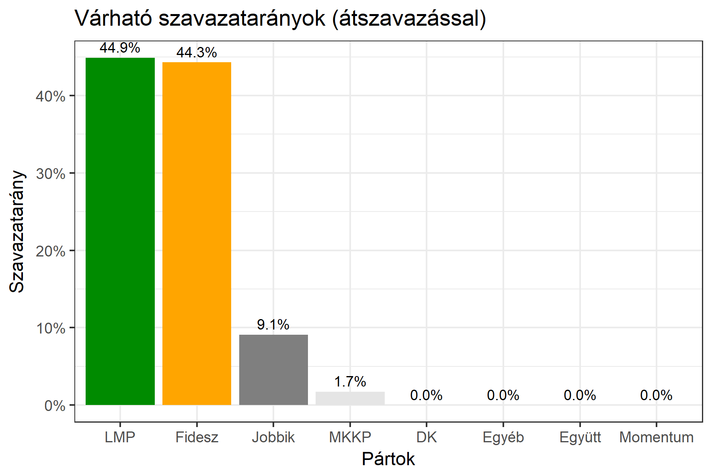

<h1 class="page-title">{{ page.title | escape }}</h1>

    

          
<h6><strong>A következő becslés várható időpontja: 2018. március 19.</strong></h6>
		  <h5>Pest megye 2-es választókerület (Budakeszi)</h5>
 <h6><strong>Választókerületi profil (2014-ben): Stabil Fideszes (erős LMP)</strong></h6>
 
<h6><strong>Legfrissebb 2018-as becslések eredménye:</strong></h6>  
			<h5><strong>Legesélyesebb ellenzéki jelölt: LMP</strong></h5>
<table class="striped">
              <thead>
                <tr>
                    <th>Jelöltek</th>
                    <th>Várható szavazatarány egyéniben (átszavazással)</th>
                </tr>
              </thead>
              <tbody>
             <tr>
                  <td>Csenger-Zalán Zsolt - Fidesz-KDNP </td>
				  <td id="id_fidesz">47.4%</td>
			</tr>
			<tr><td>Császárné Kollár Tímea - Jobbik </td><td id="id_jobbik">8.8%</td></tr>
<tr>
                  <td>dr. Tóth Zoltán - DK </td>
				  <td id="id_baloldal">5.1%</td>
			</tr>
			<tr>
                  <td>dr. Szél Bernadett - LMP </td>
				  <td id="lmp">34.5%</td>
			</tr>
			<tr>
				  <td>Szemző Áron - Momentum </td>
				  <td id="id_momentum">2.7%</td>
			</tr>
                
<tr>
<td>Betlehem Csaba - MKKP </td>
<td id="id_mkkp">1.5%</td>
</tr>  
              </tbody>
            </table><h5>Várható győztes: Fidesz</h5>
			
			
 
<strong>Fontos:</strong> A becslések csak az egyéni jelöltre adott szavazatok arányát mutatják, nem a listás szavazatokét. A becslés jelentős eltérést mutathat a kisebb pártok esetében és olyan kerületekben, ahol nincs egyértelmű esélyes jelölt.

 
			
 <h6><strong>Becslés megbízhatósága a legesélyesebb jelöltről:</strong> <strong>Nem egyértelmű az esélyes - az esélyes jelölt még változhat</strong></h6>

Megjegyzés a kerülethez: A kerületben átlagon felül teljesített a Fidesz és az LMP is 2014-ben. Figyelembe véve, hogy az LMP erős jelöltet indít a körzetben, egy ellenzéki koordináció esetén az LMP-s jelölt lenne a legesélyesebb. Azonban így sem biztos, hogy legyőzné a Fidesz jelöltjét (de mindenképp közelebb kerülne hozzá).

Az aktuális becslés leírásáról <a href="../metodologia#0312">bővebben itt olvashatsz</a>.

          

    

    

          

		  <h5>Pest megye 2-es választókerület (Budakeszi) - 2014-es eredmények</h5>
            <table class="striped">
              <thead>
                <tr>
                    <th>Jelöltek</th>
                    <th>Szavazatarányok</th>
                </tr>
              </thead>
              <tbody>
             <tr>
                  <td>Csenger-Zalán Zsolt - Fidesz-KDNP</td>
				  <td>46.5%</td>
			</tr>
			<tr>
			      <td>Dr. Szabóné Müller Timea Nóra - Összefogás (MSZP-Együtt-DK-PM-MLP)</td>
				  <td>26.8%</td>  
			</tr>
			<tr>
			      <td>Császárné Kollár Tímea Annamária - Jobbik</td>
				  <td>11.2%</td>
			</tr>
			<tr>
				  <td>Dr. Szél Bernadett - LMP</td>
				  <td>10.9%</td>
			</tr>  	
              </tbody>
            </table>
			<h5>Győztes: Fidesz-KDNP, 19.7%-kal</h5>
          

    

