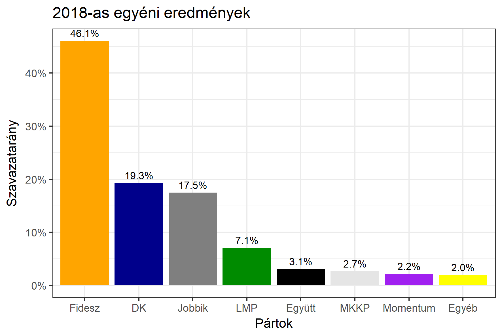

<h1 class="page-title">{{ page.title | escape }}</h1>

    

          

		  <h5>Pest megye 3-as választókerület (Szentendre)</h5>
 <h5><strong>2018-as egyéni eredmények</strong></h5>  <table class="striped">
              <thead>
                <tr>
                    <th>Jelöltek</th>
                    <th>Szavazatarány (százalék)</th>
<th>Eltérés a becsléstől</th>
                </tr>
              </thead>
              <tbody>
             <tr>
                  <td>Hadházy Sándor - Fidesz-KDNP </td>
				   <td id="id_fidesz">46.1%</td>
				   <td>+2.7%</td>
			</tr>
			<tr><td>Pál Gábor - Jobbik </td> 
		<td id="id_jobbik">17.5%</td>
				   <td>+3.4%</td>
			</tr>
<tr>
                  <td>Király Miklós - DK </td>
				   <td id="id_baloldal">19.3%</td>
				   <td>-4.2%</td>
			</tr>
			<tr>
                  <td>Drávucz Zsolt - LMP </td>
				   <td id="id_lmp">7.1%</td>
				   <td>-2.7%</td>
			</tr>
			<tr>
				  <td>Vásárhelyi Judit - Momentum </td>
				  <td id="id_momentum">2.2%</td>
				   <td>-1.3%</td>
			</tr>
<tr>
<td>Spät Judit -  Együtt </td>
 <td id="id_egyutt">3.1%</td>
				   <td>-1.6%</td>
</tr>             
<tr>
<td>Kövesdi Miklós Gábor - MKKP </td>
 <td id="id_mkkp">2.7%</td>
				   <td>+1.6%</td>
</tr>     
              </tbody>
            </table><h6><strong>Választókerületi profil (2014-ben): Biztos Fideszes</strong></h6>
 

 
			

          

    

    

          

		  <h5>Pest megye 3-as választókerület (Szentendre) - 2014-es eredmények</h5>
            <table class="striped">
              <thead>
                <tr>
                    <th>Jelöltek</th>
                    <th>Szavazatarányok</th>
                </tr>
              </thead>
              <tbody>
             <tr>
                  <td>Hadházy Sándor - Fidesz-KDNP</td>
				  <td>47.3%</td>
			</tr>
			<tr>
			      <td>Szinna Gábor - Összefogás (MSZP-Együtt-DK-PM-MLP)</td>
				  <td>26.7%</td>  
			</tr>
			<tr>
			      <td>Murányi Levente - Jobbik</td>
				  <td>14.1%</td>
			</tr>
			<tr>
				  <td>Kardos-Horváth János - LMP</td>
				  <td>7.2%</td>
			</tr>  	
              </tbody>
            </table>
			<h5>Győztes: Fidesz-KDNP, 20.6%-kal</h5>
          

    

