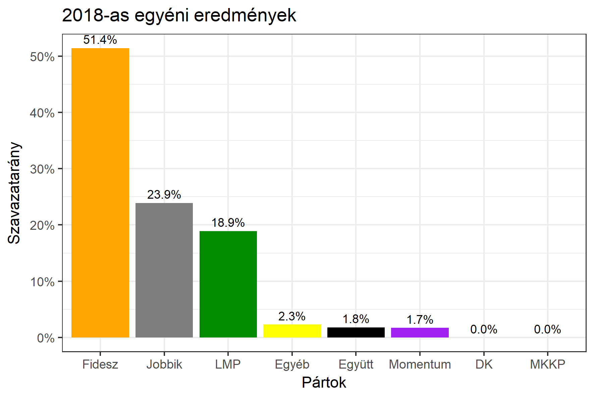
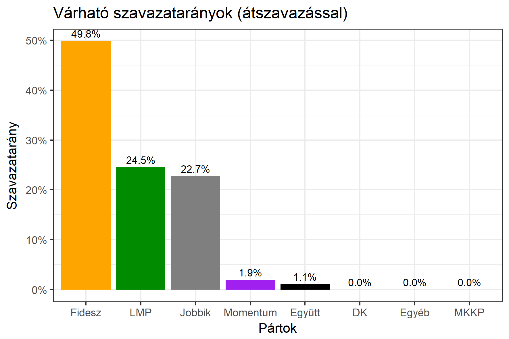

<h1 class="page-title">{{ page.title | escape }}</h1>

    

          

		  <h5>Pest megye 4-es választókerület (Vác)</h5>
 <h5><strong>2018-as egyéni eredmények</strong></h5>  <table class="striped">
              <thead>
                <tr>
                    <th>Jelöltek</th>
                    <th>Szavazatarány (százalék)</th>
<th>Eltérés a becsléstől</th>
                </tr>
              </thead>
              <tbody>
             <tr>
                  <td>Rétvári Bence - Fidesz-KDNP </td>
				   <td id="id_fidesz">51.4%</td>
				   <td>+1.6%</td>
			</tr>
			<tr><td>Fehér Zsolt - Jobbik </td> 
			<td id="id_jobbik">23.9%</td>
				   <td>+1.2%</td>
			</tr>
			<tr>
                  <td>Matkovich Ilona - LMP </td>
				   <td id="id_lmp">18.9%</td>
				   <td>-5.6%</td>
			</tr>
			<tr>
				  <td>Juhász Béla Róbert - Momentum </td>
				   <td id="id_momentum">1.7%</td>
				   <td>-0.2%</td>
			</tr>
<tr>
<td>dr. Jakab Zoltán Attila -  Együtt </td>
 <td id="id_egyutt">1.8%</td>
				   <td>+0.7%</td>
</tr>                
              </tbody>
            </table><h6><strong>Választókerületi profil (2014-ben): Biztos Fideszes</strong></h6>
 
<h5><strong>2018. április 8-i becslések (átszavazással):</strong></h5>  
			<h6><strong>Becslés megbízhatósága a legesélyesebb jelöltről:</strong> <strong>Nincs egyértelmű esélyes</strong></h6> 
<h5><strong>Legesélyesebb ellenzéki jelölt: Matkovich Ilona (LMP)</strong></h5>
<h5><strong><a href="https://rendszervaltas2018.hu">Márki-Zay Péter ajánlása</a>: Matkovich Ilona (LMP)</strong></h5>

  <table class="striped">
              <thead>
                <tr>
                    <th>Jelöltek</th>
                    <th>Várható szavazatarány egyéniben (zárójelben az arányok átszavazás esetén)</th>
                </tr>
              </thead>
              <tbody>
             <tr>
                  <td>Rétvári Bence - Fidesz-KDNP </td>
				   <td id="id_fidesz">46.0% &emsp; (49.8%)</td>
			</tr>
			<tr><td>Fehér Zsolt - Jobbik </td> <td id="id_jobbik">22.4% &emsp; (22.7%)</td></tr>
			<tr>
                  <td>Matkovich Ilona - LMP </td>
				   <td id="id_lmp">7.4% &emsp; (24.5%)</td>
			</tr>
			<tr>
				  <td>Juhász Béla Róbert - Momentum </td>
				   <td id="id_momentum">2.6% &emsp; (1.9%)</td>
			</tr>
<tr>
<td>dr. Jakab Zoltán Attila -  Együtt </td>
 <td id="id_egyutt">1.7% &emsp; (1.1%)</td>
</tr>                
              </tbody>
            </table><h5>Várható győztes: Fidesz-KDNP</h5>
			
			
 
<strong>Fontos:</strong> A becslések csak az egyéni jelöltre adott szavazatok arányát mutatják, nem a listás szavazatokét. A becslés jelentős eltérést mutathat a kisebb pártok esetében és olyan kerületekben, ahol nincs egyértelmű esélyes jelölt.

 
			

          

    

    

          

		  <h5>Pest megye 4-es választókerület (Vác) - 2014-es eredmények</h5>
            <table class="striped">
              <thead>
                <tr>
                    <th>Jelöltek</th>
                    <th>Szavazatarányok</th>
                </tr>
              </thead>
              <tbody>
             <tr>
                  <td>Harrach Péter Pál - Fidesz-KDNP</td>
				  <td>46.8%</td>
			</tr>
			<tr>
			      <td>Szinna Gábor - Összefogás (MSZP-Együtt-DK-PM-MLP)</td>
				  <td>24.8%</td>  
			</tr>
			<tr>
			      <td>Murányi Levente - Jobbik</td>
				  <td>20.0%</td>
			</tr>
			<tr>
				  <td>Kardos-Horváth János - LMP</td>
				  <td>4.2%</td>
			</tr>  	
              </tbody>
            </table>
			<h5>Győztes: Fidesz-KDNP, 22.0%-kal</h5>
          

    

