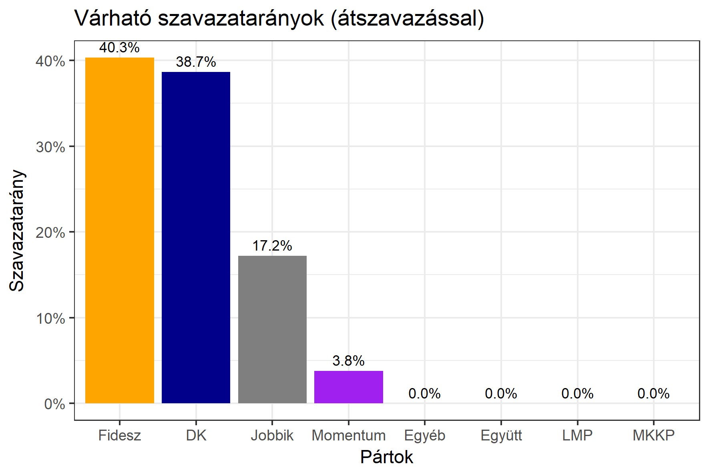

<h1 class="page-title">{{ page.title | escape }}</h1>

    

          

		  <h5>Pest megye 5-ös választókerület (Dunakeszi)</h5>
 <h5><strong>2018-as eredmények</strong></h5>  <h6><strong>Választókerületi profil (2014-ben): Enyhén Fideszes (baloldali kihívó)</strong></h6>
 
<h6><strong>Legfrissebb 2018-as becslések eredménye (átszavazással):</strong></h6>  
			<h6><strong>Becslés megbízhatósága a legesélyesebb jelöltről:</strong> <strong>Nincs egyértelmű esélyes</strong></h6> 
<h5><strong>Legesélyesebb ellenzéki jelölt: Rónai Sándor (DK)</strong></h5>
<h5><strong><a href="https://rendszervaltas2018.hu">Márki-Zay Péter ajánlása</a>: Rónai Sándor (DK) </strong></h5>
<h5><strong><a href="https://www.v18.eu/53korzet">A V18 ajánlása</a>: Rónai Sándor (DK)</strong></h5>

  <table class="striped">
              <thead>
                <tr>
                    <th>Jelöltek</th>
                    <th>Várható szavazatarány egyéniben (zárójelben az arányok átszavazás esetén)</th>
                </tr>
              </thead>
              <tbody>
             <tr>
                  <td>Tuzson Bence - Fidesz-KDNP </td>
				   <td id="id_fidesz">38.5% &emsp; (40.3%)</td>
			</tr>
			<tr><td>Varga Zoltán Péter - Jobbik </td> <td id="id_jobbik">17.3% &emsp; (17.2%)</td></tr>
<tr>
                  <td>Rónai Sándor - DK </td>
				   <td id="id_baloldal">22.5% &emsp; (38.7%)</td>
			</tr>
			<tr>
				  <td>Kohut Ákos - Momentum </td>
				   <td id="id_momentum">4.5% &emsp; (3.8%)</td>
			</tr>                
              </tbody>
            </table><h5>Várható győztes: Fidesz-KDNP</h5>
			
			
 
<strong>Fontos:</strong> A becslések csak az egyéni jelöltre adott szavazatok arányát mutatják, nem a listás szavazatokét. A becslés jelentős eltérést mutathat a kisebb pártok esetében és olyan kerületekben, ahol nincs egyértelmű esélyes jelölt.

 
			

Az aktuális becslés leírásáról <a href="../metodologia#0406">bővebben itt olvashatsz</a>.

          

    

    

          

		  <h5>Pest megye 5-ös választókerület (Dunakeszi) - 2014-es eredmények</h5>
            <table class="striped">
              <thead>
                <tr>
                    <th>Jelöltek</th>
                    <th>Szavazatarányok</th>
                </tr>
              </thead>
              <tbody>
             <tr>
                  <td>Dr. Tuzson Bence Balázs - Fidesz-KDNP</td>
				  <td>41.3%</td>
			</tr>
			<tr>
			      <td>Szabó Imre - Összefogás (MSZP-Együtt-DK-PM-MLP)</td>
				  <td>30.8%</td>  
			</tr>
			<tr>
			      <td>Nyiri Márton - Jobbik</td>
				  <td>16.4%</td>
			</tr>
			<tr>
				  <td>Juhász Péter  - LMP</td>
				  <td>7.7%</td>
			</tr>  	
              </tbody>
            </table>
			<h5>Győztes: Fidesz-KDNP, 10.5%-kal</h5>
          

    

