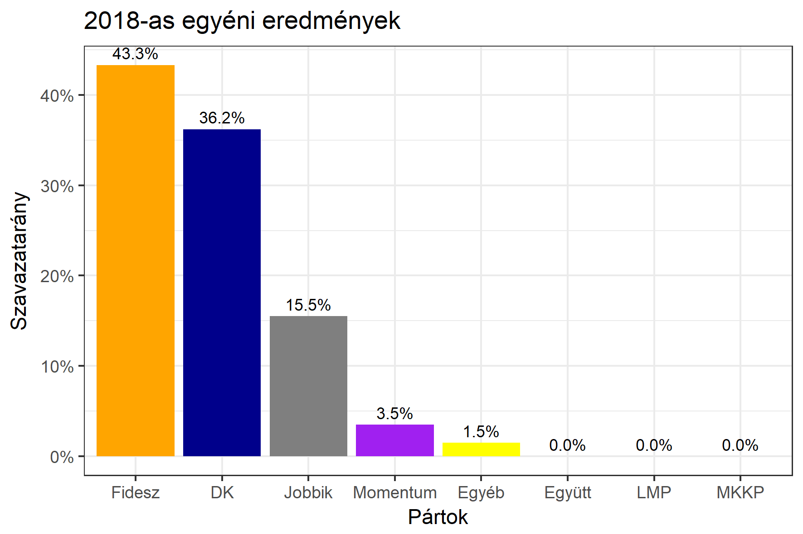

<h1 class="page-title">{{ page.title | escape }}</h1>

    

          

		  <h5>Pest megye 5-ös választókerület (Dunakeszi)</h5>
 <h5><strong>2018-as egyéni eredmények</strong></h5>  <table class="striped">
              <thead>
                <tr>
                    <th>Jelöltek</th>
                    <th>Szavazatarány (százalék)</th>
<th>Eltérés a becsléstől</th>
                </tr>
              </thead>
              <tbody>
             <tr>
                  <td>Tuzson Bence - Fidesz-KDNP </td>
				   <td id="id_fidesz">43.3%</td>
				   <td>+3.0%</td>
			</tr>
			<tr><td>Varga Zoltán Péter - Jobbik </td> 
			<td id="id_jobbik">15.5%</td>
				   <td>-1.7%</td>
			</tr>
<tr>
                  <td>Rónai Sándor - DK </td>
				  <td id="id_baloldal">36.2%</td>
				   <td>-2.5%</td>
			</tr>
			<tr>
				  <td>Kohut Ákos - Momentum </td>
				  <td id="id_momentum">3.5%</td>
				   <td>-0.3%</td>
			</tr>                
              </tbody>
            </table><h6><strong>Választókerületi profil (2014-ben): Enyhén Fideszes (baloldali kihívó)</strong></h6>
 

 
			

          

    

    

          

		  <h5>Pest megye 5-ös választókerület (Dunakeszi) - 2014-es eredmények</h5>
            <table class="striped">
              <thead>
                <tr>
                    <th>Jelöltek</th>
                    <th>Szavazatarányok</th>
                </tr>
              </thead>
              <tbody>
             <tr>
                  <td>Dr. Tuzson Bence Balázs - Fidesz-KDNP</td>
				  <td>41.3%</td>
			</tr>
			<tr>
			      <td>Szabó Imre - Összefogás (MSZP-Együtt-DK-PM-MLP)</td>
				  <td>30.8%</td>  
			</tr>
			<tr>
			      <td>Nyiri Márton - Jobbik</td>
				  <td>16.4%</td>
			</tr>
			<tr>
				  <td>Juhász Péter  - LMP</td>
				  <td>7.7%</td>
			</tr>  	
              </tbody>
            </table>
			<h5>Győztes: Fidesz-KDNP, 10.5%-kal</h5>
          

    

