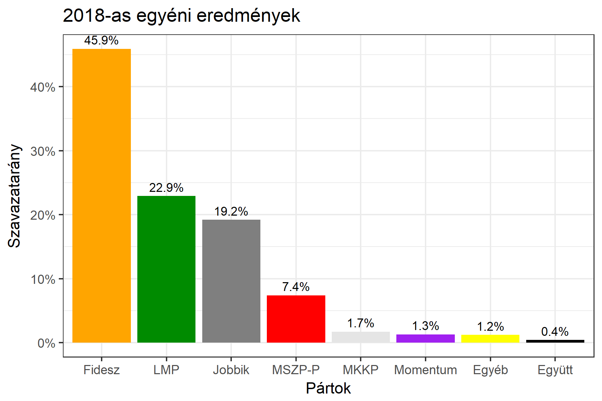

<h1 class="page-title">{{ page.title | escape }}</h1>

    

          

		  <h5>Pest megye 6-os választókerület (Gödöllő)</h5>
 <h5><strong>2018-as egyéni eredmények</strong></h5>  <table class="striped">
              <thead>
                <tr>
                    <th>Jelöltek</th>
                    <th>Szavazatarány (százalék)</th>
<th>Eltérés a becsléstől</th>
                </tr>
              </thead>
              <tbody>
             <tr>
                  <td>Vécsey László József - Fidesz-KDNP </td>
				  <td id="id_fidesz">45.9%</td>
				   <td>+3.1%</td>
			</tr>
			<tr><td>Víg János - Jobbik </td> 
			<td id="id_jobbik">19.2%</td>
				   <td>-5.6%</td>
			</tr>
			<tr>
                  <td>Makrai Zoltán - MSZP-Párbeszéd </td>
				   <td id="id_baloldal">7.4%</td>
				   <td>-11.4%</td>
			</tr>
			<tr>
                  <td>Lengyel Szilvia - LMP </td>
				  <td id="id_lmp">22.9%</td>
				   <td>+13.8%</td>
			</tr>
			<tr>
				  <td>Molnár László - Momentum </td>
				<td id="id_momentum">1.3%</td>
				   <td>-1.9%</td>
			</tr>
<tr>
<td>Kis Imre -  Együtt </td>
 <td id="id_egyutt">0.4%</td>
				   <td>-1.4%</td>
</tr>           
<tr>
<td>Bősze Gábor - MKKP </td>
 <td id="id_mkkp">1.7%</td>
				   <td>+0.7%</td>
</tr>       
              </tbody>
            </table><h6><strong>Választókerületi profil (2014-ben): Stabil Fideszes</strong></h6>
 

 
			

          

    

    

          

		  <h5>Pest megye 6-os választókerület (Gödöllő) - 2014-es eredmények</h5>
            <table class="striped">
              <thead>
                <tr>
                    <th>Jelöltek</th>
                    <th>Szavazatarányok</th>
                </tr>
              </thead>
              <tbody>
             <tr>
                  <td>Vécsey László József - Fidesz-KDNP</td>
				  <td>42.9%</td>
			</tr>
			<tr>
			      <td>Kovács Barnabás - Összefogás (MSZP-Együtt-DK-PM-MLP)</td>
				  <td>25.4%</td>  
			</tr>
			<tr>
			      <td>Bertha Szilvia Zsuzsanna - Jobbik</td>
				  <td>19.1%</td>
			</tr>
			<tr>
				  <td>Lengyel Szilvia - LMP</td>
				  <td>6.4%</td>
			</tr>  	
              </tbody>
            </table>
			<h5>Győztes: Fidesz-KDNP, 17.5%-kal</h5>
          

    

