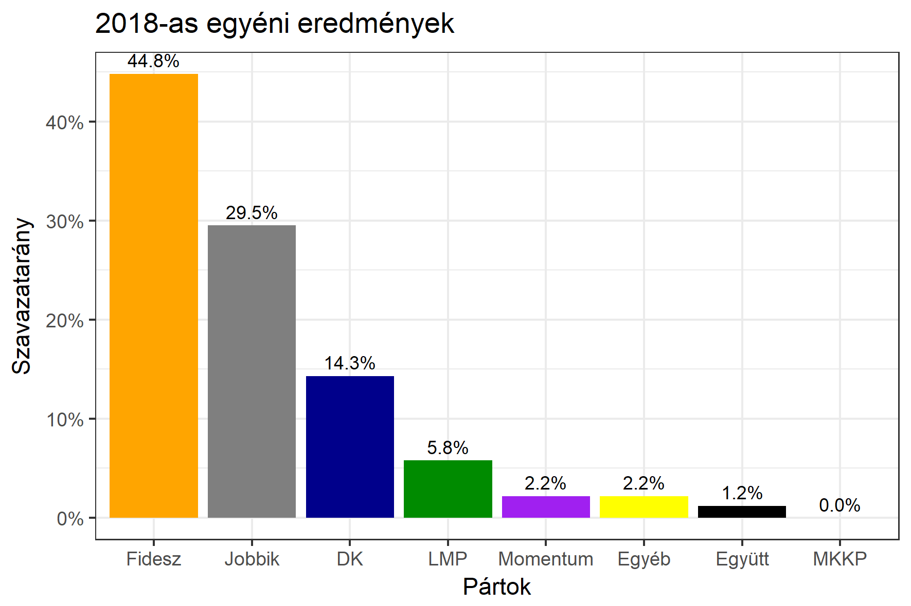

<h1 class="page-title">{{ page.title | escape }}</h1>

    

          

		  <h5>Pest megye 7-es választókerület (Vecsés)</h5>
 <h5><strong>2018-as egyéni eredmények</strong></h5>  <table class="striped">
              <thead>
                <tr>
                    <th>Jelöltek</th>
                    <th>Szavazatarány (százalék)</th>
<th>Eltérés a becsléstől</th>
                </tr>
              </thead>
              <tbody>
             <tr>
                  <td>dr. Szűcs Lajos - Fidesz-KDNP </td>
				   <td id="id_fidesz">44.8%</td>
				   <td>+3.2%</td>
			</tr>
			<tr><td>Sas Zoltán - Jobbik </td> 
			<td id="id_jobbik">29.5%</td>
				   <td>+1.0%</td>
			</tr>
<tr>
                  <td>Nyeste Andrea - DK </td>
				   <td id="id_baloldal">14.3%</td>
				   <td>-7.7%</td>
			</tr>
			<tr>
                  <td>Apostol Klaudia - LMP </td>
				   <td id="id_lmp">5.8%</td>
				   <td>+0.8%</td>
			</tr>
			<tr>
				  <td>Kalasovszky Bernadett - Momentum </td>
				   <td id="id_momentum">2.2%</td>
				   <td>+0.4%</td>
			</tr>
<tr>
<td>Tóth Judit -  Együtt </td>
 <td id="id_egyutt">1.2%</td>
				   <td>+0.1%</td>
</tr>                
              </tbody>
            </table><h6><strong>Választókerületi profil (2014-ben): Stabil Fideszes</strong></h6>
 

 
			

          

    

    

          

		  <h5>Pest megye 7-es választókerület (Vecsés) - 2014-es eredmények</h5>
            <table class="striped">
              <thead>
                <tr>
                    <th>Jelöltek</th>
                    <th>Szavazatarányok</th>
                </tr>
              </thead>
              <tbody>
             <tr>
                  <td>Dr. Szűcs Lajos - Fidesz-KDNP</td>
				  <td>43.0%</td>
			</tr>
			<tr>
			      <td>Szabó Rebeka Katalin - Összefogás (MSZP-Együtt-DK-PM-MLP)</td>
				  <td>29.1%</td>  
			</tr>
			<tr>
			      <td>Sas Zoltán - Jobbik</td>
				  <td>19.6%</td>
			</tr>
			<tr>
				  <td>Pintér Sándor - LMP</td>
				  <td>4.5%</td>
			</tr>  	
              </tbody>
            </table>
			<h5>Győztes: Fidesz-KDNP, 13.9%-kal</h5>
          

    

