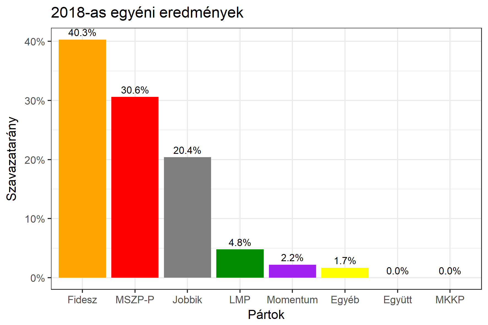

<h1 class="page-title">{{ page.title | escape }}</h1>

    

          

		  <h5>Pest megye 8-as választókerület (Szigetszentmiklós)</h5>
 <h5><strong>2018-as egyéni eredmények</strong></h5>  <table class="striped">
              <thead>
                <tr>
                    <th>Jelöltek</th>
                    <th>Szavazatarány (százalék)</th>
<th>Eltérés a becsléstől</th>
                </tr>
              </thead>
              <tbody>
             <tr>
                  <td>Bóna Zoltán - Fidesz-KDNP </td>
				   <td id="id_fidesz">40.3%</td>
				   <td>+0.3%</td>
			</tr>
			<tr><td>Lupa János - Jobbik </td> 
			<td id="id_jobbik">20.4%</td>
				   <td>-0.4%</td>
			</tr>
<tr>
                  <td>Stefanik Zsolt - MSZP-Párbeszéd </td>
				   <td id="id_baloldal">30.6%</td>
				   <td>-1.5%</td>
			</tr>
			<tr>
                  <td>Hevényiné Danics Nikoletta - LMP </td>
				  <td id="id_lmp">4.8%</td>
				   <td>-1.1%</td>
			</tr>
			<tr>
				  <td>Tótok József - Momentum </td>
				<td id="id_momentum">2.2%</td>
				   <td>+0.2%</td>
			</tr>               
              </tbody>
            </table><h6><strong>Választókerületi profil (2014-ben): Enyhén Fideszes (baloldali kihívó)</strong></h6>
 

 
			

          

    

    

          

		  <h5>Pest megye 8-as választókerület (Szigetszentmiklós) - 2014-es eredmények</h5>
            <table class="striped">
              <thead>
                <tr>
                    <th>Jelöltek</th>
                    <th>Szavazatarányok</th>
                </tr>
              </thead>
              <tbody>
             <tr>
                  <td>Bóna Zoltán - Fidesz-KDNP</td>
				  <td>40.3%</td>
			</tr>
			<tr>
			      <td>Kuncze Gábor - Összefogás (MSZP-Együtt-DK-PM-MLP)</td>
				  <td>32.9%</td>  
			</tr>
			<tr>
			      <td>Lupa János - Jobbik</td>
				  <td>18.4%</td>
			</tr>
			<tr>
				  <td>Jaksa-Ladányi Emma Zsuzsánna - LMP</td>
				  <td>5.0%</td>
			</tr>  	
              </tbody>
            </table>
			<h5>Győztes: Fidesz-KDNP, 7.4%-kal</h5>
          

    

