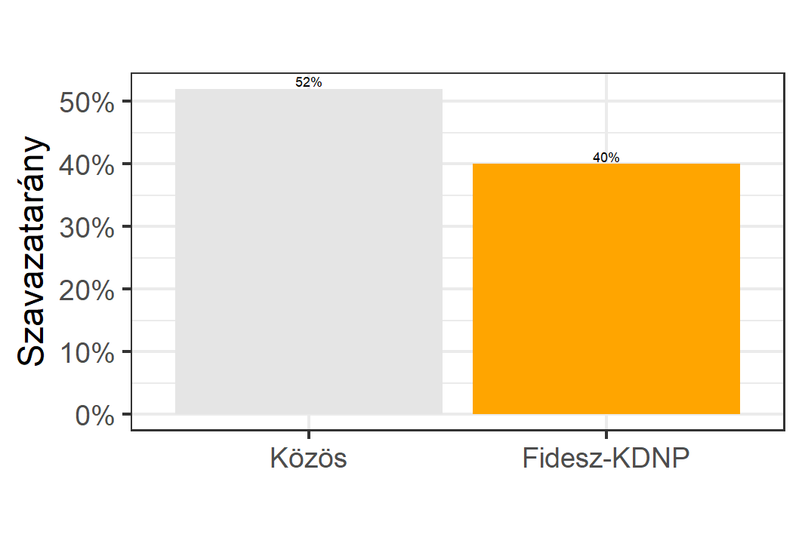
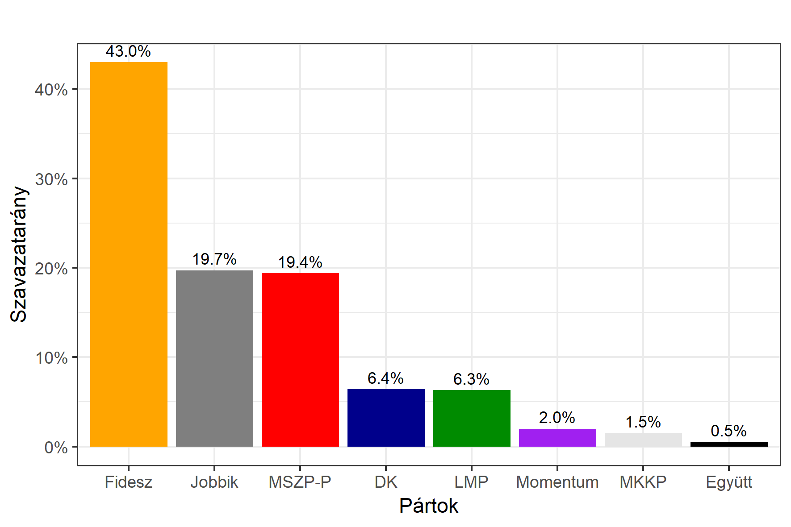

<h1 class="page-title">{{ page.title | escape }}</h1>

    

          

		  <h5>Salgótarján</h5>
		  
<h5><strong><ahref="http://www.valasztas.hu/helyi-onkormanyzati-valasztasok/salgotarjan-20160228">2016. februári időközi polgármester-választás eredménye</a></strong></h5>
 

			<table class="striped">
              <thead>
                <tr>
                    <th>Jelöltek (első két helyezett)</th>
                    <th>Szavazatarány (százalék)</th>
					<th>Szavazatok száma</th>
                </tr>
              </thead>
              <tbody>
             <tr>
                   <td>Simon Tibor - Fidesz-KDNP </td>
				   <td>40.0%</td>
				   <td>6,038</td>
			</tr>
			<tr>
			<td>Fekete Zsolt - DK-MSZP-TVE</td> 
			<td>52.0%</td>
			<td>7,840</td>
			</tr>
              </tbody>
            </table>
 
 
<h5><strong><a id="webURL" href="http://www.valasztas.hu/dyn/onk14/szavossz/hu/M13/T103/tjk.html">2014-es polgármester-választás eredménye</a></strong></h5>
 

			<table class="striped">
              <thead>
                <tr>
                    <th>Jelöltek (első két helyezett)</th>
                    <th>Szavazatarány (százalék)</th>
					<th>Szavazatok száma</th>
                </tr>
              </thead>
              <tbody>
             <tr>
                   <td>Székyné Dr. Sztrémi Melinda Anna - Fidesz-KDNP </td>
				   <td id="fidesz_mayor">42.5%</td>
				   <td id="fidesz_mayor2">5,326</td>
			</tr>
			<tr>
			<td>Dóra Ottó - MSZP-DK-EGYÜTT-TVE-ST</td> 
			<td id="ellenzek_mayor">42.9%</td>
			<td id="ellenzek_mayor2">5,376</td>
			</tr>
              </tbody>
            </table>
 

 

<h5><strong>2014-es önkormányzati választáson nyert egyéni képviselőhelyek száma</strong></h5>  

<table class="striped">
              <thead>
                <tr>
                    <th>Pártok</th>
                    <th>Egyéni képviselőhelyek</th>
                </tr>
              </thead>
              <tbody>
             <tr>
                  <td>Fidesz-KDNP</td>
				   <td id="fidesz_mp">3</td>
			</tr>
			<tr><td>Jobbik</td> 
				<td id="jobbik_mp">0</td>
			</tr>
			<tr>
                  <td>MSZP</td>
				   <td id="mszp_mp">7 *</td>
			</tr>
			<tr>
                  <td>LMP</td>
				   <td id="lmp_mp">0</td>
			</tr>
			<tr>
                  <td>DK</td>
				   <td id="dk_mp">0</td>
			</tr>
			<tr>
                  <td>Együtt</td>
				   <td id="egyutt_mp">0</td>
			</tr>
			 <tr>
                  <td>Egyéb szervezet</td>
				   <td id="egyeb_mp">0</td>
			</tr>
             <tr>
                  <td>Független</td>
				   <td id="fuggetlen_mp">0</td>
			</tr>
   
              </tbody>
            </table>

* MSZP-DK-EGYÜTT-TVE-ST közös jelölt 

 <h5><strong>2018-as országos listás eredmények</strong></h5>  

			<table class="striped">
              <thead>
                <tr>
                    <th>Pártok</th>
                    <th>Szavazatarány (százalék)</th>
                </tr>
              </thead>
              <tbody>
             <tr>
                  <td>Fidesz </td>
				   <td id="fidesz_2018">43.0%</td>
			</tr>
			<tr><td>Jobbik </td> 
			<td id="jobbik_2018">19.7%</td>
			</tr>
			<tr>
                  <td>MSZP-Párbeszéd </td>
				   <td id="mszp_2018">19.4%</td>
			</tr>
			<tr>
                  <td>LMP </td>
				   <td id="lmp_2018">6.3%</td>
			</tr>
			<tr>
                  <td>DK </td>
				   <td id="dk_2018">6.4%</td>
			</tr>
			<tr>
                  <td>Momentum </td>
				   <td id="momentum_2018">2.0%</td>
			</tr>
			<tr>
                  <td>Együtt </td>
				   <td id="egyutt_2018">0.5%</td>
			</tr>
             <tr>
                  <td>MKKP </td>
				   <td id="mkkp_2018">1.5%</td>
			</tr>
   
              </tbody>
            </table>
          

    

