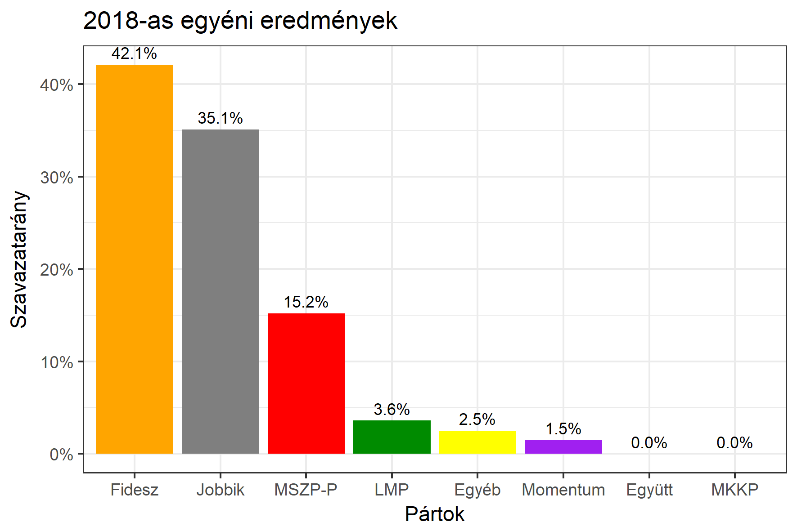

<h1 class="page-title">{{ page.title | escape }}</h1>

    

          

		  <h5>Jász-Nagykun-Szolnok megye 1-es választókerület (Szolnok)</h5>
 <h5><strong>2018-as egyéni eredmények</strong></h5>  <table class="striped">
              <thead>
                <tr>
                    <th>Jelöltek</th>
                    <th>Szavazatarány (százalék)</th>
<th>Eltérés a becsléstől</th>
                </tr>
              </thead>
              <tbody>
             <tr>
                  <td>dr. Kállai Mária - Fidesz-KDNP </td>
				   <td id="id_fidesz">42.1%</td>
				   <td>+4.7%</td>
			</tr>
			<tr><td>dr. Csikós Attila - Jobbik </td> 
		<td id="id_jobbik">35.1%</td>
				   <td>+0.4%</td>
			</tr>
<tr>
                  <td>Györfi Mihály - MSZP-Párbeszéd </td>
				   <td id="id_baloldal">15.2%</td>
				   <td>-5.6%</td>
			</tr>
			<tr>
                  <td>dr. Kelemen István - LMP </td>
				<td id="id_lmp">3.6%</td>
				   <td>-1.6%</td>
			</tr>
			<tr>
				  <td>Szekeres Éva - Momentum </td>
				 <td id="id_momentum">1.5%</td>
				   <td>-0.3%</td>
			</tr>
                
              </tbody>
            </table><h6><strong>Választókerületi profil (2014-ben): Enyhén Fideszes (baloldal / Jobbik az esélyes kihívók)</strong></h6>
 

 
			

          

    

    

          

		  <h5>Jász-Nagykun-Szolnok megye 1-es választókerület (Szolnok) - 2014-es eredmények</h5>
            <table class="striped">
              <thead>
                <tr>
                    <th>Jelöltek</th>
                    <th>Szavazatarányok</th>
                </tr>
              </thead>
              <tbody>
             <tr>
                  <td>Dr. Bene Ildikó - Fidesz-KDNP</td>
				  <td>37.3%</td>
			</tr>
			<tr>
			      <td>Iváncsik Imre - Összefogás (MSZP-Együtt-DK-PM-MLP)</td>
				  <td>28.4%</td>
			      
			</tr>
			<tr>
			      <td>Baráth Zsolt György - Jobbik</td>
				  <td>25.6%</td>
			</tr>
			<tr>
				  <td>Dr. Pető Ernő Zoltán - LMP</td>
				  <td>4.5%</td>
			</tr>                
              </tbody>
            </table>
			<h5>Győztes: Fidesz-KDNP, 8.9%-kal</h5>
          

    

