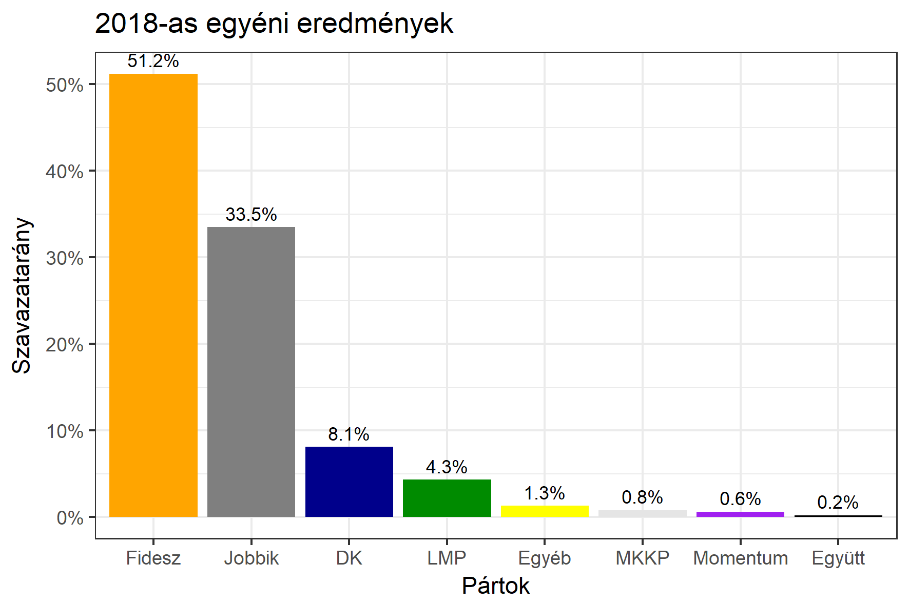

<h1 class="page-title">{{ page.title | escape }}</h1>

    

          

		  <h5>Jász-Nagykun-Szolnok megye 2-es választókerület (Jászberény)</h5>
 <h5><strong>2018-as egyéni eredmények</strong></h5>  <table class="striped">
              <thead>
                <tr>
                    <th>Jelöltek</th>
                    <th>Szavazatarány (százalék)</th>
<th>Eltérés a becsléstől</th>
                </tr>
              </thead>
              <tbody>
             <tr>
                  <td>Pócs János - Fidesz-KDNP </td>
				   <td id="id_fidesz">51.2%</td>
				   <td>+9.1%</td>
			</tr>
			<tr><td>Budai Lóránt - Jobbik </td> 
			<td id="id_jobbik">33.5%</td>
				   <td>-6.9%</td>
			</tr>
<tr>
                  <td>dr. Gedei József - DK </td>
				   <td id="id_baloldal">8.1%</td>
				   <td>-4.6%</td>
			</tr>
			<tr>
                  <td>Eszes Béla - LMP </td>
				 <td id="id_lmp">4.3%</td>
				   <td>+1.5%</td>
			</tr>
			<tr>
				  <td>Pálffy István - Momentum </td>
				  <td id="id_momentum">0.6%</td>
				   <td>-0.4%</td>
			</tr>
<tr>
<td>Urbán Imre - Együtt </td>
 <td id="id_egyutt">0.2%</td>
				   <td>-0.4%</td>
</tr>    
<tr>
<td>Csinger Marianna - MKKP </td>
 <td id="id_mkkp">0.8%</td>
				   <td>+0.4%</td>
</tr>            
              </tbody>
            </table><h6><strong>Választókerületi profil (2014-ben): Stabil Fideszes</strong></h6>
 

 
			

          

    

    

          

		  <h5>Jász-Nagykun-Szolnok megye 2-es választókerület (Jászberény) - 2014-es eredmények</h5>
            <table class="striped">
              <thead>
                <tr>
                    <th>Jelöltek</th>
                    <th>Szavazatarányok</th>
                </tr>
              </thead>
              <tbody>
             <tr>
                  <td>Pócs János - Fidesz-KDNP</td>
				  <td>42.8%</td>
			</tr>
			<tr>
			      <td>Budai Lóránt - Jobbik</td>
				  <td>30.1%</td>
			</tr>
			<tr>
			      <td>Dr. Szekeres Imre Jenő - Összefogás (MSZP-Együtt-DK-PM-MLP)</td>
				  <td>20.2%</td>
			      
			</tr>
			<tr>
				  <td>Ménkű Ottó - LMP</td>
				  <td>2.4%</td>
			</tr>                
              </tbody>
            </table>
			<h5>Győztes: Fidesz-KDNP, 12.7%-kal</h5>
          

    

