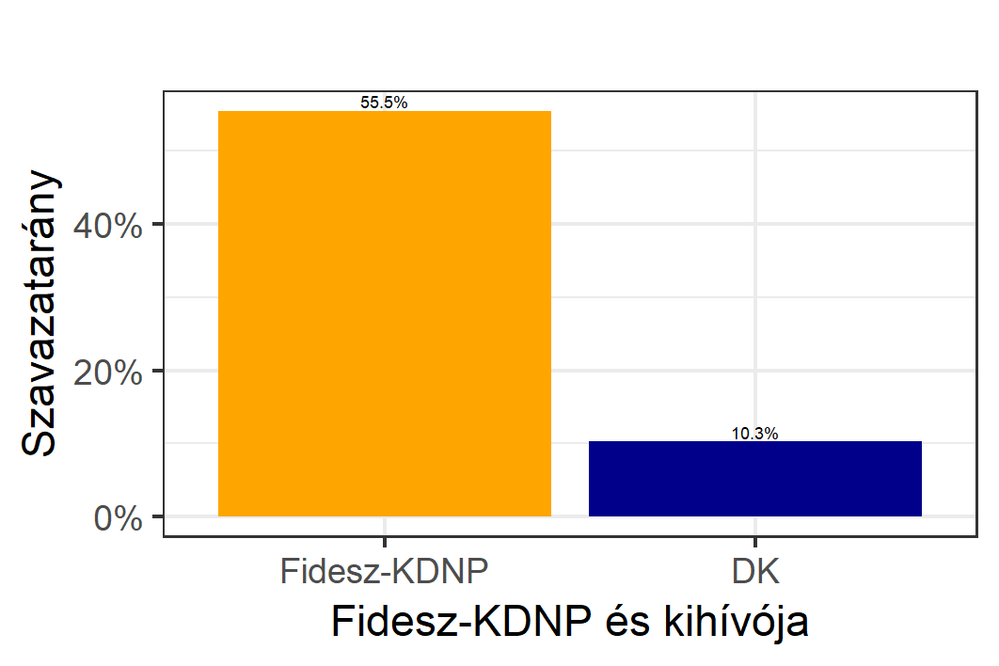
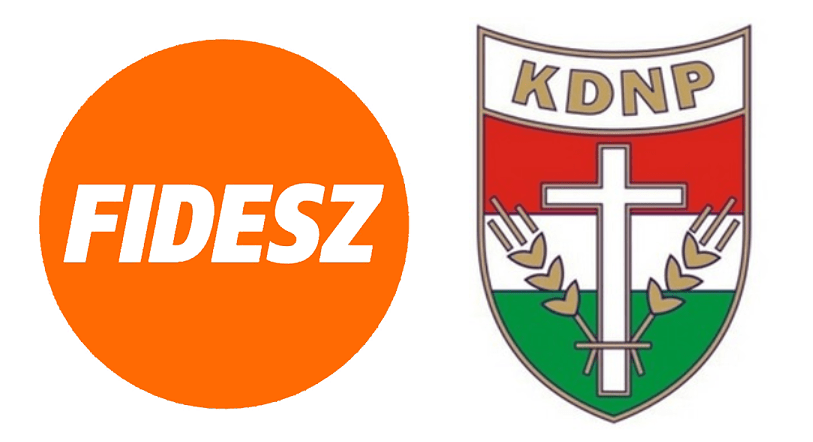
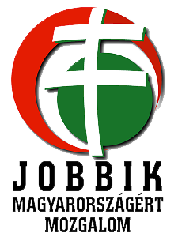

<h1 class="page-title">{{ page.title | escape }}</h1>

    

          

		  <h5>Budapest I. kerület</h5>
 
<h5><strong><a id="webURL" href="xx">2014-es polgármester-választás eredménye</a></strong></h5>
 

			<table class="striped">
              <thead>
                <tr>
                    <th>Jelöltek (első két helyezett)</th>
                    <th>Szavazatarány (százalék)</th>
					<th>Szavazatok száma</th>
                </tr>
              </thead>
              <tbody>
             <tr>
                   <td>Dr. Nagy Gábor Tamás - Fidesz-KDNP </td>
				   <td id="fidesz_mayor">21.1%</td>
				   <td id="fidesz_mayor2">1,408</td>
			</tr>
			<tr>
			<td>Dr. Kakuk György András - DK </td> 
			<td id="ellenzek_mayor">69.7%</td>
			<td id="ellenzek_mayor2">4,647</td>
			</tr>
              </tbody>
            </table>
 

* ÉSZKE jelölt

 

<h5><strong>2014-es önkormányzati választáson nyert egyéni képviselőhelyek száma</strong></h5>  

<table class="striped">
              <thead>
                <tr>
                    <th>Pártok</th>
                    <th>Egyéni képviselőhelyek</th>
                </tr>
              </thead>
              <tbody>
             <tr>
                  <td>Fidesz-KDNP</td>
				   <td id="fidesz_mp">2</td>
			</tr>
			<tr><td>Jobbik</td> 
				<td id="jobbik_mp">0</td>
			</tr>
			<tr>
                  <td>MSZP</td>
				   <td id="mszp_mp">0</td>
			</tr>
			<tr>
                  <td>LMP</td>
				   <td id="lmp_mp">0</td>
			</tr>
			<tr>
                  <td>DK</td>
				   <td id="dk_mp">0</td>
			</tr>
			<tr>
                  <td>Együtt</td>
				   <td id="egyutt_mp">0</td>
			</tr>
			 <tr>
                  <td>Egyéb szervezet</td>
				   <td id="egyeb_mp">5 *</td>
			</tr>
             <tr>
                  <td>Független</td>
				   <td id="fuggetlen_mp">1</td>
			</tr>
   
              </tbody>
            </table>

<h5><strong>2018-as országos listás eredmények</strong></h5>  

			<table class="striped">
              <thead>
                <tr>
                    <th>Pártok</th>
                    <th>Szavazatarány (százalék)</th>
                </tr>
              </thead>
              <tbody>
             <tr>
                  <td>Fidesz </td>
				   <td id="fidesz_2018">40.2%</td>
			</tr>
			<tr><td>Jobbik </td> 
			<td id="jobbik_2018">20.0%</td>
			</tr>
			<tr>
                  <td>MSZP-Párbeszéd </td>
				   <td id="mszp_2018">16.0%</td>
			</tr>
			<tr>
                  <td>LMP </td>
				   <td id="lmp_2018">7.8%</td>
			</tr>
			<tr>
                  <td>DK </td>
				   <td id="dk_2018">7.7%</td>
			</tr>
			<tr>
                  <td>Momentum </td>
				   <td id="momentum_2018">3.8%</td>
			</tr>
			<tr>
                  <td>Együtt </td>
				   <td id="egyutt_2018">0.7%</td>
			</tr>
             <tr>
                  <td>MKKP </td>
				   <td id="mkkp_2018">2.3%</td>
			</tr>
   
              </tbody>
            </table>
          

    

