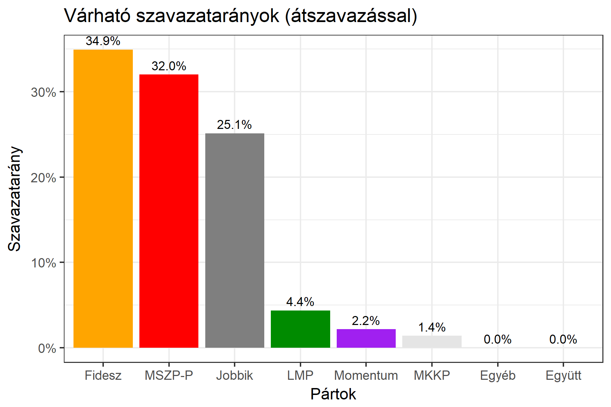

<h1 class="page-title">{{ page.title | escape }}</h1>

    

          
<h6><strong>A következő becslés várható időpontja: 2018. március 19.</strong></h6>
		  <h5>Szabolcs-Szatmár-Bereg megye 1-es választókerület (Nyíregyháza)</h5>
 <h6><strong>Választókerületi profil (2014-ben): Kétesélyes (Fidesz-baloldal)</strong></h6>
 
<h6><strong>Legfrissebb 2018-as becslések eredménye:</strong></h6> 
			<h5><strong>Legesélyesebb ellenzéki jelölt: MSZP-Párbeszéd/DK</strong></h5>
<table class="striped">
              <thead>
                <tr>
                    <th>Jelöltek</th>
                    <th>Várható szavazatarány egyéniben (átszavazással) </th>
                </tr>
              </thead>
              <tbody>
             <tr>
                  <td>dr. Szabó Tünde - Fidesz-KDNP </td>
				  <td id="id_fidesz">36.6%</td>
			</tr>
			<tr><td>Lengyel Máté - Jobbik </td><td id="id_jobbik">23.8%</td></tr>
<tr>
                  <td>Csabai Lászlóné - MSZP-Párbeszéd </td>
				  <td id="id_baloldal">28.8%</td>
			</tr>
			<tr>
                  <td>dr. Szoboszlay György Csaba - LMP </td>
				  <td id="lmp">3.8%</td>
			</tr>
			<tr>
				  <td>Babosi György - Momentum </td>
				  <td id="id_momentum">3.4%</td>
			</tr>
<tr>
<td>Lövei Csaba -  Együtt </td>
<td id="id_egyutt">1.7%</td>
</tr>             
<tr>
<td>Vajas Károly - MKKP </td>
<td id="id_mkkp">1.9%</td>
</tr>   
              </tbody>
            </table><h5>Várható győztes: Fidesz</h5>
			
			
  
<strong>Fontos:</strong> A becslések csak az egyéni jelöltre adott szavazatok arányát mutatják, nem a listás szavazatokét. A becslés jelentős eltérést mutathat a kisebb pártok esetében és olyan kerületekben, ahol nincs egyértelmű esélyes jelölt.

 
			
 <h6><strong>Becslés megbízhatósága a legesélyesebb jelöltről:</strong> <strong>Nem egyértelmű az esélyes - az esélyes jelölt még változhat</strong></h6>

Megjegyzés a kerülethez: A kerület abszolút kétesélyes a Fidesz és baloldal között, de a Jobbik is magas támogatottsággal rendelkezik. Koordinált indulás esetén egyértelműen jók az ellenzék esélyei (koordinálás nélkül viszont könnyen a Fidesz nyerhet).

Az aktuális becslés leírásáról <a href="../metodologia#0312">bővebben itt olvashatsz</a>.

          

    

    

          

		  <h5>Szabolcs-Szatmár-Bereg megye 1-es választókerület (Nyíregyháza) - 2014-es eredmények</h5>
            <table class="striped">
              <thead>
                <tr>
                    <th>Jelöltek</th>
                    <th>Szavazatarányok</th>
                </tr>
              </thead>
              <tbody>
             <tr>
                  <td>Petneházy Szabolcs Attila - Fidesz-KDNP</td>
				  <td>35.8%</td>
			</tr>
			<tr>
			      <td>Jeszenszki András - Összefogás (MSZP-Együtt-DK-PM-MLP)</td>
				  <td>32.3%</td>  
			</tr>
			<tr>
			      <td>Balczó Zoltán György - Jobbik</td>
				  <td>22.8%</td>
			</tr>
			<tr>
				  <td>Szabolcsi Beáta - LMP</td>
				  <td>3.9%</td>
			</tr>  	
              </tbody>
            </table>
			<h5>Győztes: Fidesz-KDNP, 3.5%-kal</h5>
          

    

