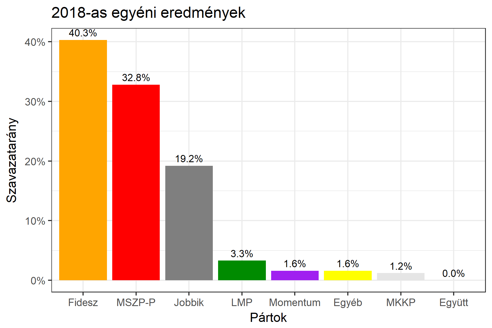

<h1 class="page-title">{{ page.title | escape }}</h1>

    

          

		  <h5>Szabolcs-Szatmár-Bereg megye 1-es választókerület (Nyíregyháza)</h5>
 <h5><strong>2018-as egyéni eredmények</strong></h5>  <table class="striped">
              <thead>
                <tr>
                    <th>Jelöltek</th>
                  <th>Szavazatarány (százalék)</th>
<th>Eltérés a becsléstől</th>
                </tr>
              </thead>
              <tbody>
             <tr>
                  <td>dr. Szabó Tünde - Fidesz-KDNP </td>
				   <td id="id_fidesz">40.3%</td>
				   <td>+5.4%</td>
			</tr>
			<tr><td>Lengyel Máté - Jobbik </td> 
			<td id="id_jobbik">19.2%</td>
				   <td>-5.9%</td>
			</tr>
<tr>
                  <td>Csabai Lászlóné - MSZP-Párbeszéd </td>
				   <td id="id_baloldal">32.8%</td>
				   <td>+0.8%</td>
			</tr>
			<tr>
                  <td>dr. Szoboszlay György Csaba - LMP </td>
				  <td id="id_lmp">3.3%</td>
				   <td>-1.1%</td>
			</tr>
			<tr>
				  <td>Babosi György - Momentum </td>
				  <td id="id_momentum">1.6%</td>
				   <td>-0.6%</td>
			</tr>             
<tr>
<td>Vajas Károly - MKKP </td>
 <td id="id_mkkp">1.2%</td>
				   <td>-0.2%</td>
</tr>   
              </tbody>
            </table><h6><strong>Választókerületi profil (2014-ben): Kétesélyes (Fidesz és baloldal között)</strong></h6>
 

 
			

          

    

    

          

		  <h5>Szabolcs-Szatmár-Bereg megye 1-es választókerület (Nyíregyháza) - 2014-es eredmények</h5>
            <table class="striped">
              <thead>
                <tr>
                    <th>Jelöltek</th>
                    <th>Szavazatarányok</th>
                </tr>
              </thead>
              <tbody>
             <tr>
                  <td>Petneházy Szabolcs Attila - Fidesz-KDNP</td>
				  <td>35.8%</td>
			</tr>
			<tr>
			      <td>Jeszenszki András - Összefogás (MSZP-Együtt-DK-PM-MLP)</td>
				  <td>32.3%</td>  
			</tr>
			<tr>
			      <td>Balczó Zoltán György - Jobbik</td>
				  <td>22.8%</td>
			</tr>
			<tr>
				  <td>Szabolcsi Beáta - LMP</td>
				  <td>3.9%</td>
			</tr>  	
              </tbody>
            </table>
			<h5>Győztes: Fidesz-KDNP, 3.5%-kal</h5>
          

    

