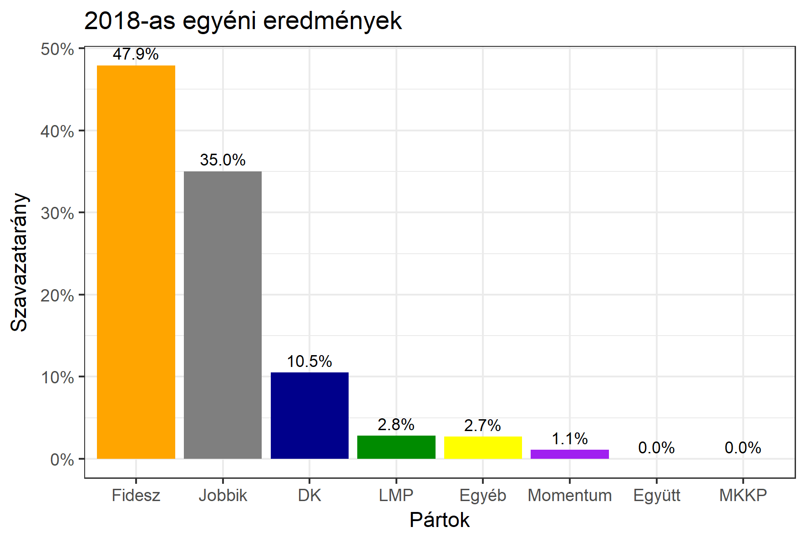

<h1 class="page-title">{{ page.title | escape }}</h1>

    

          

		  <h5>Szabolcs-Szatmár-Bereg megye 2-es választókerület (Nyíregyháza)</h5>
 <h5><strong>2018-as egyéni eredmények</strong></h5>  <table class="striped">
              <thead>
                <tr>
                    <th>Jelöltek</th>
                    <th>Szavazatarány (százalék)</th>
<th>Eltérés a becsléstől</th>
                </tr>
              </thead>
              <tbody>
             <tr>
                  <td>dr. Vinnai Győző - Fidesz-KDNP </td>
				    <td id="id_fidesz">47.9%</td>
				   <td>+6.2%</td>
			</tr>
			<tr><td>dr. Fülöp Erik - Jobbik </td> 
			 <td id="id_jobbik">35.0%</td>
				   <td>-5.3%</td>
			</tr>
<tr>
                  <td>dr. Helmeczy László - DK </td>
				   <td id="id_baloldal">10.5%</td>
				   <td>-4.0%</td>
			</tr>
			<tr>
                  <td>Cselószki Tamás - LMP </td>
				    <td id="id_lmp">2.8%</td>
				   <td>+0.3%</td>
			</tr>
			<tr>
				  <td>Szántó Gábor - Momentum </td>
				   <td id="id_momentum">1.1%</td>
				   <td>+0.2%</td>
			</tr>
       
         
              </tbody>
            </table><h6><strong>Választókerületi profil (2014-ben): Stabil Fideszes</strong></h6>
 

 
			

          

    

    

          

		  <h5>Szabolcs-Szatmár-Bereg megye 2-es választókerület (Nyíregyháza) - 2014-es eredmények</h5>
            <table class="striped">
              <thead>
                <tr>
                    <th>Jelöltek</th>
                    <th>Szavazatarányok</th>
                </tr>
              </thead>
              <tbody>
             <tr>
                  <td>Dr. Vinnai Győző - Fidesz-KDNP</td>
				  <td>43.1%</td>
			</tr>
			<tr>
			      <td>Dr. Gyüre Csaba - Jobbik</td>
				  <td>27.6%</td>
			</tr>
			<tr>
			      <td>Juhász Ferenc - Összefogás (MSZP-Együtt-DK-PM-MLP)</td>
				  <td>22.3%</td>  
			</tr>
			<tr>
				  <td>Tóth Miklós - LMP</td>
				  <td>2.3%</td>
			</tr>  	
              </tbody>
            </table>
			<h5>Győztes: Fidesz-KDNP, 15.5%-kal</h5>
          

    

