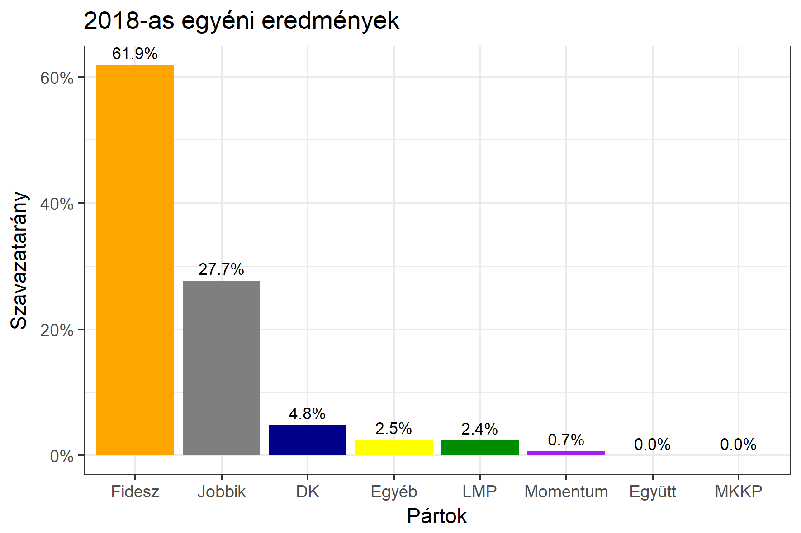

<h1 class="page-title">{{ page.title | escape }}</h1>

    

          

		  <h5>Szabolcs-Szatmár-Bereg megye 3-as választókerület (Kisvárda)</h5>
 <h5><strong>2018-as egyéni eredmények</strong></h5>  <table class="striped">
              <thead>
                <tr>
                    <th>Jelöltek</th>
                    <th>Szavazatarány (százalék)</th>
<th>Eltérés a becsléstől</th>
                </tr>
              </thead>
              <tbody>
             <tr>
                  <td>dr. Seszták Miklós - Fidesz-KDNP </td>
				   <td id="id_fidesz">61.9%</td>
				   <td>+12.7%</td>
			</tr>
			<tr><td>Dr. Gyüre Csaba - Jobbik </td> 
			 <td id="id_jobbik">27.7%</td>
				   <td>-8.1%</td>
			</tr>
<tr>
                  <td>Rakóczki Dénesné - DK </td>
				    <td id="id_baloldal">4.8%</td>
				   <td>-7.5%</td>
			</tr>
			<tr>
                  <td>Makranczi István - LMP </td>
				   <td id="id_lmp">2.4%</td>
				   <td>+0.4%</td>
			</tr>
			<tr>
				  <td>Matejka Rita - Momentum </td>
				   <td id="id_momentum">0.7%</td>
				   <td>+0.0%</td>
			</tr>
                
              </tbody>
            </table><h6><strong>Választókerületi profil (2014-ben): Biztos Fideszes</strong></h6>
 

 
			

          

    

    

          

		  <h5>Szabolcs-Szatmár-Bereg megye 3-as választókerület (Kisvárda) - 2014-es eredmények</h5>
            <table class="striped">
              <thead>
                <tr>
                    <th>Jelöltek</th>
                    <th>Szavazatarányok</th>
                </tr>
              </thead>
              <tbody>
             <tr>
                  <td>Dr. Seszták Miklós István - Fidesz-KDNP</td>
				  <td>48.6%</td>
			</tr>
			<tr>
			      <td>Földi István - Jobbik</td>
				  <td>26.8%</td>
			</tr>
			<tr>
			      <td>Dr. Legény Zsolt - Összefogás (MSZP-Együtt-DK-PM-MLP)</td>
				  <td>19.0%</td>  
			</tr>
			<tr>
				  <td>Dr. Balogh Emese Ilona - LMP</td>
				  <td>1.7%</td>
			</tr>  	
              </tbody>
            </table>
			<h5>Győztes: Fidesz-KDNP, 21.8%-kal</h5>
          

    

