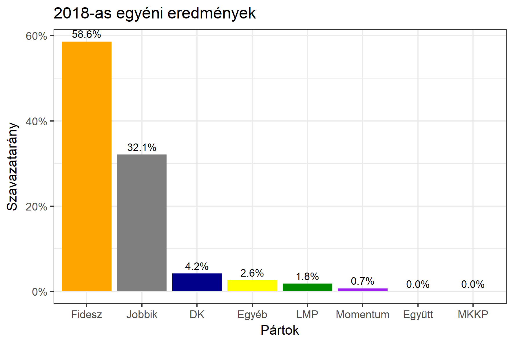

<h1 class="page-title">{{ page.title | escape }}</h1>

    

          

		  <h5>Szabolcs-Szatmár-Bereg megye 5-ös választókerület (Mátészalka)</h5>
 <h5><strong>2018-as egyéni eredmények</strong></h5>  <table class="striped">
              <thead>
                <tr>
                    <th>Jelöltek</th>
                    <th>Szavazatarány (százalék)</th>
<th>Eltérés a becsléstől</th>
                </tr>
              </thead>
              <tbody>
             <tr>
                  <td>Kovács Sándor - Fidesz-KDNP </td>
				    <td id="id_fidesz">58.6%</td>
				   <td>+8.2%</td>
			</tr>
			<tr><td>dr. Apáti István - Jobbik </td> 
			 <td id="id_jobbik">32.9%</td>
				   <td>-3.1%</td>
			</tr>
<tr>
                  <td>Csomáliné Rácz Erika - DK </td>
				   <td id="id_baloldal">4.2%</td>
				   <td>-7.6%</td>
			</tr>
			<tr>
                  <td>Tárkányi Sándor - LMP </td>
				    <td id="id_lmp">1.8%</td>
				   <td>+0.5%</td>
			</tr>
			<tr>
				  <td>Magyar Péter - Momentum </td>
				    <td id="id_momentum">0.7%</td>
				   <td>+0.2%</td>
			</tr>
                
              </tbody>
            </table><h6><strong>Választókerületi profil (2014-ben): Biztos Fideszes</strong></h6>
 

 
			

          

          

    

          

		  <h5>Szabolcs-Szatmár-Bereg megye 5-ös választókerület (Mátészalka) - 2014-es eredmények</h5>
            <table class="striped">
              <thead>
                <tr>
                    <th>Jelöltek</th>
                    <th>Szavazatarányok</th>
                </tr>
              </thead>
              <tbody>
             <tr>
                  <td>Kovács Sándor - Fidesz-KDNP</td>
				  <td>50.8%</td>
			</tr>
			<tr>
			      <td>Dr. Apáti István - Jobbik</td>
				  <td>27.2%</td>
			</tr>
			<tr>
			      <td>Halmi József - Összefogás (MSZP-Együtt-DK-PM-MLP)</td>
				  <td>18.2%</td>  
			</tr>
			<tr>
				  <td>Tempfli József - LMP</td>
				  <td>1.2%</td>
			</tr>  	
              </tbody>
            </table>
			<h5>Győztes: Fidesz-KDNP, 23.6%-kal</h5>
          

    

