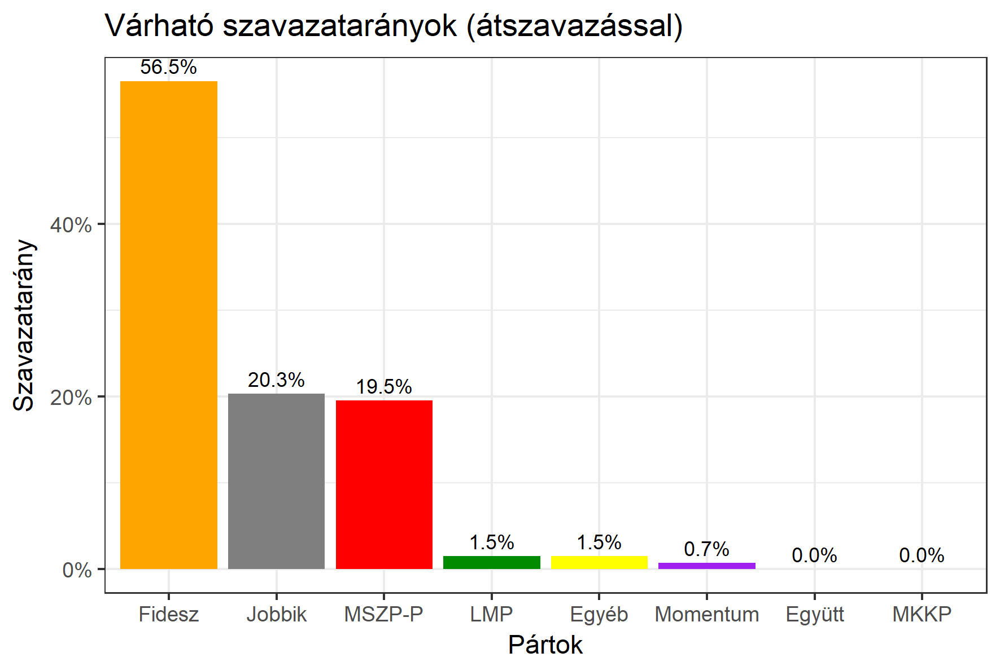
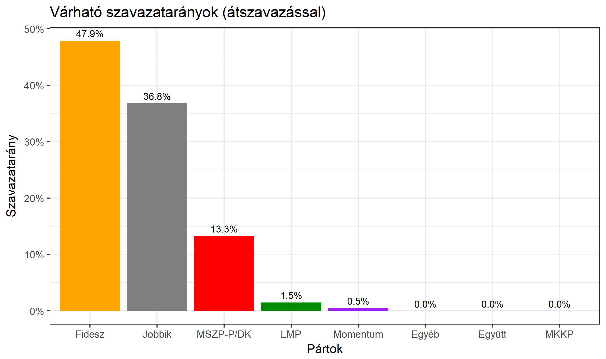

<h1 class="page-title">{{ page.title | escape }}</h1>

    

          

		  <h5>Szabolcs-Szatmár-Bereg megye 6-os választókerület (Nyírbátor)</h5>
 <h5><strong>2018-as egyéni eredmények</strong></h5>  <table class="striped">
              <thead>
                <tr>
                    <th>Jelöltek</th>
                    <th>Szavazatarány (százalék)</th>
<th>Eltérés a becsléstől</th>
                </tr>
              </thead>
              <tbody>
             <tr>
                  <td>dr. Simon Miklós - Fidesz-KDNP </td>
				    <td id="id_fidesz">56.5%</td>
				   <td>+9.5%</td>
			</tr>
			<tr><td>Kész Géza - Jobbik </td> 
			 <td id="id_jobbik">20.3%</td>
				   <td>-17.6%</td>
			</tr>
<tr>
                  <td>dr. Veres János - MSZP-Párbeszéd </td>
				   <td id="id_baloldal">19.5%</td>
				   <td>+6.7%</td>
			</tr>
			<tr>
                  <td>Czimre József - LMP </td>
				   <td id="id_lmp">1.5%</td>
				   <td>-0.1%</td>
			</tr>
			<tr>
				  <td>Bankus Tibor János - Momentum </td>
				 <td id="id_momentum">0.7%</td>
				   <td>+0.1%</td>
			</tr>
                
              </tbody>
            </table><h6><strong>Választókerületi profil (2014-ben): Biztos Fideszes</strong></h6>
 
<h5><strong>2018. április 8-i becslések (átszavazással):</strong></h5>  
			<h6><strong>Becslés megbízhatósága a legesélyesebb jelöltről:</strong> <strong>A Jobbikos jelölt az egyértelmű esélyes</strong></h6> 
<h5><strong>Legesélyesebb ellenzéki jelölt: Kész Géza (Jobbik)</strong></h5>
<h5><strong><a href="https://rendszervaltas2018.hu">Márki-Zay Péter ajánlása</a>: Kész Géza (Jobbik)</strong></h5>

  <table class="striped">
              <thead>
                <tr>
                    <th>Jelöltek</th>
                    <th>Várható szavazatarány egyéniben (zárójelben az arányok átszavazás esetén)</th>
                </tr>
              </thead>
              <tbody>
             <tr>
                  <td>dr. Simon Miklós - Fidesz-KDNP </td>
				   <td id="id_fidesz">47.6% &emsp; (47.0%)</td>
			</tr>
			<tr><td>Kész Géza - Jobbik </td> <td id="id_jobbik">32.4% &emsp; (37.9%)</td></tr>
<tr>
                  <td>dr. Veres János - MSZP-Párbeszéd </td>
				   <td id="id_baloldal">15.6% &emsp; (12.8%)</td>
			</tr>
			<tr>
                  <td>Czimre József - LMP </td>
				   <td id="id_lmp">2.5% &emsp; (1.6%)</td>
			</tr>
			<tr>
				  <td>Bankus Tibor János - Momentum </td>
				   <td id="id_momentum">0.9% &emsp; (0.6%)</td>
			</tr>
                
              </tbody>
            </table><h5>Várható győztes: Fidesz-KDNP</h5>
			
			
 
<strong>Fontos:</strong> A becslések csak az egyéni jelöltre adott szavazatok arányát mutatják, nem a listás szavazatokét. A becslés jelentős eltérést mutathat a kisebb pártok esetében és olyan kerületekben, ahol nincs egyértelmű esélyes jelölt.

 
			

Az aktuális becslés leírásáról <a href="../metodologia#0406">bővebben itt olvashatsz</a>.

          

    

    

          

		  <h5>Szabolcs-Szatmár-Bereg megye 6-os választókerület (Nyírbátor) - 2014-es eredmények</h5>
            <table class="striped">
              <thead>
                <tr>
                    <th>Jelöltek</th>
                    <th>Szavazatarányok</th>
                </tr>
              </thead>
              <tbody>
             <tr>
                  <td>Dr. Simon Miklós - Fidesz-KDNP</td>
				  <td>47.0%</td>
			</tr>
			<tr>
			      <td>Dr. Kiss Sándor - Jobbik</td>
				  <td>28.2%</td>
			</tr>
			<tr>
			      <td>Dr. Helmeczy László József - Összefogás (MSZP-Együtt-DK-PM-MLP)</td>
				  <td>19.7%</td>  
			</tr>
			<tr>
				  <td>Máté György Ákos - LMP</td>
				  <td>1.4%</td>
			</tr>  	
              </tbody>
            </table>
			<h5>Győztes: Fidesz-KDNP, 18.8%-kal</h5>
          

    

