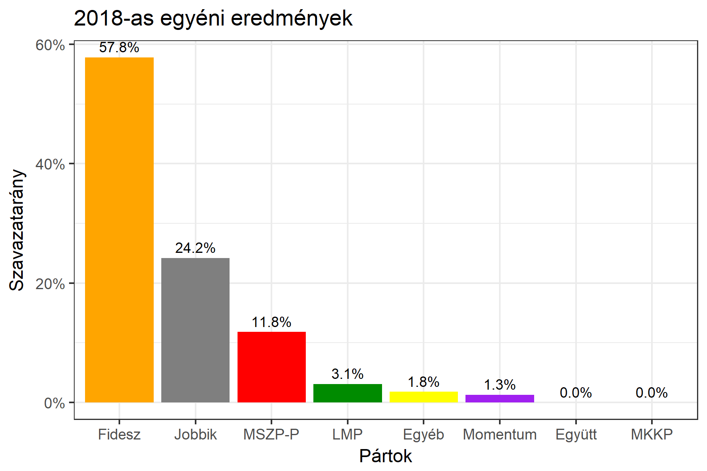

<h1 class="page-title">{{ page.title | escape }}</h1>

    

          

		  <h5>Tolna megye 3-as választókerület (Paks)</h5>
 <h5><strong>2018-as egyéni eredmények</strong></h5>  <table class="striped">
              <thead>
                <tr>
                    <th>Jelöltek</th>
                    <th>Szavazatarány (százalék)</th>
<th>Eltérés a becsléstől</th>
                </tr>
              </thead>
              <tbody>
             <tr>
                  <td>Süli János - Fidesz-KDNP </td>
				    <td id="id_fidesz">57.8%</td>
				   <td>+9.7%</td>
			</tr>
			<tr><td>Bencze János - Jobbik </td> 
		 <td id="id_jobbik">24.2%</td>
				   <td>-7.2%</td>
			</tr>
<tr>
                  <td>Heringes Anita - MSZP-Párbeszéd </td>
				    <td id="id_baloldal">11.8%</td>
				   <td>-2.1%</td>
			</tr>
			<tr>
                  <td>Dömötörné Solymár Orsika - LMP </td>
				   <td id="id_lmp">3.1%</td>
				   <td>-1.8%</td>
			</tr>
			<tr>
				  <td>Dobosi Norbert - Momentum </td>
				   <td id="id_momentum">1.3%</td>
				   <td>-0.4%</td>
			</tr>
                
              </tbody>
            </table><h6><strong>Választókerületi profil (2014-ben): Biztos Fideszes</strong></h6>
 
<h5><strong>2018. április 8-i becslések (átszavazással):</strong></h5>  
			<h6><strong>Becslés megbízhatósága a legesélyesebb jelöltről:</strong> <strong>A Jobbikos jelölt az egyértelmű esélyes</strong></h6> 
<h5><strong>Legesélyesebb ellenzéki jelölt: Bencze János (Jobbik)</strong></h5>
<h5><strong><a href="https://rendszervaltas2018.hu">Márki-Zay Péter ajánlása</a>: Bencze János (Jobbik)</strong></h5>

  <table class="striped">
              <thead>
                <tr>
                    <th>Jelöltek</th>
                    <th>Várható szavazatarány egyéniben (zárójelben az arányok átszavazás esetén)</th>
                </tr>
              </thead>
              <tbody>
             <tr>
                  <td>Süli János - Fidesz-KDNP </td>
				   <td id="id_fidesz">48.8% &emsp; (48.1%)</td>
			</tr>
			<tr><td>Bencze János - Jobbik </td> <td id="id_jobbik">25.1% &emsp; (31.4%)</td></tr>
<tr>
                  <td>Heringes Anita - MSZP-Párbeszéd </td>
				   <td id="id_baloldal">15.6% &emsp; (13.9%)</td>
			</tr>
			<tr>
                  <td>Dömötörné Solymár Orsika - LMP </td>
				   <td id="id_lmp">6.1% &emsp; (4.9%)</td>
			</tr>
			<tr>
				  <td>Dobosi Norbert - Momentum </td>
				   <td id="id_momentum">2.2% &emsp; (1.7%)</td>
			</tr>
                
              </tbody>
            </table><h5>Várható győztes: Fidesz-KDNP</h5>
			
			
 
<strong>Fontos:</strong> A becslések csak az egyéni jelöltre adott szavazatok arányát mutatják, nem a listás szavazatokét. A becslés jelentős eltérést mutathat a kisebb pártok esetében és olyan kerületekben, ahol nincs egyértelmű esélyes jelölt.

 
			

Az aktuális becslés leírásáról <a href="../metodologia#0406">bővebben itt olvashatsz</a>.

          

    

    

          

		  <h5>Tolna megye 3-as választókerület (Paks) - 2014-es eredmények</h5>
            <table class="striped">
              <thead>
                <tr>
                    <th>Jelöltek</th>
                    <th>Szavazatarányok</th>
                </tr>
              </thead>
              <tbody>
             <tr>
                  <td>Hirt Ferenc - Fidesz-KDNP</td>
				  <td>49.9%</td>
			</tr>
			<tr>
			      <td>Bencze János - Jobbik</td>
				  <td>22.6%</td>
			</tr>
			<tr>
			      <td>Heringes Anita - Összefogás (MSZP-Együtt-DK-PM-MLP)</td>
				  <td>20.3%</td>  
			</tr>
			<tr>
				  <td>Harmat Gabriella - LMP</td>
				  <td>3.5%</td>
			</tr>  	
              </tbody>
            </table>
			<h5>Győztes: Fidesz-KDNP, 27.3%-kal</h5>
          

    

