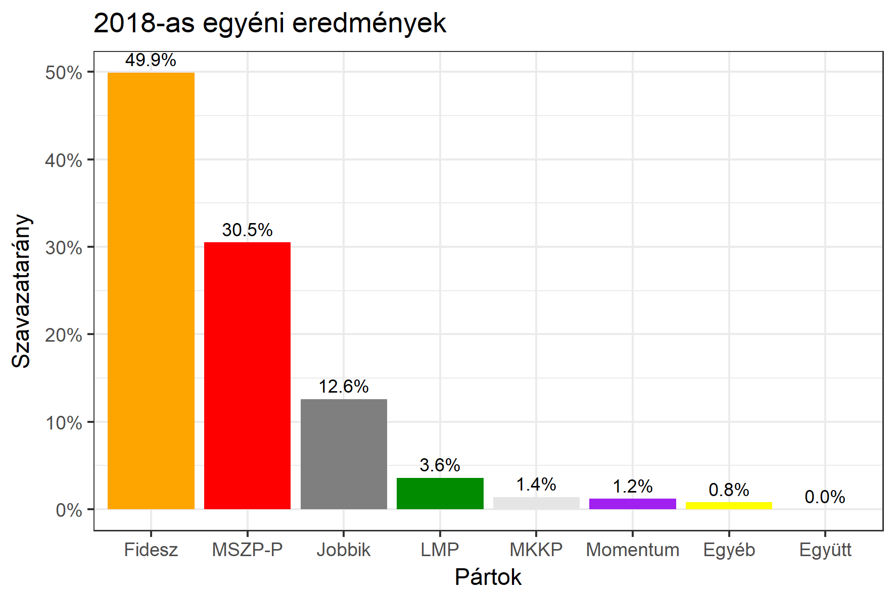

<h1 class="page-title">{{ page.title | escape }}</h1>

    

          

		  <h5>Vas megye 1-es választókerület (Szombathely)</h5>
 <h5><strong>2018-as egyéni eredmények</strong></h5>  <table class="striped">
              <thead>
                <tr>
                    <th>Jelöltek</th>
                    <th>Szavazatarány (százalék)</th>
<th>Eltérés a becsléstől</th>
                </tr>
              </thead>
              <tbody>
             <tr>
                  <td>dr. Hende Csaba - Fidesz-KDNP </td>
				    <td id="id_fidesz">49.9%</td>
				   <td>+6.2%</td>
			</tr>
			<tr><td>Balassa Péter - Jobbik </td> 
			 <td id="id_jobbik">12.6%</td>
				   <td>-2.8%</td>
			</tr>
<tr>
                  <td>dr. Nemény András - MSZP-Párbeszéd </td>
				    <td id="id_baloldal">30.5%</td>
				   <td>+1.3%</td>
			</tr>
			<tr>
                  <td>Németh Ákos - LMP </td>
				    <td id="id_lmp">3.6%</td>
				   <td>-3.2%</td>
			</tr>
			<tr>
				  <td>Falka Péter - Momentum </td>
				  <td id="id_momentum">1.2%</td>
				   <td>-1.8%</td>
			</tr>
<tr>
<td>Viszlayné Pavelkovits Petra - MKKP </td>
  <td id="id_mkkp">1.4%</td>
				   <td>-0.4%</td>
</tr>    
              </tbody>
            </table><h6><strong>Választókerületi profil (2014-ben): Stabil Fideszes</strong></h6>
 

 
			

          

    

    

          

		  <h5>Vas megye 1-es választókerület (Szombathely) - 2014-es eredmények</h5>
            <table class="striped">
              <thead>
                <tr>
                    <th>Jelöltek</th>
                    <th>Szavazatarányok</th>
                </tr>
              </thead>
              <tbody>
             <tr>
                  <td>Dr. Hende Csaba Károly - Fidesz-KDNP</td>
				  <td>45.0%</td>
			</tr>
			<tr>
			      <td>Dr. Nemény András - Összefogás (MSZP-Együtt-DK-PM-MLP)</td>
				  <td>30.6%</td>  
			</tr>
			<tr>
			      <td>Balassa Péter Sándor - Jobbik</td>
				  <td>15.3%</td>
			</tr>
			<tr>
				  <td>Horváth Zoltán - LMP</td>
				  <td>6.2%</td>
			</tr>  	
              </tbody>
            </table>
			<h5>Győztes: Fidesz-KDNP, 14.4%-kal</h5>
          

    

