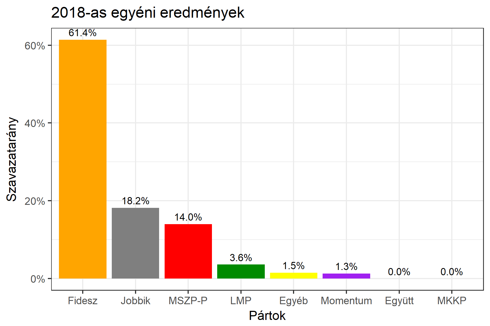

<h1 class="page-title">{{ page.title | escape }}</h1>

    

          

		  <h5>Vas megye 2-es választókerület (Sárvár)</h5>
 <h5><strong>2018-as egyéni eredmények</strong></h5>  <table class="striped">
              <thead>
                <tr>
                    <th>Jelöltek</th>
                    <th>Szavazatarány (százalék)</th>
<th>Eltérés a becsléstől</th>
                </tr>
              </thead>
              <tbody>
             <tr>
                  <td>Ágh Péter - Fidesz-KDNP </td>
				    <td id="id_fidesz">61.4%</td>
				   <td>+9.2%</td>
			</tr>
			<tr><td>Rába Kálmán - Jobbik </td> 
			 <td id="id_jobbik">18.2%</td>
				   <td>-0.6%</td>
			</tr>
<tr>
                  <td>dr. Horváth Attila - MSZP-Párbeszéd </td>
				   <td id="id_baloldal">14.0%</td>
				   <td>-8.9%</td>
			</tr>
			<tr>
                  <td>György István Péter - LMP </td>
				    <td id="id_lmp">3.6%</td>
				   <td>-0.9%</td>
			</tr>
			<tr>
				  <td>Kovács Attila - Momentum </td>
				   <td id="id_momentum">1.3%</td>
				   <td>-0.3%</td>
			</tr>
                
              </tbody>
            </table><h6><strong>Választókerületi profil (2014-ben): Biztos Fideszes</strong></h6>
 

 
			

          

    

    

          

		  <h5>Vas megye 2-es választókerület (Sárvár) - 2014-es eredmények</h5>
            <table class="striped">
              <thead>
                <tr>
                    <th>Jelöltek</th>
                    <th>Szavazatarányok</th>
                </tr>
              </thead>
              <tbody>
             <tr>
                  <td>Ágh Péter  - Fidesz-KDNP</td>
				  <td>52.0%</td>
			</tr>
			<tr>
			      <td>Fehér László István - Összefogás (MSZP-Együtt-DK-PM-MLP)</td>
				  <td>24.1%</td>  
			</tr>
			<tr>
			      <td>Rába Kálmán - Jobbik</td>
				  <td>17.0%</td>
			</tr>
			<tr>
				  <td>Bogáti András - LMP</td>
				  <td>3.9%</td>
			</tr>  	
              </tbody>
            </table>
			<h5>Győztes: Fidesz-KDNP, 27.9%-kal</h5>
          

    

