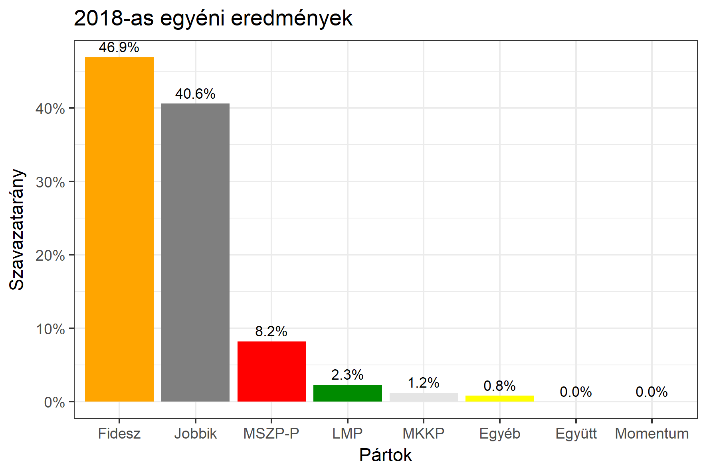

<h1 class="page-title">{{ page.title | escape }}</h1>

    

          

		  <h5>Veszprém megye 3-as választókerület (Tapolca)</h5>
 <h5><strong>2018-as egyéni eredmények</strong></h5>  <table class="striped">
              <thead>
                <tr>
                    <th>Jelöltek</th>
                    <th>Szavazatarány (százalék)</th>
<th>Eltérés a becsléstől</th>
                </tr>
              </thead>
              <tbody>
             <tr>
                  <td>Fenyvesi Zoltán - Fidesz-KDNP </td>
				    <td id="id_fidesz">46.9%</td>
				   <td>+6.8%</td>
			</tr>
			<tr><td>Rig Lajos - Jobbik </td> 
			 <td id="id_jobbik">40.6%</td>
				   <td>+1.4%</td>
			</tr>
<tr>
                  <td>Kárpáti Lajos - MSZP-Párbeszéd </td>
				   <td id="id_baloldal">8.2%</td>
				   <td>-9.0%</td>
			</tr>
			<tr>
                  <td>Takács Lajos - LMP </td>
				   <td id="id_lmp">2.3%</td>
				   <td>-0.7%</td>
			</tr>
			<tr>
				  </tr>
    
<tr>
<td>Pavlovics Márk - MKKP </td>
  <td id="id_mkkp">1.2%</td>
				   <td>+0.8%</td>
</tr>            
              </tbody>
            </table><h6><strong>Választókerületi profil (2014-ben): Kétesélyes (Fidesz és Jobbik között)</strong></h6>
 

 
			

          

    

    

          

		  <h5>Veszprém megye 3-as választókerület (Tapolca) - 2015. április 12-i időközi választás</h5>
            <table class="striped">
              <thead>
                <tr>
                    <th>Jelöltek</th>
                    <th>Szavazatarányok</th>
                </tr>
              </thead>
              <tbody>
             <tr>
                  <td>Rig Lajos - Jobbik</td>
				  <td>35.5%</td>
			</tr>
			<tr>
			      <td>Fenyvesi Zoltán Mihály - Fidesz-KDNP</td>
				  <td>34.3%</td>  
			</tr>
			<tr>
			      <td>Pad Ferenc - MSZP-DK</td>
				  <td>26.2%</td>
			</tr>
			<tr>
				  <td>Sallee Barbara - LMP</td>
				  <td>2.0%</td>
			</tr>  	
              </tbody>
            </table>
			<h5>Győztes: Jobbik, 1.2%-kal</h5>
          

    

    

          

		  <h5>Veszprém megye 3-as választókerület (Tapolca) - 2014-es eredmények</h5>
            <table class="striped">
              <thead>
                <tr>
                    <th>Jelöltek</th>
                    <th>Szavazatarányok</th>
                </tr>
              </thead>
              <tbody>
             <tr>
                  <td>Lasztovicza Jenő - Fidesz-KDNP</td>
				  <td>43.1%</td>
			</tr>
			<tr>
			      <td>Dr. Horváth József - Összefogás (MSZP-Együtt-DK-PM-MLP)</td>
				  <td>27.3%</td>  
			</tr>
			<tr>
			      <td>Dobó Zoltán - Jobbik</td>
				  <td>23.5%</td>
			</tr>
			<tr>
				  <td>Guzslován Gábor - LMP</td>
				  <td>3.0%</td>
			</tr>  	
              </tbody>
            </table>
			<h5>Győztes: Fidesz-KDNP, 15.8%-kal</h5>
          

    

