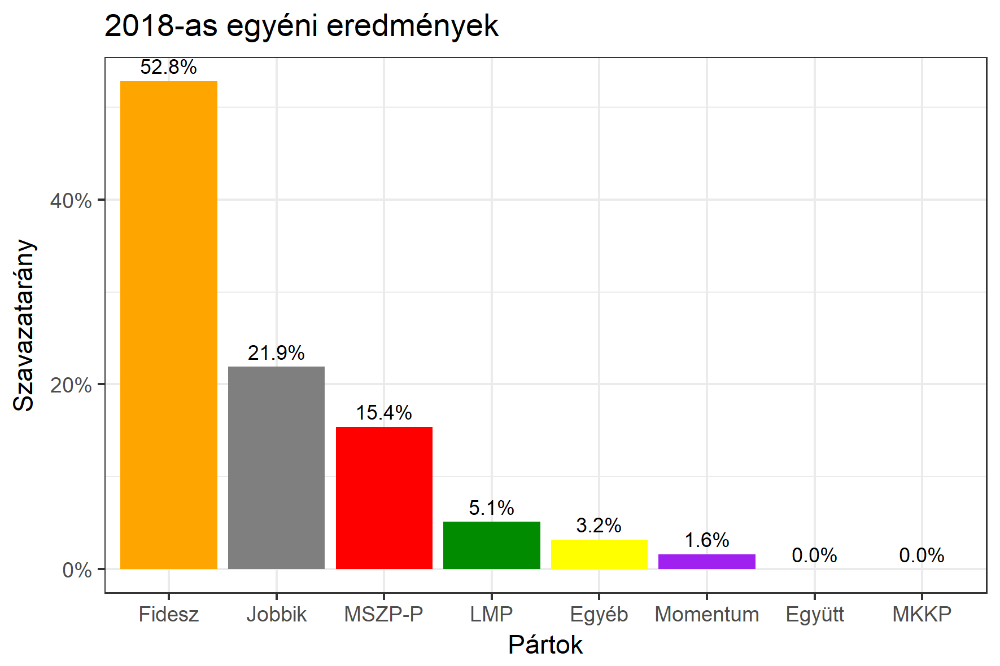

<h1 class="page-title">{{ page.title | escape }}</h1>

    

          

		  <h5>Zala megye 1-es választókerület (Zalaegerszeg)</h5>
 <h5><strong>2018-as egyéni eredmények</strong></h5>  <table class="striped">
              <thead>
                <tr>
                    <th>Jelöltek</th>
                    <th>Szavazatarány (százalék)</th>
<th>Eltérés a becsléstől</th>
                </tr>
              </thead>
              <tbody>
             <tr>
                  <td>Vígh László - Fidesz-KDNP </td>
				    <td id="id_fidesz">52.8%</td>
				   <td>+6.8%</td>
			</tr>
			<tr><td>Benke Richárd - Jobbik </td> 
			 <td id="id_jobbik">21.9%</td>
				   <td>-7.4%</td>
			</tr>
<tr>
                  <td>Góra Balázs - MSZP-Párbeszéd </td>
				    <td id="id_baloldal">15.4%</td>
				   <td>-2.6%</td>
			</tr>
			<tr>
                  <td>dr. Paksy Zoltán - LMP </td>
				   <td id="id_lmp">5.1%</td>
				   <td>+0.1%</td>
			</tr>
			<tr>
				  <td>Fodor Zsolt - Momentum </td>
				  <td id="id_momentum">1.6%</td>
				   <td>-0.2%</td>
			</tr>
                
              </tbody>
            </table><h6><strong>Választókerületi profil (2014-ben): Stabil Fideszes</strong></h6>
 

 
			

          

    

    

          

		  <h5>Zala megye 1-es választókerület (Zalaegerszeg) - 2014-es eredmények</h5>
            <table class="striped">
              <thead>
                <tr>
                    <th>Jelöltek</th>
                    <th>Szavazatarányok</th>
                </tr>
              </thead>
              <tbody>
             <tr>
                  <td>Vigh László - Fidesz-KDNP</td>
				  <td>44.4%</td>
			</tr>
			<tr>
			      <td>Major Gábor - Összefogás (MSZP-Együtt-DK-PM-MLP)</td>
				  <td>24.1%</td>  
			</tr>
			<tr>
			      <td>Pete Róbert - Jobbik</td>
				  <td>21.3%</td>
			</tr>
			<tr>
				  <td>Dr. Paksy Zoltán - LMP</td>
				  <td>4.3%</td>
			</tr>  	
              </tbody>
            </table>
			<h5>Győztes: Fidesz-KDNP, 20.3%-kal</h5>
          

    

