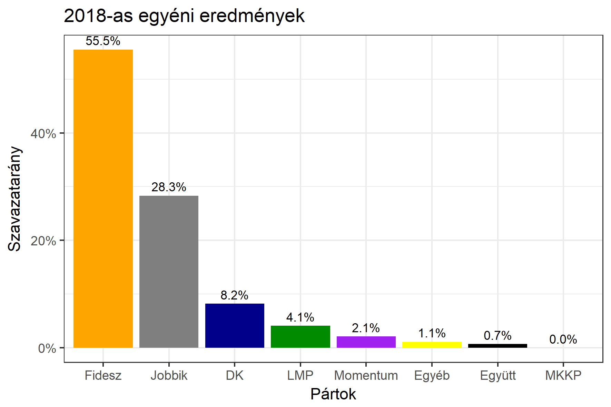

<h1 class="page-title">{{ page.title | escape }}</h1>

    

          

		  <h5>Zala megye 2-es választókerület (Keszthely)</h5>
 <h5><strong>2018-as egyéni eredmények</strong></h5>  <table class="striped">
              <thead>
                <tr>
                    <th>Jelöltek</th>
                    <th>Szavazatarány (százalék)</th>
<th>Eltérés a becsléstől</th>
                </tr>
              </thead>
              <tbody>
             <tr>
                  <td>Manninger Jenő - Fidesz-KDNP </td>
				    <td id="id_fidesz">55.5%</td>
				   <td>+9.1%</td>
			</tr>
			<tr><td>dr. Weller-Jakus Tamás - Jobbik </td> 
			 <td id="id_jobbik">28.3%</td>
				   <td>-4.0%</td>
			</tr>
<tr>
                  <td>Kovács Viktória - DK </td>
				   <td id="id_baloldal">8.2%</td>
				   <td>-4.6%</td>
			</tr>
			<tr>
                  <td>Temesváry Tibor - LMP </td>
				  <td id="id_lmp">4.1%</td>
				   <td>-1.4%</td>
			</tr>
			<tr>
				  <td>Elekes István - Momentum </td>
				   <td id="id_momentum">2.1%</td>
				   <td>+0.2%</td>
			</tr>
<tr>
<td>Csontos Gábor -  Együtt </td>
  <td id="id_egyutt">0.7%</td>
				   <td>-0.4%</td>
</tr>                
              </tbody>
            </table><h6><strong>Választókerületi profil (2014-ben): Biztos Fideszes</strong></h6>
 

 
			

          

    

    

          

		  <h5>Zala megye 2-es választókerület (Keszthely) - 2014-es eredmények</h5>
            <table class="striped">
              <thead>
                <tr>
                    <th>Jelöltek</th>
                    <th>Szavazatarányok</th>
                </tr>
              </thead>
              <tbody>
             <tr>
                  <td>Manninger Jenő Vilmos - Fidesz-KDNP</td>
				  <td>49.3%</td>
			</tr>
			<tr>
			      <td>Selmeczy Zsuzsanna - Jobbik</td>
				  <td>24.2%</td>
			</tr>
			<tr>
			      <td>Szermek Zsolt Ottó - Összefogás (MSZP-Együtt-DK-PM-MLP)</td>
				  <td>19.7%</td>  
			</tr>
			<tr>
				  <td>Németh Áron Csaba - LMP</td>
				  <td>4.0%</td>
			</tr>  	
              </tbody>
            </table>
			<h5>Győztes: Fidesz-KDNP, 25.1%-kal</h5>
          

    

