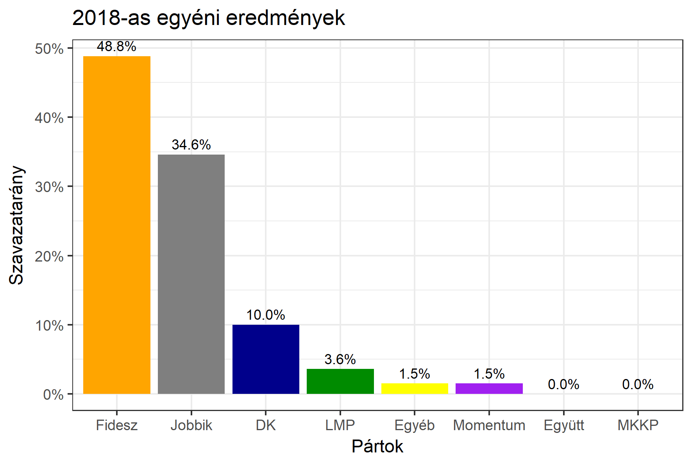

<h1 class="page-title">{{ page.title | escape }}</h1>

    

          

		  <h5>Zala megye 3-as választókerület (Nagykanizsa)</h5>
 <h5><strong>2018-as egyéni eredmények</strong></h5>  <table class="striped">
              <thead>
                <tr>
                    <th>Jelöltek</th>
                    <th>Szavazatarány (százalék)</th>
<th>Eltérés a becsléstől</th>
                </tr>
              </thead>
              <tbody>
             <tr>
                  <td>Cseresnyés Péter - Fidesz-KDNP </td>
				    <td id="id_fidesz">48.8%</td>
				   <td>+10.4%</td>
			</tr>
			<tr><td>Zakó László - Jobbik </td> 
			 <td id="id_jobbik">34.6%</td>
				   <td>-4.3%</td>
			</tr>
<tr>
                  <td>Horváth Jácint - DK </td>
				    <td id="id_baloldal">10.0%</td>
				   <td>-7.7%</td>
			</tr>
			<tr>
                  <td>dr. Károlyi Attila József - LMP </td>
				    <td id="id_lmp">3.6%</td>
				   <td>-0.1%</td>
			</tr>
			<tr>
				  <td>dr. Polónyi Tamás - Momentum </td>
				   <td id="id_momentum">1.5%</td>
				   <td>+0.2%</td>
			</tr>
                
              </tbody>
            </table><h6><strong>Választókerületi profil (2014-ben): Enyhén Fideszes (Jobbik / baloldal az esélyes kihívók)</strong></h6>
 

 
			

          

    

    

          

		  <h5>Zala megye 3-as választókerület (Nagykanizsa) - 2014-es eredmények</h5>
            <table class="striped">
              <thead>
                <tr>
                    <th>Jelöltek</th>
                    <th>Szavazatarányok</th>
                </tr>
              </thead>
              <tbody>
             <tr>
                  <td>Cseresnyés Péter - Fidesz-KDNP</td>
				  <td>39.6%</td>
			</tr>
			<tr>
			      <td>Zakó László - Jobbik</td>
				  <td>27.3%</td>
			</tr>
			<tr>
			      <td>Göndör István - Összefogás (MSZP-Együtt-DK-PM-MLP)</td>
				  <td>26.0%</td>  
			</tr>
			<tr>
				  <td>Tringer Ferenc Péter - LMP</td>
				  <td>3.3%</td>
			</tr>  	
              </tbody>
            </table>
			<h5>Győztes: Fidesz-KDNP, 12.6%-kal</h5>
          

    

